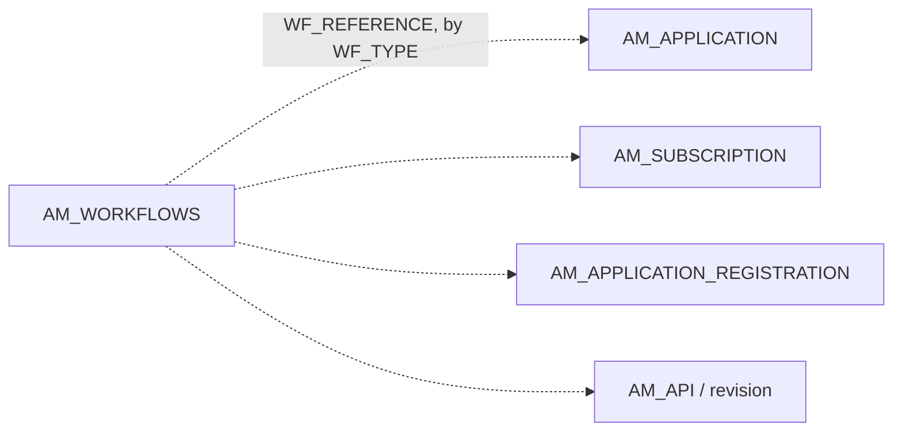
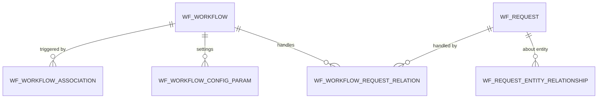

# Workflows

!!! abstract "In one sentence"
    Workflows put an **approval step** in front of actions such as creating an application, subscribing, generating keys or publishing an API. `AM_WORKFLOWS` tracks each pending approval. The `WF_*` tables belong to the embedded Identity Server's own workflow engine.

## The idea

By default everything in APIM happens instantly. An admin can switch on approval workflows, for example "a human must approve every new subscription". Then:

1. The developer subscribes. APIM writes the `AM_SUBSCRIPTION` row with `SUB_STATUS = 'ON_HOLD'`, and an **`AM_WORKFLOWS` row with `WF_STATUS = 'CREATED'`** that points at the subscription.
2. An approver sees the task in the Admin Portal (or an external BPMN engine does) and approves or rejects it.
3. APIM updates the `AM_WORKFLOWS` row (`APPROVED` or `REJECTED`) and finishes the original action. In this example it sets the subscription to `UNBLOCKED` or `REJECTED`.

The same pattern works for many actions. `WF_TYPE` says which one, and `WF_REFERENCE` holds the ID of the thing being approved.

| `WF_TYPE` (examples) | `WF_REFERENCE` points at |
|---|---|
| `AM_APPLICATION_CREATION`, `AM_APPLICATION_UPDATE`, `AM_APPLICATION_DELETION` | `AM_APPLICATION.APPLICATION_ID` |
| `AM_SUBSCRIPTION_CREATION`, `AM_SUBSCRIPTION_UPDATE`, `AM_SUBSCRIPTION_DELETION` | `AM_SUBSCRIPTION.SUBSCRIPTION_ID` |
| `AM_APPLICATION_REGISTRATION_PRODUCTION` / `_SANDBOX` | `AM_APPLICATION_REGISTRATION` (via its `WF_REF`) |
| `AM_API_STATE`, `AM_API_PRODUCT_STATE` | The API or product being moved through its lifecycle |
| `AM_REVISION_DEPLOYMENT` | The revision deployment request |
| `AM_USER_SIGNUP` | The user who signed up |

## How the tables connect

APIM's approval tracking:



- These are **polymorphic, logical** links: which table `WF_REFERENCE` refers to depends on `WF_TYPE`. There are no foreign keys.

The Identity Server workflow engine (`WF_*`):



## The tables

### AM_WORKFLOWS

**One row =** one approval task raised by APIM.

| Column | What it means |
|---|---|
| `WF_ID` | Primary key. |
| `WF_TYPE` | Which action is being approved (see the table above). |
| `WF_REFERENCE` | ID of the object waiting for approval. It's text, and its meaning depends on `WF_TYPE`. |
| `WF_STATUS` | `CREATED` (pending), `APPROVED`, `REJECTED` or `REGISTERED`. |
| `WF_EXTERNAL_REFERENCE` | Unique ID used by the approver or an external engine to call back. |
| `WF_STATUS_DESC` | The approver's comment. |
| `WF_METADATA`, `WF_PROPERTIES` | Details shown to the approver (JSON). |
| `TENANT_ID`, `TENANT_DOMAIN`, `WF_CREATED_TIME`, `WF_UPDATED_TIME` | Scope and timing. |

[Full column list](../reference/am.md#am_workflows)

### WF_WORKFLOW

**One row =** one workflow definition in the Identity Server workflow engine. It has `ID`, `WF_NAME`, `DESCRIPTION`, `TEMPLATE_ID`, `IMPL_ID` and `TENANT_ID`. APIM's approval workflows don't use it. It's there for identity-management workflows, such as "approve adding a user to a role". [Full column list](../reference/wf.md#wf_workflow)

### WF_WORKFLOW_ASSOCIATION

**One row =** "run workflow W when event E happens and condition C matches". It has `EVENT_ID`, `ASSOC_CONDITION`, `IS_ENABLED` and `WORKFLOW_ID` (FK, cascade). [Full column list](../reference/wf.md#wf_workflow_association)

### WF_WORKFLOW_CONFIG_PARAM

**One row =** one configuration parameter of a workflow (`PARAM_NAME`, `PARAM_VALUE`, `PARAM_QNAME`, `PARAM_HOLDER`). `WORKFLOW_ID` → `WF_WORKFLOW` (FK, cascade). [Full column list](../reference/wf.md#wf_workflow_config_param)

### WF_REQUEST

**One row =** one request waiting in the Identity Server engine. It has `UUID`, `OPERATION_TYPE`, `CREATED_BY`, `STATUS` and the serialized `REQUEST`. [Full column list](../reference/wf.md#wf_request)

### WF_REQUEST_ENTITY_RELATIONSHIP

**One row =** "request R is about entity E" (`ENTITY_NAME`, `ENTITY_TYPE`, e.g. a user or a role). `REQUEST_ID` → `WF_REQUEST` (FK, cascade). [Full column list](../reference/wf.md#wf_request_entity_relationship)

### WF_WORKFLOW_REQUEST_RELATION

**One row =** "workflow W is handling request R", with its own `STATUS`. FKs → `WF_WORKFLOW` and `WF_REQUEST`, cascade. [Full column list](../reference/wf.md#wf_workflow_request_relation)

### WF_BPS_PROFILE

**One row =** the connection details for an external business-process server that runs workflows (`HOST_URL_MANAGER`, `HOST_URL_WORKER`, credentials and callback settings), per `TENANT_ID`. [Full column list](../reference/wf.md#wf_bps_profile)

## Example

Subscription approval:

| Table | Row |
|---|---|
| `AM_SUBSCRIPTION` | `SUBSCRIPTION_ID = 9`, `SUB_STATUS = ON_HOLD` |
| `AM_WORKFLOWS` | `WF_TYPE = AM_SUBSCRIPTION_CREATION`, `WF_REFERENCE = 9`, `WF_STATUS = CREATED`, `WF_EXTERNAL_REFERENCE = 7d2e…` |

After approval, `WF_STATUS = APPROVED` and `SUB_STATUS = UNBLOCKED`.

## Try it

```sql
-- Pending approvals, oldest first
SELECT WF_TYPE, WF_REFERENCE, WF_STATUS, TENANT_DOMAIN, WF_CREATED_TIME
FROM AM_WORKFLOWS
WHERE WF_STATUS = 'CREATED'
ORDER BY WF_CREATED_TIME;
```

## Related flows

- [Approval workflows](../flows/13-approval-workflows.md)
- [Subscribe to an API](../flows/08-subscribe.md)

!!! note "Different in 3.x"
    The same tables exist in 3.x. The revision-deployment workflow type is new in 4.x. See [3.x Workflows](../../apim-3/domains/workflows.md).
