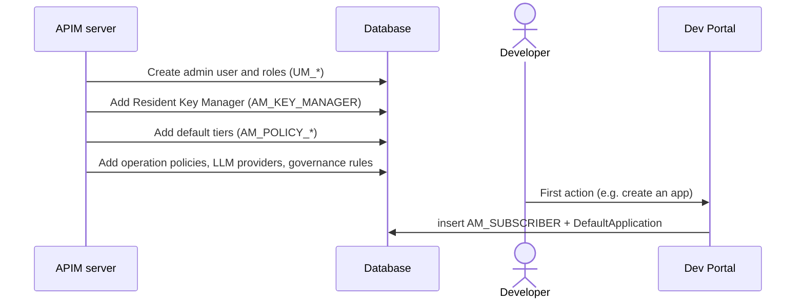

# Setup & first user

!!! abstract "What happens"
    The first time APIM starts, it fills in the rows everything else depends on: the admin user and roles, the built-in Key Manager, the default rate-limit tiers, the built-in operation policies, the LLM providers and the default governance rules. Later, the first time a user does something in the Developer Portal, APIM creates a *subscriber* row for them and a **DefaultApplication**.

**Who:** APIM server at startup, then each user on first Dev Portal action · **Tables written:** [`UM_USER`](../reference/um.md#um_user), [`UM_ROLE`](../reference/um.md#um_role), [`UM_HYBRID_ROLE`](../reference/um.md#um_hybrid_role), [`AM_KEY_MANAGER`](../reference/am.md#am_key_manager), `AM_POLICY_*`, [`AM_API_THROTTLE_POLICY`](../reference/am.md#am_api_throttle_policy), [`AM_OPERATION_POLICY`](../reference/am.md#am_operation_policy), [`AM_LLM_PROVIDER`](../reference/am.md#am_llm_provider), `GOV_*`, [`AM_GW_INSTANCES`](../reference/am.md#am_gw_instances), [`AM_SYSTEM_CONFIGS`](../reference/am.md#am_system_configs), [`AM_SUBSCRIBER`](../reference/am.md#am_subscriber), [`AM_APPLICATION`](../reference/am.md#am_application) · **Tables read:** [`UM_USER_ROLE`](../reference/um.md#um_user_role)

## The flow at a glance

This diagram shows the two moments that create "starter" data: server startup, and a user's first action in the Developer Portal.



- The first four messages happen once, the first time the server starts against an empty database.
- The last message happens once per user, the first time they do anything in the Developer Portal.

## Step by step

!!! info "Starter data comes from code, not SQL"
    The 4.7.0 database scripts only insert a handful of lookup rows, such as the 7 [`AM_ALERT_TYPES`](../reference/am.md#am_alert_types). Everything below is created **by the server at startup**.

1. **Admin user and roles.** The shared DB's user store tables are populated.
    - The super tenant `carbon.super` has the fixed tenant ID **`-1234`** and **no row** in [`UM_TENANT`](../reference/um.md#um_tenant). Only *extra* tenants get a row there.
    - [`UM_USER`](../reference/um.md#um_user) gets two users: `admin`, and an internal `apim_reserved_user`. [`UM_ROLE`](../reference/um.md#um_role) gets `admin`, and [`UM_HYBRID_ROLE`](../reference/um.md#um_hybrid_role) gets the internal roles: `everyone`, `system`, `publisher`, `creator`, `subscriber`, `devops`, `observer`, `integration_dev` and `analytics`.
    - [`UM_PERMISSION`](../reference/um.md#um_permission) and [`UM_ROLE_PERMISSION`](../reference/um.md#um_role_permission) get the permission tree, and the registry (`REG_*`) gets its base folders (around 500 resources).

    | UM_USER.UM_USER_NAME | UM_TENANT_ID |
    |---|---|
    | admin | -1234 |
    | apim_reserved_user | -1234 |

2. **Resident Key Manager.** One row goes into [`AM_KEY_MANAGER`](../reference/am.md#am_key_manager): `NAME = 'Resident Key Manager'`, `TYPE = 'default'`, `ORGANIZATION = 'carbon.super'`, and a generated `UUID` such as `b446…`. Its settings (token endpoint, grant types and so on) live in the `CONFIGURATION` blob. Other tables refer to this Key Manager by its **UUID**.

3. **Default tiers.** The default rate-limit policies are inserted:
    - 18 subscription tiers into [`AM_POLICY_SUBSCRIPTION`](../reference/am.md#am_policy_subscription): `Gold`, `Silver`, `Bronze`, `Unauthenticated`, `DefaultSubscriptionless` and `Unlimited`, plus the `Async*` and `AsyncWH*` event tiers and the `AIGold` / `AISilver` / `AIBronze` token tiers;
    - `50PerMin`, `20PerMin`, `10PerMin` and `Unlimited` into [`AM_POLICY_APPLICATION`](../reference/am.md#am_policy_application);
    - `50KPerMin`, `20KPerMin`, `10KPerMin` and `Unlimited` into [`AM_API_THROTTLE_POLICY`](../reference/am.md#am_api_throttle_policy).

    All of them are keyed by `(NAME, TENANT_ID)`. No custom (global) policy is created.

4. **Other built-in content.**
    - 56 built-in operation policies go into [`AM_OPERATION_POLICY`](../reference/am.md#am_operation_policy), [`AM_OPERATION_POLICY_DEFINITION`](../reference/am.md#am_operation_policy_definition) and [`AM_COMMON_OPERATION_POLICY`](../reference/am.md#am_common_operation_policy).
    - 9 LLM providers (OpenAI, Azure OpenAI, Anthropic, Gemini, Mistral, AWS Bedrock and others) go into [`AM_LLM_PROVIDER`](../reference/am.md#am_llm_provider), with 26 models in [`AM_LLM_PROVIDER_MODEL`](../reference/am.md#am_llm_provider_model).
    - The governance policy *WSO2 API Management Best Practices* goes into [`GOV_POLICY`](../reference/gov.md#gov_policy). It's linked to rulesets through [`GOV_POLICY_RULESET`](../reference/gov.md#gov_policy_ruleset), and the 4 rulesets and 89 rules go into [`GOV_RULESET`](../reference/gov.md#gov_ruleset) and [`GOV_RULESET_RULE`](../reference/gov.md#gov_ruleset_rule). See [Governance check](14-governance.md).
    - The built-in gateway registers itself in [`AM_GW_INSTANCES`](../reference/am.md#am_gw_instances) and [`AM_GW_INSTANCE_ENV_MAPPING`](../reference/am.md#am_gw_instance_env_mapping) (environment `Default`). It keeps updating its `LAST_UPDATED` heartbeat every 30 seconds.
    - The tenant's configuration is stored as one [`AM_SYSTEM_CONFIGS`](../reference/am.md#am_system_configs) row (`carbon.super`, `TENANT`).

    !!! note "Not seeded"
        [`AM_GATEWAY_ENVIRONMENT`](../reference/am.md#am_gateway_environment) stays empty. The `Default` environment comes from `deployment.toml`, not from the database. [`AM_SYSTEM_APPS`](../reference/am.md#am_system_apps) also stays empty until someone logs into a portal UI, which registers that portal's own OAuth client there.

5. **First Dev Portal action → subscriber.** The first time a user calls the Dev Portal (in the test, by creating an application), APIM inserts a row into [`AM_SUBSCRIBER`](../reference/am.md#am_subscriber), unique on `(TENANT_ID, USER_ID)`. In the same moment it creates the user's **DefaultApplication** in [`AM_APPLICATION`](../reference/am.md#am_application). See [Create an application](07-create-application.md).

    | SUBSCRIBER_ID | USER_ID | TENANT_ID | EMAIL_ADDRESS |
    |---|---|---|---|
    | 1 | admin | -1234 | *(empty)* |

!!! warning "Logical link (no foreign key)"
    `AM_SUBSCRIBER.USER_ID` holds a **username**, not a foreign key. It matches `UM_USER.UM_USER_NAME` when you use the JDBC user store, but if users live in LDAP or Active Directory there's no user row in the database at all. `TENANT_ID` columns across APIM hold the tenant ID by value only (`-1234` = super tenant, which has no `UM_TENANT` row).

6. **Organizations (optional).** If you enable organizations, [`AM_ORGANIZATION_MAPPING`](../reference/am.md#am_organization_mapping) maps an APIM organization (`ORG_UUID`) to an external one (`EXT_ORG_ID`, `PARENT_ORG_UUID`). Most 4.x tables have an `ORGANIZATION` column. By default it holds the tenant domain (`carbon.super`).

## What gets cleaned up

This data is almost never deleted.
- Deleting an [`AM_SUBSCRIBER`](../reference/am.md#am_subscriber) row is **blocked** (`ON DELETE RESTRICT`) while the subscriber still owns applications.
- Disabling a tenant sets `UM_TENANT.UM_ACTIVE = false` rather than deleting the row.

## Try it

This query lists the Key Managers, the default subscription tiers and the subscribers for the super tenant.

```sql
SELECT NAME, TYPE, ENABLED, ORGANIZATION FROM AM_KEY_MANAGER;

SELECT NAME, QUOTA_TYPE, QUOTA, UNIT_TIME, TIME_UNIT FROM AM_POLICY_SUBSCRIPTION WHERE TENANT_ID = -1234;

SELECT SUBSCRIBER_ID, USER_ID, TENANT_ID, DATE_SUBSCRIBED FROM AM_SUBSCRIBER;
```

!!! note "Different in 3.x"
    3.x bootstraps the same way. The main difference is that tables are scoped by `TENANT_ID` rather than an `ORGANIZATION` column, and there are no LLM providers, operation policies or governance rules. See [3.x: Setup & first user](../../apim-3/flows/01-bootstrap.md).

**Related domains:** [Tenants & users](../domains/tenancy-users.md) · [Keys & tokens](../domains/keys-tokens.md) · [Throttling policies](../domains/throttling.md)
