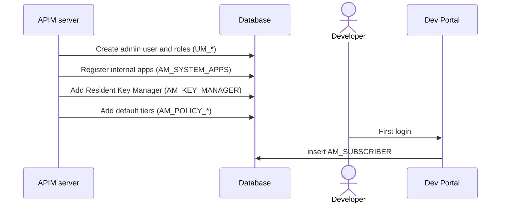

# Setup & first user

!!! abstract "What happens"
    When APIM starts for the first time, it fills in the rows everything else depends on: the super tenant, the admin user, a few internal OAuth apps, the built-in Key Manager and the default rate-limit tiers. Later, the first time a user opens the Developer Portal, APIM creates a *subscriber* row for them.

**Who:** APIM server at startup, then each user on first login · **Tables written:** [`UM_TENANT`](../reference/um.md#um_tenant), [`UM_USER`](../reference/um.md#um_user), [`AM_SYSTEM_APPS`](../reference/am.md#am_system_apps), [`AM_KEY_MANAGER`](../reference/am.md#am_key_manager), `AM_POLICY_*`, [`AM_SUBSCRIBER`](../reference/am.md#am_subscriber) · **Tables read:** [`UM_USER_ROLE`](../reference/um.md#um_user_role)

## The flow at a glance

This diagram shows the two moments that create "starter" data: server startup, and a user's first visit to the Developer Portal.



- The first four messages happen once, the first time the server starts against an empty database.
- The last message happens once per user, the first time they do anything in the Developer Portal.

## Step by step

!!! info "Most starter data comes from code, not SQL"
    In 4.7.0, the database scripts only insert a handful of rows (for example [`AM_ALERT_TYPES`](../reference/am.md#am_alert_types) and a few Identity Server lookup tables). The admin user, system apps, Key Manager and default tiers are all created **by the server at startup**. The exact order below is inferred from how APIM behaves, not from the SQL.

1. **Super tenant and admin user.** The shared DB's user store tables are populated.
    - The super tenant `carbon.super` has the fixed tenant ID **`-1234`**. In the JDBC user store it doesn't get a row in [`UM_TENANT`](../reference/um.md#um_tenant); only *extra* tenants do (`UM_ID`, `UM_DOMAIN_NAME`, `UM_ACTIVE`).
    - The admin user goes into [`UM_USER`](../reference/um.md#um_user) (`UM_USER_NAME = 'admin'`, `UM_TENANT_ID = -1234`), and roles such as `admin` and `Internal/subscriber` go into [`UM_ROLE`](../reference/um.md#um_role), [`UM_HYBRID_ROLE`](../reference/um.md#um_hybrid_role) and the user-role mapping tables.

    | UM_USER.UM_USER_NAME | UM_TENANT_ID |
    |---|---|
    | admin | -1234 |

2. **Internal OAuth apps.** The Publisher, Dev Portal and Admin Portal are single-page apps, and each needs its own OAuth client to call APIM's REST APIs. Their keys are stored in [`AM_SYSTEM_APPS`](../reference/am.md#am_system_apps) (`NAME`, `CONSUMER_KEY`, `CONSUMER_SECRET`, `TENANT_DOMAIN`). The matching OAuth client rows are in [`IDN_OAUTH_CONSUMER_APPS`](../reference/idn.md#idn_oauth_consumer_apps).

    | NAME | CONSUMER_KEY | TENANT_DOMAIN |
    |---|---|---|
    | apim_devportal | `x7Kp…` | carbon.super |
    | apim_publisher | `Qa2m…` | carbon.super |

3. **Resident Key Manager.** One row is added to [`AM_KEY_MANAGER`](../reference/am.md#am_key_manager) with `NAME = 'Resident Key Manager'`, `TYPE = 'default'`, `ORGANIZATION = 'carbon.super'`, and a generated `UUID`. Its settings (token endpoint, grant types and so on) live in the `CONFIGURATION` blob.

4. **Default tiers.** The default rate-limit policies are inserted:
    - subscription tiers such as `Gold`, `Silver`, `Bronze`, `Unlimited` and `Unauthenticated` into [`AM_POLICY_SUBSCRIPTION`](../reference/am.md#am_policy_subscription),
    - application tiers such as `10PerMin` and `Unlimited` into [`AM_POLICY_APPLICATION`](../reference/am.md#am_policy_application),
    - resource tiers such as `10KPerMin` and `Unlimited` into [`AM_API_THROTTLE_POLICY`](../reference/am.md#am_api_throttle_policy).

    All of them are keyed by `(NAME, TENANT_ID)`.

5. **First Dev Portal action → subscriber.** The first time a user creates an application, or even just opens the portal, APIM inserts a row into [`AM_SUBSCRIBER`](../reference/am.md#am_subscriber). It is unique on `(TENANT_ID, USER_ID)`. APIM then creates the user's **DefaultApplication** straight away (see [Create an application](07-create-application.md)).

    | SUBSCRIBER_ID | USER_ID | TENANT_ID | EMAIL_ADDRESS |
    |---|---|---|---|
    | 1 | admin | -1234 | admin@example.com |

!!! warning "Logical link (no foreign key)"
    `AM_SUBSCRIBER.USER_ID` holds a **username**, not a foreign key. It matches `UM_USER.UM_USER_NAME` when you use the JDBC user store, but if users live in LDAP or Active Directory there's no user row in the database at all. `TENANT_ID` columns across APIM point at `UM_TENANT.UM_ID` by value only (`-1234` = super tenant).

6. **Organizations (optional).** If you enable organizations, [`AM_ORGANIZATION_MAPPING`](../reference/am.md#am_organization_mapping) maps an APIM organization (`ORG_UUID`) to an external one (`EXT_ORG_ID`, `PARENT_ORG_UUID`). Most 4.x tables have an `ORGANIZATION` column. By default it holds the tenant domain (`carbon.super`).

## What gets cleaned up

This data is almost never deleted.
- Deleting an [`AM_SUBSCRIBER`](../reference/am.md#am_subscriber) row is **blocked** (`ON DELETE RESTRICT`) while the subscriber still owns applications.
- Disabling a tenant sets `UM_TENANT.UM_ACTIVE = false` rather than deleting the row.

## Try it

This query lists the internal apps and the Key Managers configured for the super tenant.

```sql
SELECT NAME, CONSUMER_KEY, TENANT_DOMAIN FROM AM_SYSTEM_APPS;

SELECT NAME, TYPE, ENABLED, ORGANIZATION FROM AM_KEY_MANAGER;

SELECT SUBSCRIBER_ID, USER_ID, TENANT_ID, DATE_SUBSCRIBED FROM AM_SUBSCRIBER;
```

!!! note "Different in 3.x"
    3.x bootstraps the same way. The main difference is that tables are scoped by `TENANT_ID` rather than an `ORGANIZATION` column. See [3.x: Setup & first user](../../apim-3/flows/01-bootstrap.md).

**Related domains:** [Tenants & users](../domains/tenancy-users.md) · [Keys & tokens](../domains/keys-tokens.md) · [Throttling policies](../domains/throttling.md)
