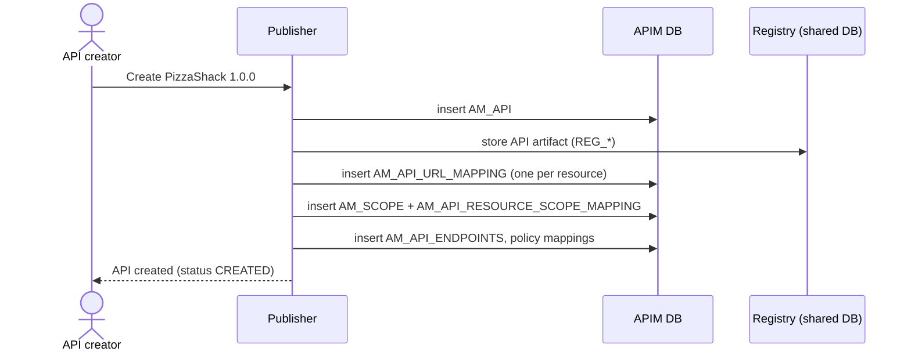

# Create an API

!!! abstract "What happens"
    An API creator designs an API in the Publisher: its name, version, context, resources (verb + path), scopes, endpoints and policies. APIM stores the searchable core in `AM_API` and one row per resource in `AM_API_URL_MAPPING`, and keeps the full API description in the registry.

**Who:** API creator (Publisher portal or REST API) · **Tables written:** [`AM_API`](../reference/am.md#am_api), [`AM_API_URL_MAPPING`](../reference/am.md#am_api_url_mapping), [`AM_SCOPE`](../reference/am.md#am_scope), [`AM_API_RESOURCE_SCOPE_MAPPING`](../reference/am.md#am_api_resource_scope_mapping), [`AM_API_ENDPOINTS`](../reference/am.md#am_api_endpoints), [`AM_API_OPERATION_POLICY_MAPPING`](../reference/am.md#am_api_operation_policy_mapping), `REG_*` · **Tables read:** [`AM_API_THROTTLE_POLICY`](../reference/am.md#am_api_throttle_policy), [`AM_SHARED_SCOPE`](../reference/am.md#am_shared_scope), [`AM_OPERATION_POLICY`](../reference/am.md#am_operation_policy)

## The flow at a glance

This diagram shows what gets saved when a creator clicks **Create** and then adds resources and scopes.



- The API isn't live yet. Nothing reaches a gateway until you [deploy a revision](04-deploy-revision.md).
- All these rows describe the **working copy** of the API (the "current API"), not a revision.

## Step by step

1. **The API row.** One row goes into [`AM_API`](../reference/am.md#am_api).
    - The API gets a numeric `API_ID` (used by older tables) and a string `API_UUID` (used by newer ones).
    - `API_PROVIDER`, `API_NAME`, `API_VERSION` and `ORGANIZATION` together must be unique.
    - Other columns: `CONTEXT` (the URL prefix), `API_TYPE` (`HTTP`, `WS`, `GRAPHQL`, `SOAP`, `WEBSUB`, `SSE`, `ASYNC` … or `APIProduct`), and `STATUS = 'CREATED'`.

    | API_ID | API_UUID | API_NAME | API_VERSION | CONTEXT | API_TYPE | STATUS | ORGANIZATION |
    |---|---|---|---|---|---|---|---|
    | 7 | `5f3c…a1` | PizzaShackAPI | 1.0.0 | /pizzashack/1.0.0 | HTTP | CREATED | carbon.super |

2. **The registry artifact.** The rest of the API goes to the registry, in the `REG_*` tables of the shared DB: description, tags, visibility, business owner, the OpenAPI definition and so on. See the [Registry](../domains/registry.md) domain.

    !!! warning "Logical link (no foreign key)"
        The registry artifact and the `AM_API` row are tied together by the API UUID. There is no database constraint between the APIM DB and the shared DB.

3. **Resources.** Each verb + path becomes one row in [`AM_API_URL_MAPPING`](../reference/am.md#am_api_url_mapping), linked by `API_ID`. Each row carries:
    - the resource-level rate limit in `THROTTLING_TIER`, e.g. `Unlimited`, which matches [`AM_API_THROTTLE_POLICY`](../reference/am.md#am_api_throttle_policy)`.NAME`,
    - `AUTH_SCHEME` (`Any`, `None` …),
    - `REVISION_UUID`, which is empty for the working copy.

    | URL_MAPPING_ID | API_ID | HTTP_METHOD | URL_PATTERN | AUTH_SCHEME | THROTTLING_TIER | REVISION_UUID |
    |---|---|---|---|---|---|---|
    | 101 | 7 | GET | /menu | Any | Unlimited | *(null)* |
    | 102 | 7 | POST | /order | Any | 10KPerMin | *(null)* |

    !!! warning "Logical link (no foreign key)"
        `AM_API_URL_MAPPING.API_ID` → `AM_API.API_ID` has **no FK** in 4.7.0. Deleting an API relies on APIM's code to remove these rows.

4. **Scopes.**
    - A local scope, such as `order:write`, is saved in [`AM_SCOPE`](../reference/am.md#am_scope) (`SCOPE_ID`, `NAME`, `TENANT_ID`), with its role bindings in [`AM_SCOPE_BINDING`](../reference/am.md#am_scope_binding).
    - With the Resident Key Manager, the same scope is also registered in [`IDN_OAUTH2_SCOPE`](../reference/idn.md#idn_oauth2_scope).
    - Each resource that needs the scope gets a row in [`AM_API_RESOURCE_SCOPE_MAPPING`](../reference/am.md#am_api_resource_scope_mapping), which links `SCOPE_NAME` to `URL_MAPPING_ID`. This FK cascades on delete.
    - Scopes shared between APIs are defined once in [`AM_SHARED_SCOPE`](../reference/am.md#am_shared_scope) and are only *referenced* by name here.

    | SCOPE_NAME | URL_MAPPING_ID |
    |---|---|
    | order:write | 102 |

    !!! warning "Logical link (no foreign key)"
        The mapping points to the scope by **name**. `AM_SCOPE.NAME` ↔ `IDN_OAUTH2_SCOPE.NAME` is also a name match. See [Scopes](../domains/scopes.md).

5. **Endpoints.** Backend URLs for production and sandbox are stored in [`AM_API_ENDPOINTS`](../reference/am.md#am_api_endpoints).
    - Each row has `API_UUID`, `ENDPOINT_UUID`, `ENDPOINT_NAME` and `KEY_TYPE`, with the config in the `ENDPOINT_CONFIG` blob.
    - `REVISION_UUID = 'Current API'` for the working copy.
    - [`AM_API_PRIMARY_EP_MAPPING`](../reference/am.md#am_api_primary_ep_mapping) records which endpoint is the primary one.

6. **Optional extras**, all linked to the API:
    - **Operation policies** (e.g. "add header") attached to a resource go into [`AM_API_OPERATION_POLICY_MAPPING`](../reference/am.md#am_api_operation_policy_mapping) (`URL_MAPPING_ID`, `POLICY_UUID`, `DIRECTION`, `POLICY_ORDER`). API-level policies go into [`AM_API_POLICY_MAPPING`](../reference/am.md#am_api_policy_mapping). See [Operation policies](../domains/operation-policies.md).
    - **Labels:** [`AM_API_LABEL_MAPPING`](../reference/am.md#am_api_label_mapping) (`API_UUID`, `LABEL_UUID`).
    - **GraphQL** query-complexity values: [`AM_GRAPHQL_COMPLEXITY`](../reference/am.md#am_graphql_complexity).
    - **Mutual-TLS client certificates:** [`AM_API_CLIENT_CERTIFICATE`](../reference/am.md#am_api_client_certificate).
    - **Created from the Service Catalog:** [`AM_API_SERVICE_MAPPING`](../reference/am.md#am_api_service_mapping) (`API_ID`, `SERVICE_KEY`).
    - **Extra key/value metadata:** [`AM_API_METADATA`](../reference/am.md#am_api_metadata).

## What gets cleaned up

When an API is deleted, many child tables clean themselves up through `ON DELETE CASCADE`. These include:
- [`AM_REVISION`](../reference/am.md#am_revision)
- [`AM_API_ENDPOINTS`](../reference/am.md#am_api_endpoints)
- [`AM_API_LABEL_MAPPING`](../reference/am.md#am_api_label_mapping)
- [`AM_API_POLICY_MAPPING`](../reference/am.md#am_api_policy_mapping)
- [`AM_GRAPHQL_COMPLEXITY`](../reference/am.md#am_graphql_complexity)
- [`AM_API_CLIENT_CERTIFICATE`](../reference/am.md#am_api_client_certificate)
- [`AM_API_LC_EVENT`](../reference/am.md#am_api_lc_event)
- [`AM_SUBSCRIPTION`](../reference/am.md#am_subscription)

The URL mappings have no FK, so APIM's code deletes them. That delete then cascades on to the scope and operation-policy mappings.

Two tables **block** the delete (`RESTRICT`) until their rows are removed first: [`AM_EXTERNAL_STORES`](../reference/am.md#am_external_stores) and [`AM_API_METADATA`](../reference/am.md#am_api_metadata), which has no ON DELETE rule. For the full picture, see [Revoke & delete](12-revocation-and-delete.md).

## Try it

This query shows an API's resources with the scope each one needs.

```sql
SELECT a.API_NAME, a.API_VERSION, u.HTTP_METHOD, u.URL_PATTERN,
       u.THROTTLING_TIER, s.SCOPE_NAME
FROM AM_API a
JOIN AM_API_URL_MAPPING u ON u.API_ID = a.API_ID AND u.REVISION_UUID IS NULL
LEFT JOIN AM_API_RESOURCE_SCOPE_MAPPING s ON s.URL_MAPPING_ID = u.URL_MAPPING_ID
WHERE a.API_NAME = 'PizzaShackAPI'
ORDER BY u.URL_PATTERN, u.HTTP_METHOD;
```

!!! note "Different in 3.x"
    In 3.x, `AM_API` has **no `API_UUID`** column (the UUID lives only in the registry), no `ORGANIZATION`, `STATUS` or `REVISION_UUID` columns, and no endpoint or operation-policy tables. See [3.x: Create an API](../../apim-3/flows/02-create-api.md).

**Related domains:** [API definition](../domains/api-definition.md) · [Scopes](../domains/scopes.md) · [Operation policies](../domains/operation-policies.md) · [Registry](../domains/registry.md)
