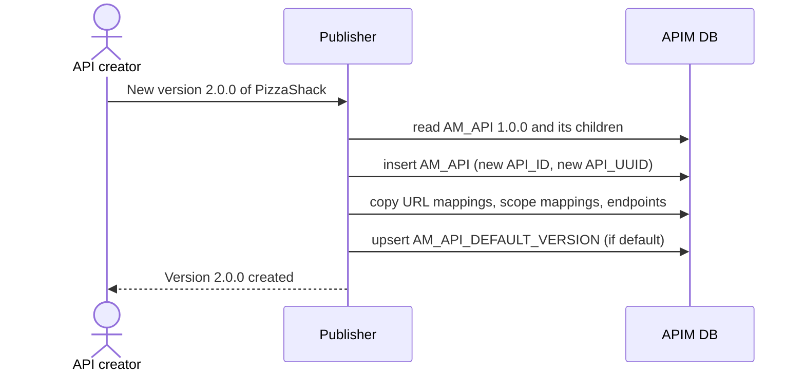

# Create a new version

!!! abstract "What happens"
    The creator copies an existing API into a new version, for example PizzaShack 1.0.0 → 2.0.0. In the database, a new version is simply **a brand-new API**: a new `AM_API` row with the same name and provider. It gets its own resources and scopes. Optionally, one version is marked as the *default version*.

**Who:** API creator (Publisher) · **Tables written:** [`AM_API`](../reference/am.md#am_api), [`AM_API_URL_MAPPING`](../reference/am.md#am_api_url_mapping), [`AM_API_RESOURCE_SCOPE_MAPPING`](../reference/am.md#am_api_resource_scope_mapping), [`AM_API_ENDPOINTS`](../reference/am.md#am_api_endpoints), [`AM_API_DEFAULT_VERSION`](../reference/am.md#am_api_default_version) · **Tables read:** everything belonging to the source version

## The flow at a glance

This diagram shows a new version being copied from an existing one.



- The new version always starts in the `CREATED` state and has no revisions yet.
- Existing subscriptions are **not** copied, because they belong to the old version's `API_ID`. There is an optional "copy subscriptions" feature, but it runs only when the new version is published.

## Step by step

1. **New API row.** A new row goes into [`AM_API`](../reference/am.md#am_api). It has the same `API_PROVIDER` and `API_NAME` but a new `API_VERSION`, a new `API_ID` and `API_UUID`, and a `CONTEXT` that includes the new version. `VERSION_COMPARABLE` holds a sortable form of the version string, so APIM can find the "latest" version.

    | API_ID | API_NAME | API_VERSION | CONTEXT | STATUS |
    |---|---|---|---|---|
    | 7 | PizzaShackAPI | 1.0.0 | /pizzashack/1.0.0 | PUBLISHED |
    | 12 | PizzaShackAPI | 2.0.0 | /pizzashack/2.0.0 | CREATED |

2. **Children copied.** The working copy's resources ([`AM_API_URL_MAPPING`](../reference/am.md#am_api_url_mapping)) are recreated under the new `API_ID`, together with their scope mappings, operation-policy mappings, endpoints and so on. The registry artifact is also copied.

3. **Default version (optional).** If the creator ticks **Make this the default version**, [`AM_API_DEFAULT_VERSION`](../reference/am.md#am_api_default_version) is updated. It holds **one row per API name + provider**:
    - `DEFAULT_API_VERSION` is the version that clients get when they call the context *without* a version, e.g. `/pizzashack/menu`.
    - `PUBLISHED_DEFAULT_API_VERSION` is the default version that is actually published right now.

    | API_NAME | API_PROVIDER | DEFAULT_API_VERSION | PUBLISHED_DEFAULT_API_VERSION | ORGANIZATION |
    |---|---|---|---|---|
    | PizzaShackAPI | admin | 2.0.0 | 1.0.0 | carbon.super |

    !!! warning "Logical link (no foreign key)"
        `AM_API_DEFAULT_VERSION` links to [`AM_API`](../reference/am.md#am_api) by **name + provider + version strings**, not by id. Renaming or deleting versions relies on APIM's code to keep it consistent.

## What gets cleaned up

- Deleting one version deletes only that version's `AM_API` row and its children (see [Create an API](02-create-api.md#what-gets-cleaned-up)).
- The `AM_API_DEFAULT_VERSION` row is removed or updated by code, not by a cascade.

## Try it

This query lists all versions of an API and shows which one is the default.

```sql
SELECT a.API_NAME, a.API_VERSION, a.STATUS,
       d.DEFAULT_API_VERSION, d.PUBLISHED_DEFAULT_API_VERSION
FROM AM_API a
LEFT JOIN AM_API_DEFAULT_VERSION d
       ON d.API_NAME = a.API_NAME AND d.API_PROVIDER = a.API_PROVIDER
      AND d.ORGANIZATION = a.ORGANIZATION
WHERE a.API_NAME = 'PizzaShackAPI'
ORDER BY a.VERSION_COMPARABLE;
```

!!! note "Different in 3.x"
    3.x works the same way, but has no `ORGANIZATION` or `VERSION_COMPARABLE` columns, and no endpoint tables to copy. See [3.x: Create a new version](../../apim-3/flows/03-new-version.md).

**Related domains:** [API definition](../domains/api-definition.md) · [Lifecycle & labels](../domains/lifecycle-labels.md)
