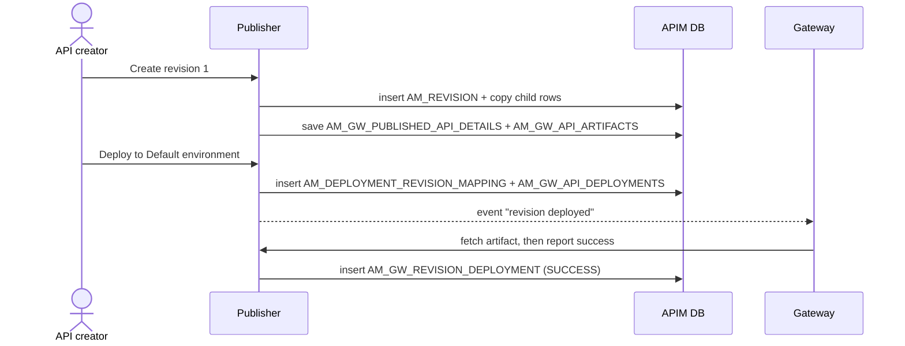

# Deploy a revision

!!! abstract "What happens"
    The creator takes a **revision**, a frozen snapshot of the API, and deploys it to one or more **gateway environments**. APIM:

    1. copies the API's resources, scopes and policies under a new `REVISION_UUID`, and builds the ready-to-run gateway artifact straight away,
    2. records which environment the revision should run on,
    3. records each gateway's confirmation once it has deployed the artifact.

!!! success "Verified on a running server"
    Confirmed on WSO2 APIM 4.7.0 (embedded H2, default config) by creating revision 1 of `PizzaShackAPI 1.0.0` and deploying it to the built-in `Default` environment. Surprises:

    - **The gateway artifact is built when the revision is *created*, not when it's deployed.** [`AM_GW_PUBLISHED_API_DETAILS`](../reference/am.md#am_gw_published_api_details) and [`AM_GW_API_ARTIFACTS`](../reference/am.md#am_gw_api_artifacts) were written by the *Create revision* call.
    - **[`AM_DEPLOYED_REVISION`](../reference/am.md#am_deployed_revision) was never written.** The gateway's confirmation was recorded in [`AM_GW_REVISION_DEPLOYMENT`](../reference/am.md#am_gw_revision_deployment) (`STATUS = 'SUCCESS'`, `ACTION = 'DEPLOY'`).
    - **`VHOST` was stored as `NULL`** in [`AM_DEPLOYMENT_REVISION_MAPPING`](../reference/am.md#am_deployment_revision_mapping), even though the request asked for `localhost`.
    - **The `Default` environment isn't in the database.** [`AM_GATEWAY_ENVIRONMENT`](../reference/am.md#am_gateway_environment) and [`AM_GW_VHOST`](../reference/am.md#am_gw_vhost) stayed empty, because the environment comes from `deployment.toml`.

**Who:** API creator (Publisher), then each Gateway · **Tables written:** [`AM_REVISION`](../reference/am.md#am_revision), [`AM_API_REVISION_METADATA`](../reference/am.md#am_api_revision_metadata), revision copies in `AM_API_URL_MAPPING` / `AM_API_RESOURCE_SCOPE_MAPPING` / …, [`AM_GW_PUBLISHED_API_DETAILS`](../reference/am.md#am_gw_published_api_details), [`AM_GW_API_ARTIFACTS`](../reference/am.md#am_gw_api_artifacts), [`AM_DEPLOYMENT_REVISION_MAPPING`](../reference/am.md#am_deployment_revision_mapping), [`AM_GW_API_DEPLOYMENTS`](../reference/am.md#am_gw_api_deployments), [`AM_GW_REVISION_DEPLOYMENT`](../reference/am.md#am_gw_revision_deployment) · **Tables read:** [`AM_GATEWAY_ENVIRONMENT`](../reference/am.md#am_gateway_environment), [`AM_GW_VHOST`](../reference/am.md#am_gw_vhost), [`AM_GW_INSTANCES`](../reference/am.md#am_gw_instances)

## The flow at a glance

This diagram shows a revision going from "snapshot" to "running on a gateway".



- The gateway pulls the artifact through an internal REST API on the control plane rather than reading the database directly.
- `AM_DEPLOYMENT_REVISION_MAPPING` means "we *asked* for this". `AM_GW_REVISION_DEPLOYMENT` means "this gateway *confirmed* it".

## Step by step

1. **Create the revision.** A new row goes into [`AM_REVISION`](../reference/am.md#am_revision).
    - `ID` is the revision number (1, 2, 3 …) *per API*, so the primary key is `(ID, API_UUID)`.
    - `REVISION_UUID` is the global identifier that every copied row points to.
    - `AM_API.REVISIONS_CREATED` goes up by one (0 → 1 in the test). An API can keep only a limited number of revisions (5 by default).

    | ID | API_UUID | REVISION_UUID | DESCRIPTION | CREATED_BY |
    |---|---|---|---|---|
    | 1 | `b41b…` | `4b45…` | first revision | *(null)* |

2. **Snapshot the child rows.** The working copy's rows are **copied** with the new `REVISION_UUID` filled in. In the test that was the two URL mappings and the scope mapping. Operation-policy mappings, client certificates and GraphQL complexity are copied the same way when they exist.
    - [`AM_API_REVISION_METADATA`](../reference/am.md#am_api_revision_metadata) stores the API-level tier at snapshot time (`API_UUID`, `REVISION_UUID`, `API_TIER = 'Unlimited'`).
    - The registry artifact is also copied, into a revision path.

    | URL_MAPPING_ID | API_ID | HTTP_METHOD | URL_PATTERN | REVISION_UUID |
    |---|---|---|---|---|
    | 1 | 1 | GET | /menu | *(null = working copy)* |
    | 5 | 1 | GET | /menu | `4b45…` |

    !!! warning "Logical link (no foreign key)"
        Most copied tables point at the revision through a plain `REVISION_UUID` column with no FK. The value **`'Current API'`** (in `AM_API_ENDPOINTS`, `AM_API_PRIMARY_EP_MAPPING` and `AM_BACKEND`) or **NULL** (in `AM_API_URL_MAPPING`) means "the working copy, not a revision".

3. **Build the gateway artifact (still at revision creation).**
    - [`AM_GW_PUBLISHED_API_DETAILS`](../reference/am.md#am_gw_published_api_details) gets one row per API. Its `API_ID` holds the **API UUID string**, plus `TENANT_DOMAIN`, `API_NAME`, `API_VERSION` and `API_TYPE`. In the test `API_PROVIDER` was `NULL` and `API_TYPE` was `http`.
    - [`AM_GW_API_ARTIFACTS`](../reference/am.md#am_gw_api_artifacts) stores the built artifact, a zip file in the `ARTIFACT` blob, keyed by `(REVISION_ID, API_ID)`, where `REVISION_ID` is the revision UUID.
    - Updating the API also queues a new governance check (`GOV_REQUEST`), because the default policy governs `API_UPDATE` too. See [Governance check](14-governance.md).

    | AM_GW_API_ARTIFACTS.API_ID | REVISION_ID | ARTIFACT |
    |---|---|---|
    | `b41b…` | `4b45…` | *(zip blob)* |

4. **Choose where to deploy.** Gateway environments created in the Admin Portal live in [`AM_GATEWAY_ENVIRONMENT`](../reference/am.md#am_gateway_environment) (`UUID`, `NAME`, `GATEWAY_TYPE`, `ORGANIZATION`). Their hostnames live in [`AM_GW_VHOST`](../reference/am.md#am_gw_vhost), where `GATEWAY_ENV_ID` is an FK to `AM_GATEWAY_ENVIRONMENT.ID`.

    !!! info "Environments from the config file"
        The environments defined in `deployment.toml`, such as the built-in **Default** environment, are **not** stored in `AM_GATEWAY_ENVIRONMENT`. In the test both tables stayed empty.

5. **Request the deployment.** One row per environment goes into [`AM_DEPLOYMENT_REVISION_MAPPING`](../reference/am.md#am_deployment_revision_mapping).
    - `NAME` is the environment name and `VHOST` is the chosen host. For the config-file `Default` environment it was stored as `NULL`.
    - `REVISION_STATUS` is `APPROVED`, or `CREATED` while a [revision-deployment workflow](13-approval-workflows.md) is pending.
    - `DISPLAY_ON_DEVPORTAL` controls whether the Dev Portal shows this gateway URL.

    [`AM_GW_API_DEPLOYMENTS`](../reference/am.md#am_gw_api_deployments) also gets a row saying which environment label each revision targets (`API_ID` = API UUID, `REVISION_ID`, `LABEL = 'Default'`, `VHOST`).

    | NAME | VHOST | REVISION_UUID | REVISION_STATUS | DISPLAY_ON_DEVPORTAL |
    |---|---|---|---|---|
    | Default | *(null)* | `4b45…` | APPROVED | true |

    !!! warning "Logical link (no foreign key)"
        `NAME` matches an environment **by name**, either `AM_GATEWAY_ENVIRONMENT.NAME` or a `deployment.toml` environment. There's no FK.

6. **Gateway confirms.** Each gateway registers itself in [`AM_GW_INSTANCES`](../reference/am.md#am_gw_instances) and updates a heartbeat there. After it deploys the artifact, APIM records its per-API state in [`AM_GW_REVISION_DEPLOYMENT`](../reference/am.md#am_gw_revision_deployment).
    - Only one revision of an API can be deployed to a given environment at a time. Deploying revision 2 replaces revision 1 there.

    | GATEWAY_ID | API_ID | ORGANIZATION | STATUS | ACTION | REVISION_UUID |
    |---|---|---|---|---|---|
    | 1 | `b41b…` | carbon.super | SUCCESS | DEPLOY | `4b45…` |

    !!! warning "`AM_DEPLOYED_REVISION` stays empty"
        The schema also has [`AM_DEPLOYED_REVISION`](../reference/am.md#am_deployed_revision) (`NAME`, `VHOST`, `REVISION_UUID`, `DEPLOYED_TIME`), which older docs describe as the "confirmed" table. In 4.7.0 with the built-in gateway, it was **not written** during deployment. Use `AM_GW_REVISION_DEPLOYMENT` to see what gateways actually confirmed.

!!! info "Federated and third-party gateways"
    For external gateways such as AWS, Azure or Kong:
    - [`AM_API_EXTERNAL_API_MAPPING`](../reference/am.md#am_api_external_api_mapping) links the APIM API to its ID on the external gateway.
    - [`AM_GATEWAY_TOKEN`](../reference/am.md#am_gateway_token) and the `AM_GW_PLATFORM_*` tables support gateways that register themselves.

    See [Revisions & deployment](../domains/revisions-deployment.md). These weren't exercised in the test.

## What gets cleaned up

- **Undeploying** removes the environment's row from `AM_DEPLOYMENT_REVISION_MAPPING`. The gateways' state in `AM_GW_REVISION_DEPLOYMENT` is expected to change too, though undeploying wasn't tested.
- **Deleting a revision** cascades to `AM_DEPLOYMENT_REVISION_MAPPING`, `AM_DEPLOYED_REVISION` and `AM_API_REVISION_METADATA`. The copied URL mappings and so on are removed by code.
- **Deleting the API** cascades to `AM_REVISION`, and from there to everything above. APIM refuses to delete an API that still has subscriptions, though (see [Revoke & delete](12-revocation-and-delete.md)).
- **Deleting an environment** cascades to its VHosts, permissions and gateway tokens.

## Try it

This query shows where each revision of an API is requested, and what each gateway reported.

```sql
SELECT a.API_NAME, a.API_VERSION, r.ID AS REVISION_NO,
       m.NAME AS ENVIRONMENT, m.REVISION_STATUS,
       g.STATUS AS GATEWAY_STATUS, g.ACTION
FROM AM_API a
JOIN AM_REVISION r ON r.API_UUID = a.API_UUID
JOIN AM_DEPLOYMENT_REVISION_MAPPING m ON m.REVISION_UUID = r.REVISION_UUID
LEFT JOIN AM_GW_REVISION_DEPLOYMENT g
       ON g.REVISION_UUID = r.REVISION_UUID AND g.API_ID = a.API_UUID
WHERE a.API_NAME = 'PizzaShackAPI';
```

!!! note "Different in 3.x"
    3.x has **no revisions**. Publishing an API pushes it to the gateway environments in `deployment.toml`, and every change to a published API goes live immediately. The optional database sync writes `AM_GW_API_ARTIFACTS` keyed by a **gateway label**, with a `Publish` or `Remove` instruction. It's off by default, so those tables are usually empty. See [3.x: Publish to the gateway](../../apim-3/flows/04-publish-to-gateway.md).

**Related domains:** [Revisions & deployment](../domains/revisions-deployment.md) · [API definition](../domains/api-definition.md)
