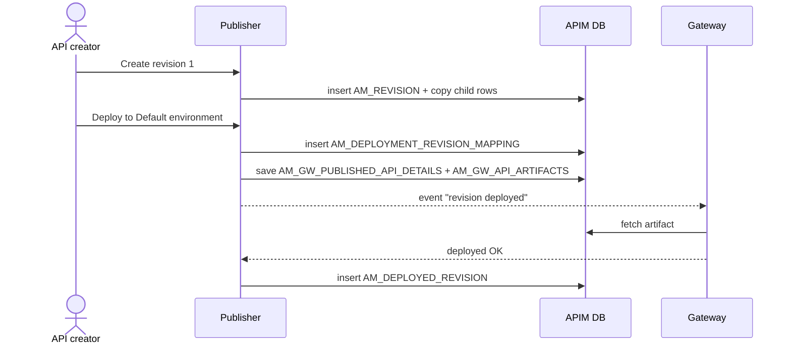

# Deploy a revision

!!! abstract "What happens"
    The creator takes a **revision**, a frozen snapshot of the API, and deploys it to one or more **gateway environments**. APIM:

    1. copies the API's resources, scopes, endpoints and policies under a new `REVISION_UUID`,
    2. records which environment the revision should run on,
    3. saves the ready-to-run gateway artifact,
    4. marks the deployment as done once each gateway confirms it.

**Who:** API creator (Publisher), then each Gateway · **Tables written:** [`AM_REVISION`](../reference/am.md#am_revision), [`AM_API_REVISION_METADATA`](../reference/am.md#am_api_revision_metadata), revision copies in `AM_API_URL_MAPPING` / `AM_API_ENDPOINTS` / …, [`AM_DEPLOYMENT_REVISION_MAPPING`](../reference/am.md#am_deployment_revision_mapping), [`AM_GW_PUBLISHED_API_DETAILS`](../reference/am.md#am_gw_published_api_details), [`AM_GW_API_ARTIFACTS`](../reference/am.md#am_gw_api_artifacts), [`AM_DEPLOYED_REVISION`](../reference/am.md#am_deployed_revision) · **Tables read:** [`AM_GATEWAY_ENVIRONMENT`](../reference/am.md#am_gateway_environment), [`AM_GW_VHOST`](../reference/am.md#am_gw_vhost)

## The flow at a glance

This diagram shows a revision going from "snapshot" to "running on a gateway".



- In practice the gateway pulls the artifact through an internal REST API on the control plane rather than reading the database directly. The diagram shortens this to "fetch".
- `AM_DEPLOYMENT_REVISION_MAPPING` means "we *asked* for this". `AM_DEPLOYED_REVISION` means "the gateway *confirmed* it".

## Step by step

1. **Create the revision.** A new row goes into [`AM_REVISION`](../reference/am.md#am_revision).
    - `ID` is the revision number (1, 2, 3 …) *per API*, so the primary key is `(ID, API_UUID)`.
    - `REVISION_UUID` is the global identifier that every copied row points to.
    - `AM_API.REVISIONS_CREATED` is incremented. An API can keep only a limited number of revisions (5 by default).

    | ID | API_UUID | REVISION_UUID | DESCRIPTION | CREATED_BY |
    |---|---|---|---|---|
    | 1 | `5f3c…a1` | `9b7e…04` | First release | admin |

2. **Snapshot the child rows.** The working copy's rows are **copied** with the new `REVISION_UUID` filled in. That includes URL mappings, scope mappings, operation-policy mappings, endpoints, client certificates and GraphQL complexity.
    - [`AM_API_REVISION_METADATA`](../reference/am.md#am_api_revision_metadata) stores the API-level tier at snapshot time (`API_UUID`, `REVISION_UUID`, `API_TIER`).
    - The registry artifact is also copied, into a revision path.

    | URL_MAPPING_ID | API_ID | HTTP_METHOD | URL_PATTERN | REVISION_UUID |
    |---|---|---|---|---|
    | 101 | 7 | GET | /menu | *(null = working copy)* |
    | 205 | 7 | GET | /menu | `9b7e…04` |

    !!! warning "Logical link (no foreign key)"
        Most copied tables point at the revision through a plain `REVISION_UUID` column with no FK. The value **`'Current API'`** (in `AM_API_ENDPOINTS` and `AM_BACKEND`) or **NULL** (in `AM_API_URL_MAPPING`) means "the working copy, not a revision".

3. **Choose where to deploy.** Gateway environments live in [`AM_GATEWAY_ENVIRONMENT`](../reference/am.md#am_gateway_environment) (`UUID`, `NAME`, `GATEWAY_TYPE`, `ORGANIZATION`). Their hostnames live in [`AM_GW_VHOST`](../reference/am.md#am_gw_vhost), where `GATEWAY_ENV_ID` is an FK to `AM_GATEWAY_ENVIRONMENT.ID`.

    !!! info "Environments from the config file"
        The environments defined in `deployment.toml`, such as the built-in **Default** environment, are **not** stored in `AM_GATEWAY_ENVIRONMENT`. Only environments created in the Admin Portal are.

4. **Request the deployment.** One row per environment goes into [`AM_DEPLOYMENT_REVISION_MAPPING`](../reference/am.md#am_deployment_revision_mapping).
    - `NAME` is the environment name and `VHOST` is the chosen host.
    - `REVISION_STATUS` is `APPROVED`, or `CREATED` while a [revision-deployment workflow](13-approval-workflows.md) is pending.
    - `DISPLAY_ON_DEVPORTAL` controls whether the Dev Portal shows this gateway URL.

    | NAME | VHOST | REVISION_UUID | REVISION_STATUS | DISPLAY_ON_DEVPORTAL |
    |---|---|---|---|---|
    | Default | localhost | `9b7e…04` | APPROVED | true |

    !!! warning "Logical link (no foreign key)"
        `NAME` matches an environment **by name**, either `AM_GATEWAY_ENVIRONMENT.NAME` or a `deployment.toml` environment. There's no FK.

5. **Save the gateway artifact.**
    - [`AM_GW_PUBLISHED_API_DETAILS`](../reference/am.md#am_gw_published_api_details) gets one row per API. Its `API_ID` holds the **API UUID string**, along with the name, version, tenant domain and `API_TYPE`.
    - [`AM_GW_API_ARTIFACTS`](../reference/am.md#am_gw_api_artifacts) stores the built artifact blob, keyed by `(REVISION_ID, API_ID)`, where `REVISION_ID` is the revision UUID.
    - [`AM_GW_API_DEPLOYMENTS`](../reference/am.md#am_gw_api_deployments) records which label/environment and VHost each revision's artifact targets.

    | AM_GW_API_ARTIFACTS.API_ID | REVISION_ID | ARTIFACT |
    |---|---|---|
    | `5f3c…a1` | `9b7e…04` | *(blob)* |

6. **Gateway confirms.** When a gateway reports success, APIM inserts the same `(NAME, VHOST, REVISION_UUID)` into [`AM_DEPLOYED_REVISION`](../reference/am.md#am_deployed_revision).
    - Newer gateway-instance tracking also records each gateway in [`AM_GW_INSTANCES`](../reference/am.md#am_gw_instances), and its per-API state in [`AM_GW_REVISION_DEPLOYMENT`](../reference/am.md#am_gw_revision_deployment) (`STATUS`, `ACTION`, `REVISION_UUID`).
    - Only one revision of an API can be deployed to a given environment at a time. Deploying revision 2 replaces revision 1 there.

!!! info "Federated and third-party gateways"
    For external gateways such as AWS, Azure or Kong:
    - [`AM_API_EXTERNAL_API_MAPPING`](../reference/am.md#am_api_external_api_mapping) links the APIM API to its ID on the external gateway.
    - [`AM_GATEWAY_TOKEN`](../reference/am.md#am_gateway_token) and the `AM_GW_PLATFORM_*` tables support gateways that register themselves.

    See [Revisions & deployment](../domains/revisions-deployment.md).

## What gets cleaned up

- **Undeploying** removes the rows from `AM_DEPLOYMENT_REVISION_MAPPING` and `AM_DEPLOYED_REVISION`.
- **Deleting a revision** cascades to both of those tables and to `AM_API_REVISION_METADATA`. The copied URL mappings, endpoints and so on are removed by code.
- **Deleting the API** cascades to `AM_REVISION`, and from there to everything above.
- **Deleting an environment** cascades to its VHosts, permissions and gateway tokens.

## Try it

This query shows where each revision of an API is requested and where it's actually running.

```sql
SELECT a.API_NAME, a.API_VERSION, r.ID AS REVISION_NO,
       m.NAME AS ENVIRONMENT, m.VHOST, m.REVISION_STATUS,
       CASE WHEN d.REVISION_UUID IS NULL THEN 'pending' ELSE 'deployed' END AS GATEWAY_STATE
FROM AM_API a
JOIN AM_REVISION r ON r.API_UUID = a.API_UUID
JOIN AM_DEPLOYMENT_REVISION_MAPPING m ON m.REVISION_UUID = r.REVISION_UUID
LEFT JOIN AM_DEPLOYED_REVISION d
       ON d.REVISION_UUID = m.REVISION_UUID AND d.NAME = m.NAME
WHERE a.API_NAME = 'PizzaShackAPI';
```

!!! note "Different in 3.x"
    3.x has **no revisions**. Publishing an API writes the artifact straight into `AM_GW_API_ARTIFACTS`, keyed by a **gateway label** with a `PUBLISH` or `REMOVE` instruction. Every change to a published API goes live immediately. See [3.x: Publish to the gateway](../../apim-3/flows/04-publish-to-gateway.md).

**Related domains:** [Revisions & deployment](../domains/revisions-deployment.md) · [API definition](../domains/api-definition.md)
