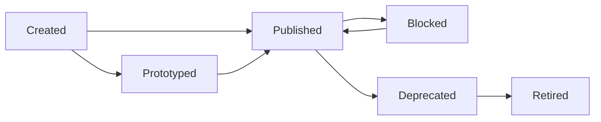
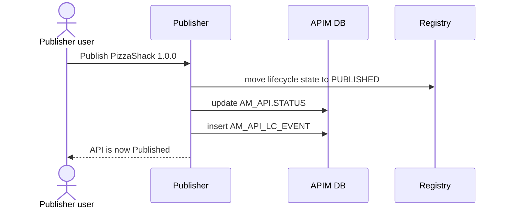

# Change lifecycle state

!!! abstract "What happens"
    A publisher moves an API through its lifecycle, e.g. *Created → Published*. APIM updates the API's state, logs the change in `AM_API_LC_EVENT` and, if an approval workflow is switched on, waits for approval first. Publishing is what makes an API visible in the Developer Portal.

!!! success "Verified on a running server"
    Confirmed on WSO2 APIM 4.7.0 (embedded H2, default config) by publishing `PizzaShackAPI 1.0.0` after deploying revision 1. The call updated `AM_API.STATUS` from `CREATED` to `PUBLISHED`, added exactly one [`AM_API_LC_EVENT`](../reference/am.md#am_api_lc_event) row, and changed the registry artifact's properties. Nothing else changed: there were no gateway tables, because the gateway already had the revision, and no [`AM_API_LC_PUBLISH_EVENTS`](../reference/am.md#am_api_lc_publish_events) row.

**Who:** API publisher (Publisher portal) · **Tables written:** [`AM_API`](../reference/am.md#am_api) (`STATUS`), [`AM_API_LC_EVENT`](../reference/am.md#am_api_lc_event), registry lifecycle properties (`REG_*`), optionally [`AM_WORKFLOWS`](../reference/am.md#am_workflows) · **Tables read:** [`AM_DEPLOYMENT_REVISION_MAPPING`](../reference/am.md#am_deployment_revision_mapping)

## The lifecycle states

These are the standard states and the usual moves between them.



- **Published** APIs can be seen and subscribed to in the Dev Portal. **Blocked** APIs stay visible but can't be called.
- **Deprecated** APIs accept no new subscriptions. **Retired** APIs are removed from the Dev Portal and the gateways.

## The flow at a glance

This diagram shows a publish action with no approval workflow.



- The lifecycle itself (the allowed states, checklist items and so on) is a registry lifecycle definition. The current state is kept both in the registry and in `AM_API.STATUS`.
- In 4.x, you can only publish an API that has at least one [deployed revision](04-deploy-revision.md). Advertise-only APIs are the exception.

## Step by step

1. **(Optional) approval.** If the *API state change* workflow is enabled:
    - APIM inserts a row into [`AM_WORKFLOWS`](../reference/am.md#am_workflows) with `WF_TYPE = 'AM_API_STATE'` and `WF_REFERENCE` set to the API's id, then waits.
    - The state change below only happens once `WF_STATUS` becomes `APPROVED`. See [Approval workflows](13-approval-workflows.md).

2. **State change.** The registry artifact's lifecycle state changes, and [`AM_API`](../reference/am.md#am_api)`.STATUS` is set to the new state (for example `PUBLISHED`).

3. **Audit trail.** One row goes into [`AM_API_LC_EVENT`](../reference/am.md#am_api_lc_event):

    | EVENT_ID | API_ID | PREVIOUS_STATE | NEW_STATE | USER_ID | TENANT_ID | EVENT_DATE |
    |---|---|---|---|---|---|---|
    | 1 | 1 | *(null)* | CREATED | admin | -1234 | 2026-09-26 10:46:37 |
    | 3 | 1 | CREATED | PUBLISHED | admin | -1234 | 2026-09-26 10:47:28 |

    Event 2 belongs to version 2.0.0 (API_ID 2), created in between.

    `API_ID` is a real FK to `AM_API.API_ID` with `ON DELETE CASCADE`, so an API's history disappears when the API is deleted.

4. **Side effects.**
    - **Publishing a new version** can deprecate older versions, and can copy their subscriptions to the new version ([`AM_SUBSCRIPTION`](../reference/am.md#am_subscription) rows under the new `API_ID`), if the publisher ticks those options.
    - **Publishing** also sets `PUBLISHED_DEFAULT_API_VERSION` in [`AM_API_DEFAULT_VERSION`](../reference/am.md#am_api_default_version) when this version is the default.
    - [`AM_API_LC_PUBLISH_EVENTS`](../reference/am.md#am_api_lc_publish_events) (`TENANT_DOMAIN`, `API_ID`, `EVENT_TIME`) is meant to record publish events for external consumers. It was **not** written when publishing in the test, and no shipped 4.7.0 code was found that uses it, so treat it as legacy.

## What gets cleaned up

- **Retiring** an API undeploys its revisions from the gateways. Its `AM_API` row and history stay until someone deletes the API.
- **Deleting** the API removes the `AM_API_LC_EVENT` rows by cascade.

## Try it

This query shows an API's full lifecycle history.

```sql
SELECT a.API_NAME, a.API_VERSION, e.PREVIOUS_STATE, e.NEW_STATE,
       e.USER_ID, e.EVENT_DATE
FROM AM_API_LC_EVENT e
JOIN AM_API a ON a.API_ID = e.API_ID
WHERE a.API_NAME = 'PizzaShackAPI'
ORDER BY e.EVENT_DATE;
```

!!! note "Different in 3.x"
    In 3.x, `AM_API` has **no `STATUS` column**, so the state lives only in the registry and `AM_API_LC_EVENT`. The `AM_API_LC_EVENT` FK is `ON DELETE RESTRICT` rather than cascade, and publishing pushes the API straight to the gateway. See [3.x: Change lifecycle state](../../apim-3/flows/05-lifecycle.md).

**Related domains:** [Lifecycle & labels](../domains/lifecycle-labels.md) · [Workflows](../domains/workflows.md) · [Registry](../domains/registry.md)
