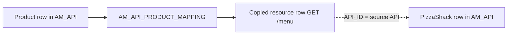
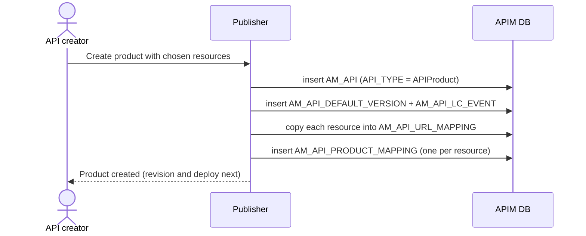

# Create an API product

!!! abstract "What happens"
    An API product bundles chosen resources from one or more APIs into a single thing that developers can subscribe to, for example a "Food Delivery" bundle. APIM stores the product as **another row in `AM_API`**, with `API_TYPE = 'APIProduct'`. For each chosen resource it makes a **copy** of the source API's resource row in `AM_API_URL_MAPPING`, and links the product to that copy through `AM_API_PRODUCT_MAPPING`.

!!! success "Verified on a running server"
    Confirmed on WSO2 APIM 4.7.0 (embedded H2, default config) by creating a product `FoodDelivery 1.0.0` containing `GET /menu` from `PizzaShackAPI 1.0.0`. The call wrote one [`AM_API`](../reference/am.md#am_api) row, one [`AM_API_DEFAULT_VERSION`](../reference/am.md#am_api_default_version) row, one [`AM_API_LC_EVENT`](../reference/am.md#am_api_lc_event) (`NULL → CREATED`), one [`AM_API_URL_MAPPING`](../reference/am.md#am_api_url_mapping) row, one [`AM_API_PRODUCT_MAPPING`](../reference/am.md#am_api_product_mapping) row, and a registry artifact. Surprise:

    - **The resource row is copied, and the copy is labelled in an odd way.** The new `AM_API_URL_MAPPING` row keeps `API_ID` = the **source API** (1), but stores the **product's** `API_ID` (`'3'`) in its `REVISION_UUID` column. So `REVISION_UUID` doesn't always hold a revision UUID.
    - No governance rows were written for the product.

**Who:** API creator (Publisher) · **Tables written:** [`AM_API`](../reference/am.md#am_api), [`AM_API_DEFAULT_VERSION`](../reference/am.md#am_api_default_version), [`AM_API_LC_EVENT`](../reference/am.md#am_api_lc_event), [`AM_API_URL_MAPPING`](../reference/am.md#am_api_url_mapping) (a copy per resource), [`AM_API_PRODUCT_MAPPING`](../reference/am.md#am_api_product_mapping), registry artifact, then [revisions](04-deploy-revision.md) as for any API · **Tables read:** [`AM_API_URL_MAPPING`](../reference/am.md#am_api_url_mapping) of the source APIs

## The idea in one picture

This diagram shows a product borrowing a resource from an API by copying its row.



- The product gets its **own copy** of each chosen resource row. The copy still names the source API in `API_ID`, so the gateway knows which backend to call.
- A developer subscribes to the product like any other API, so the [subscription](08-subscribe.md) row uses the product's `API_ID`.

## The flow at a glance



## Step by step

1. **Product row.** A new row goes into [`AM_API`](../reference/am.md#am_api) with `API_TYPE = 'APIProduct'`, its own `API_ID` and `API_UUID`, and a context. In the test, `API_TIER` and `API_SUBTYPE` were `NULL`. Products get version `1.0.0` and always have an [`AM_API_DEFAULT_VERSION`](../reference/am.md#am_api_default_version) row. A lifecycle event (`NULL → CREATED`) is logged too.

    | API_ID | API_UUID | API_NAME | API_VERSION | CONTEXT | API_TYPE | STATUS |
    |---|---|---|---|---|---|---|
    | 1 | `b41b…` | PizzaShackAPI | 1.0.0 | /pizzashack/1.0.0 | HTTP | PUBLISHED |
    | 3 | `fa97…` | FoodDelivery | 1.0.0 | /food/1.0.0 | APIProduct | CREATED |

2. **Resource copies.** For each chosen resource, APIM inserts a **new** row into [`AM_API_URL_MAPPING`](../reference/am.md#am_api_url_mapping) that copies the source resource:

    | URL_MAPPING_ID | API_ID | HTTP_METHOD | URL_PATTERN | REVISION_UUID |
    |---|---|---|---|---|
    | 1 | 1 | GET | /menu | *(null: PizzaShack's own working copy)* |
    | 7 | 1 | GET | /menu | `3` *(the product's API_ID)* |

    !!! warning "`REVISION_UUID` is overloaded"
        For product resource copies, `REVISION_UUID` holds the product's `API_ID` as text rather than a revision UUID. If you filter the working copy of an API with `REVISION_UUID IS NULL`, these product copies are excluded automatically, but they still carry the source API's `API_ID`.

3. **Resource links.** One row per chosen resource goes into [`AM_API_PRODUCT_MAPPING`](../reference/am.md#am_api_product_mapping):
    - `API_ID` → the **product's** `AM_API.API_ID` (FK, cascade).
    - `URL_MAPPING_ID` → the **copied** [`AM_API_URL_MAPPING`](../reference/am.md#am_api_url_mapping) row (FK, cascade).
    - `REVISION_UUID` → `'Current API'` for the working copy, or the product's revision UUID.

    | API_PRODUCT_MAPPING_ID | API_ID (product) | URL_MAPPING_ID | REVISION_UUID |
    |---|---|---|---|
    | 1 | 3 | 7 *(copy of GET /menu of API 1)* | Current API |

4. **Scopes and tiers.** The copied row carries the resource's `THROTTLING_TIER` and `AUTH_SCHEME`. In the test no scope mapping was added for the copy (`GET /menu` had no scope), so whether a scoped resource's mapping is copied too wasn't observed.

5. **Revision and deploy.** Products are revisioned and deployed exactly like APIs ([Deploy a revision](04-deploy-revision.md)). They are also published through the same [lifecycle](05-lifecycle.md), which uses the `AM_API_PRODUCT_STATE` workflow type if approvals are on.

## What gets cleaned up

Deleting the product (verified) removed:
- its `AM_API` row,
- its `AM_API_DEFAULT_VERSION` row,
- its `AM_API_LC_EVENT` row,
- its `AM_API_PRODUCT_MAPPING` row,
- the **copied** `AM_API_URL_MAPPING` row,
- the registry artifact.

The source API's own resource rows are untouched. APIM normally **stops you** deleting an API while a product still uses its resources. That check is in code, not in the database.

## Try it

This query lists the resources inside each product and the API each resource comes from.

```sql
SELECT prod.API_NAME AS PRODUCT, src.API_NAME AS FROM_API, src.API_VERSION,
       u.HTTP_METHOD, u.URL_PATTERN
FROM AM_API prod
JOIN AM_API_PRODUCT_MAPPING pm ON pm.API_ID = prod.API_ID AND pm.REVISION_UUID = 'Current API'
JOIN AM_API_URL_MAPPING u ON u.URL_MAPPING_ID = pm.URL_MAPPING_ID
JOIN AM_API src ON src.API_ID = u.API_ID
WHERE prod.API_TYPE = 'APIProduct';
```

!!! note "Different in 3.x"
    3.x also stores products as `AM_API` rows of type `'APIProduct'`, but `AM_API_PRODUCT_MAPPING` points **directly at the source API's resource row** (no copy) and has no `REVISION_UUID`. See [3.x: Create an API product](../../apim-3/flows/06-api-product.md).

**Related domains:** [API products](../domains/api-products.md) · [API definition](../domains/api-definition.md)
