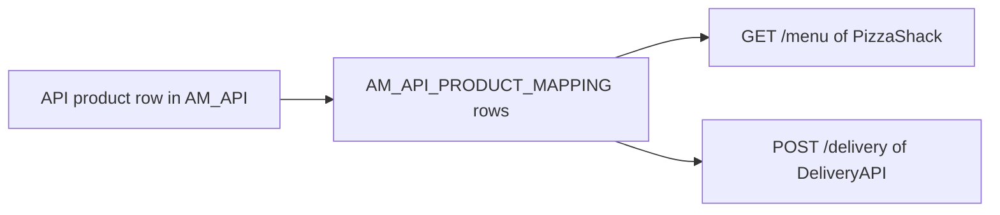
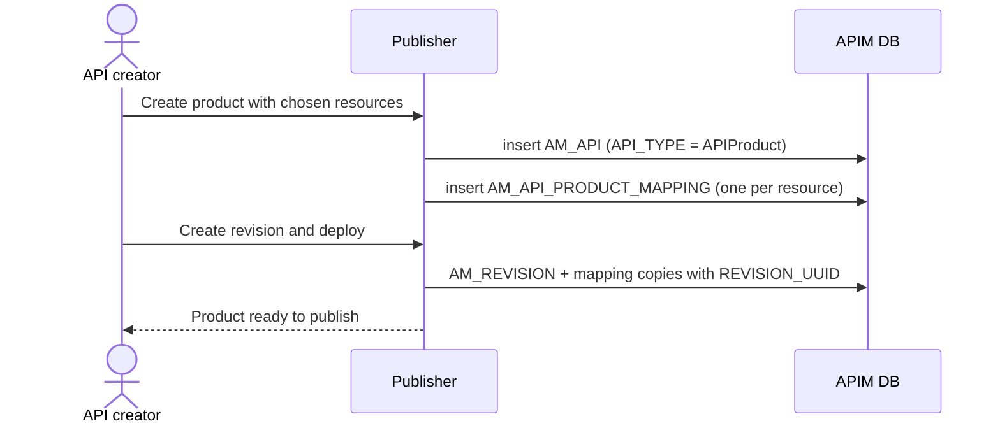

# Create an API product

!!! abstract "What happens"
    An API product bundles chosen resources from one or more APIs into a single thing that developers can subscribe to, for example "Pizza + Delivery bundle". APIM stores the product as **another row in `AM_API`**, with `API_TYPE = 'APIProduct'`. It then links that row to the *existing* resource rows of the underlying APIs through `AM_API_PRODUCT_MAPPING`.

**Who:** API creator (Publisher) · **Tables written:** [`AM_API`](../reference/am.md#am_api), [`AM_API_PRODUCT_MAPPING`](../reference/am.md#am_api_product_mapping), registry artifact, then [revisions](04-deploy-revision.md) as for any API · **Tables read:** [`AM_API_URL_MAPPING`](../reference/am.md#am_api_url_mapping) of the source APIs

## The idea in one picture

This diagram shows a product borrowing resources from two APIs rather than defining its own.



- The product doesn't copy resources. Each mapping row *points at* a resource row owned by another API.
- A developer subscribes to the product like any other API, so the [subscription](08-subscribe.md) row uses the product's `API_ID`.

## The flow at a glance



## Step by step

1. **Product row.** A new row goes into [`AM_API`](../reference/am.md#am_api) with `API_TYPE = 'APIProduct'`, its own `API_ID`/`API_UUID`, a context, and a product-level tier in `API_TIER`. By convention, products have version `1.0.0`.

    | API_ID | API_NAME | API_VERSION | CONTEXT | API_TYPE |
    |---|---|---|---|---|
    | 7 | PizzaShackAPI | 1.0.0 | /pizzashack/1.0.0 | HTTP |
    | 9 | DeliveryAPI | 1.0.0 | /delivery/1.0.0 | HTTP |
    | 15 | PizzaBundle | 1.0.0 | /pizzabundle | APIProduct |

2. **Resource links.** One row per chosen resource goes into [`AM_API_PRODUCT_MAPPING`](../reference/am.md#am_api_product_mapping):
    - `API_ID` → the **product's** `AM_API.API_ID` (FK, cascade).
    - `URL_MAPPING_ID` → the **source API's** [`AM_API_URL_MAPPING`](../reference/am.md#am_api_url_mapping) row (FK, cascade).
    - `REVISION_UUID` → empty for the working copy, or the product's revision.

    | API_PRODUCT_MAPPING_ID | API_ID (product) | URL_MAPPING_ID | REVISION_UUID |
    |---|---|---|---|
    | 1 | 15 | 101 *(GET /menu of API 7)* | *(null)* |
    | 2 | 15 | 140 *(POST /delivery of API 9)* | *(null)* |

3. **Scopes and policies come along.** Because the mapping points at the original resource rows, the product automatically inherits their scopes ([`AM_API_RESOURCE_SCOPE_MAPPING`](../reference/am.md#am_api_resource_scope_mapping)) and resource tiers.

4. **Revision and deploy.** Products are revisioned and deployed exactly like APIs ([Deploy a revision](04-deploy-revision.md)). They are also published through the same [lifecycle](05-lifecycle.md), which uses the `AM_API_PRODUCT_STATE` workflow type if approvals are on.

## What gets cleaned up

- **Deleting the product** cascades to its `AM_API_PRODUCT_MAPPING` rows.
- **Deleting a resource** from a source API cascades to the mapping rows that point at it, so the resource silently disappears from the product.
- APIM normally **stops you** deleting an API while a product still uses its resources. That check is in code, not in the database.

## Try it

This query lists the resources inside each product and the API each resource comes from.

```sql
SELECT prod.API_NAME AS PRODUCT, src.API_NAME AS FROM_API, src.API_VERSION,
       u.HTTP_METHOD, u.URL_PATTERN
FROM AM_API prod
JOIN AM_API_PRODUCT_MAPPING pm ON pm.API_ID = prod.API_ID AND pm.REVISION_UUID IS NULL
JOIN AM_API_URL_MAPPING u ON u.URL_MAPPING_ID = pm.URL_MAPPING_ID
JOIN AM_API src ON src.API_ID = u.API_ID
WHERE prod.API_TYPE = 'APIProduct';
```

!!! note "Different in 3.x"
    3.x also has API products, stored the same way, but `AM_API_PRODUCT_MAPPING` has no `REVISION_UUID` because 3.x has no revisions. See [3.x: Create an API product](../../apim-3/flows/06-api-product.md).

**Related domains:** [API products](../domains/api-products.md) · [API definition](../domains/api-definition.md)
