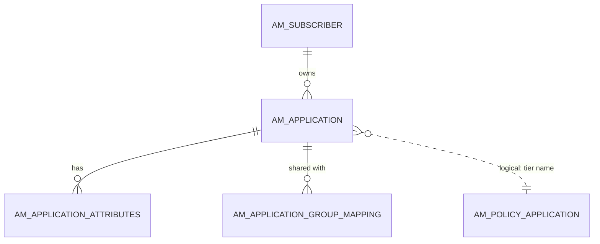
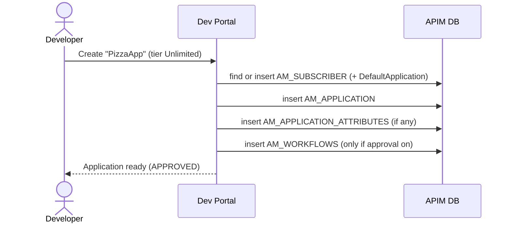

# Create an application

!!! abstract "What happens"
    A developer creates an **application** in the Developer Portal. It's the identity their software will use to call APIs. APIM makes sure the developer has a subscriber row, then stores the application with its rate-limit tier, its token type and any custom attributes.

**Who:** Developer (Dev Portal or REST API) · **Tables written:** [`AM_SUBSCRIBER`](../reference/am.md#am_subscriber) (first time only, together with a DefaultApplication), [`AM_APPLICATION`](../reference/am.md#am_application), [`AM_APPLICATION_ATTRIBUTES`](../reference/am.md#am_application_attributes), [`AM_APPLICATION_GROUP_MAPPING`](../reference/am.md#am_application_group_mapping), optionally [`AM_WORKFLOWS`](../reference/am.md#am_workflows) · **Tables read:** [`AM_POLICY_APPLICATION`](../reference/am.md#am_policy_application)

## How the tables connect

One developer can own many applications, and each application can carry extra attributes.



- The solid lines are real foreign keys, and the dashed line is a match by tier **name**.
- The application-to-subscriber FK is `RESTRICT`, so you can't delete a subscriber who still owns apps.

## The flow at a glance



- Without an approval workflow, the row is saved as `APPROVED`. With one, it stays `CREATED` until someone approves it.

## Step by step

1. **Subscriber.** APIM looks up [`AM_SUBSCRIBER`](../reference/am.md#am_subscriber) by `(TENANT_ID, USER_ID)` and inserts a row if there isn't one (see [Setup & first user](01-bootstrap.md)). The first time this happens, APIM also creates the user's **DefaultApplication**.

2. **Application.** One row goes into [`AM_APPLICATION`](../reference/am.md#am_application):
    - `SUBSCRIBER_ID` is an FK to the owner.
    - `APPLICATION_TIER` is the application-level rate limit, e.g. `10PerMin`, matched by name to [`AM_POLICY_APPLICATION`](../reference/am.md#am_policy_application).
    - `TOKEN_TYPE` is usually `JWT`.
    - `UUID` is used by the REST APIs.
    - `ORGANIZATION` is the owning org. `SHARED_ORGANIZATION` is set when the app is shared across organizations.
    - `(NAME, SUBSCRIBER_ID, ORGANIZATION)` must be unique, so one user can't have two apps with the same name.

    | APPLICATION_ID | NAME | SUBSCRIBER_ID | APPLICATION_TIER | APPLICATION_STATUS | GROUP_ID | TOKEN_TYPE | UUID | ORGANIZATION | SHARED_ORGANIZATION |
    |---|---|---|---|---|---|---|---|---|---|
    | 1 | DefaultApplication | 1 | Unlimited | APPROVED | *(empty)* | JWT | `36e9…` | carbon.super | *(null)* |
    | 2 | PizzaApp | 1 | Unlimited | APPROVED | *(null)* | JWT | `4023…` | carbon.super | private |

3. **Attributes.** Custom fields that the admin configured, such as "Contact email", are saved in [`AM_APPLICATION_ATTRIBUTES`](../reference/am.md#am_application_attributes) as `(APPLICATION_ID, NAME, APP_ATTRIBUTE)`. Deleting the app deletes these (cascade).

4. **Group sharing (optional).** If the app is shared with a group, e.g. everyone in the `pizza-team` group, each group goes into [`AM_APPLICATION_GROUP_MAPPING`](../reference/am.md#am_application_group_mapping) (`APPLICATION_ID`, `GROUP_ID`, `TENANT`). The older single-value `AM_APPLICATION.GROUP_ID` column still exists for backward compatibility.

5. **Approval (optional).** If the *application creation* workflow is on:
    - APIM inserts into [`AM_WORKFLOWS`](../reference/am.md#am_workflows) with `WF_TYPE = 'AM_APPLICATION_CREATION'` and `WF_REFERENCE = APPLICATION_ID`, and leaves `APPLICATION_STATUS = 'CREATED'`.
    - Approval flips it to `APPROVED`, and rejection to `REJECTED`. See [Approval workflows](13-approval-workflows.md).

## What gets cleaned up

Deleting an application cascades to:
- its attributes and group mappings,
- its [subscriptions](08-subscribe.md),
- its [key mappings](09-generate-keys.md),
- its [registrations](../reference/am.md#am_application_registration).

APIM's code also deletes the OAuth apps in the Key Manager, and revokes their tokens (see [Revoke & delete](12-revocation-and-delete.md)).

## Try it

This query lists each developer's applications and tiers.

```sql
SELECT s.USER_ID, a.NAME AS APPLICATION, a.APPLICATION_TIER,
       a.APPLICATION_STATUS, a.TOKEN_TYPE, a.CREATED_TIME
FROM AM_APPLICATION a
JOIN AM_SUBSCRIBER s ON s.SUBSCRIBER_ID = a.SUBSCRIBER_ID
ORDER BY s.USER_ID, a.NAME;
```

!!! note "Different in 3.x"
    3.x stores applications the same way but has no `ORGANIZATION` or `SHARED_ORGANIZATION` columns, and its unique key is `(NAME, SUBSCRIBER_ID)`. See [3.x: Create an application](../../apim-3/flows/07-create-application.md).

**Related domains:** [Applications & subscriptions](../domains/applications-subscriptions.md) · [Throttling policies](../domains/throttling.md) · [Workflows](../domains/workflows.md)
