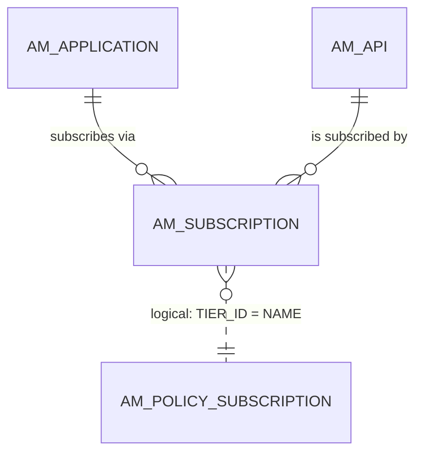
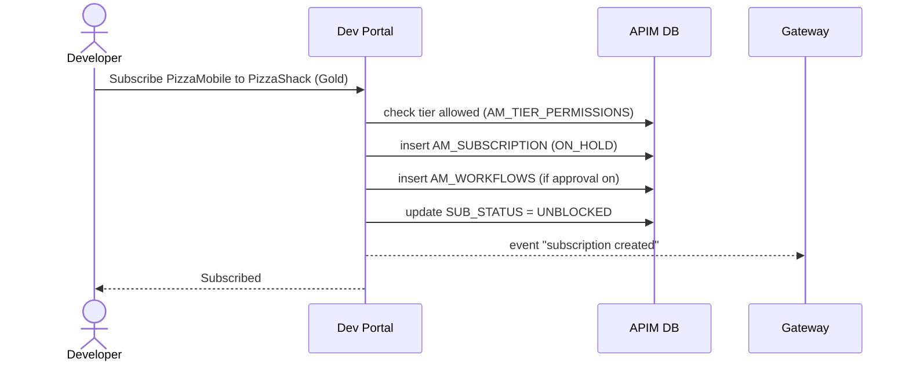

# Subscribe to an API

!!! abstract "What happens"
    A developer subscribes one of their applications to a published API and picks a **subscription tier**, e.g. Gold. APIM stores one row in `AM_SUBSCRIPTION` that joins the application to the API. That row is the "permission slip" the gateway checks on every call.

**Who:** Developer (Dev Portal) · **Tables written:** [`AM_SUBSCRIPTION`](../reference/am.md#am_subscription), optionally [`AM_WORKFLOWS`](../reference/am.md#am_workflows) · **Tables read:** [`AM_API`](../reference/am.md#am_api), [`AM_APPLICATION`](../reference/am.md#am_application), [`AM_POLICY_SUBSCRIPTION`](../reference/am.md#am_policy_subscription), [`AM_TIER_PERMISSIONS`](../reference/am.md#am_tier_permissions)

## How the tables connect

A subscription is the join between an application and an API. It also names a tier.



- An application can subscribe to many APIs, and an API can have many subscribing applications.
- The tier is matched by **name** (plus tenant), not by a foreign key.

## The flow at a glance



- Gateways learn about new subscriptions through events, and keep a copy in memory. They don't query this table on every call.

## Step by step

1. **Checks.**
    - The API must be *Published* (or *Prototyped*), and the tier must be one the API offers. The offered tiers are kept in the API's registry artifact.
    - If an admin restricted the tier to certain roles, [`AM_TIER_PERMISSIONS`](../reference/am.md#am_tier_permissions) (`TIER`, `PERMISSIONS_TYPE`, `ROLES`) is checked.

2. **Subscription row.** One row goes into [`AM_SUBSCRIPTION`](../reference/am.md#am_subscription):
    - `APPLICATION_ID` → [`AM_APPLICATION`](../reference/am.md#am_application) (FK, cascade).
    - `API_ID` → [`AM_API`](../reference/am.md#am_api) (FK, cascade). This works for API products too.
    - `TIER_ID` → the tier name, e.g. `Gold`.
    - `SUB_STATUS` → `ON_HOLD` while waiting for approval, then `UNBLOCKED`.
    - `SUBS_CREATE_STATE` → `SUBSCRIBE`.
    - `UUID` → used by the REST APIs.

    | SUBSCRIPTION_ID | APPLICATION_ID | API_ID | TIER_ID | SUB_STATUS | SUBS_CREATE_STATE | UUID |
    |---|---|---|---|---|---|---|
    | 31 | 2 *(PizzaMobile)* | 7 *(PizzaShack 1.0.0)* | Gold | UNBLOCKED | SUBSCRIBE | `e5f6…` |

    !!! warning "Logical link (no foreign key)"
        `AM_SUBSCRIPTION.TIER_ID` matches [`AM_POLICY_SUBSCRIPTION`](../reference/am.md#am_policy_subscription)`.NAME` for the same tenant. Deleting a tier doesn't touch existing subscriptions. APIM blocks that delete in code instead.

3. **Approval (optional).** With the *subscription creation* workflow on, APIM adds an [`AM_WORKFLOWS`](../reference/am.md#am_workflows) row with `WF_TYPE = 'AM_SUBSCRIPTION_CREATION'` and `WF_REFERENCE = SUBSCRIPTION_ID`. `SUB_STATUS` stays `ON_HOLD` until the workflow is approved (→ `UNBLOCKED`) or rejected (→ `REJECTED`).

4. **Later changes.** All of these update the same row:

    | Action | What changes in `AM_SUBSCRIPTION` |
    |---|---|
    | Developer requests a different tier | `TIER_ID_PENDING` holds the new tier, and `SUB_STATUS = 'TIER_UPDATE_PENDING'` until it's approved (workflow type `AM_SUBSCRIPTION_UPDATE`) |
    | Publisher blocks the subscription | `SUB_STATUS = 'BLOCKED'`, or `'PROD_ONLY_BLOCKED'` to block only production keys |
    | Developer unsubscribes | The row is deleted. With a deletion workflow, `SUBS_CREATE_STATE = 'UNSUBSCRIBE'` until it's approved |

## What gets cleaned up

- Deleting either the application **or** the API cascades and removes the subscription.
- Unsubscribing removes the row and sends an event, so the gateways drop it from memory.

## Try it

This query answers "which applications can call PizzaShack, and at which tier?".

```sql
SELECT ap.NAME AS APPLICATION, s.USER_ID AS OWNER,
       sub.TIER_ID, sub.SUB_STATUS, p.QUOTA, p.TIME_UNIT
FROM AM_SUBSCRIPTION sub
JOIN AM_APPLICATION ap ON ap.APPLICATION_ID = sub.APPLICATION_ID
JOIN AM_SUBSCRIBER s ON s.SUBSCRIBER_ID = ap.SUBSCRIBER_ID
JOIN AM_API a ON a.API_ID = sub.API_ID
LEFT JOIN AM_POLICY_SUBSCRIPTION p ON p.NAME = sub.TIER_ID AND p.TENANT_ID = s.TENANT_ID
WHERE a.API_NAME = 'PizzaShackAPI' AND a.API_VERSION = '1.0.0';
```

!!! note "Different in 3.x"
    In 3.x, both FKs on `AM_SUBSCRIPTION` are `ON DELETE RESTRICT`. That means you can't delete an application or API while subscriptions exist, so APIM's code deletes the subscriptions first. See [3.x: Subscribe to an API](../../apim-3/flows/08-subscribe.md).

**Related domains:** [Applications & subscriptions](../domains/applications-subscriptions.md) · [Throttling policies](../domains/throttling.md) · [Workflows](../domains/workflows.md)
