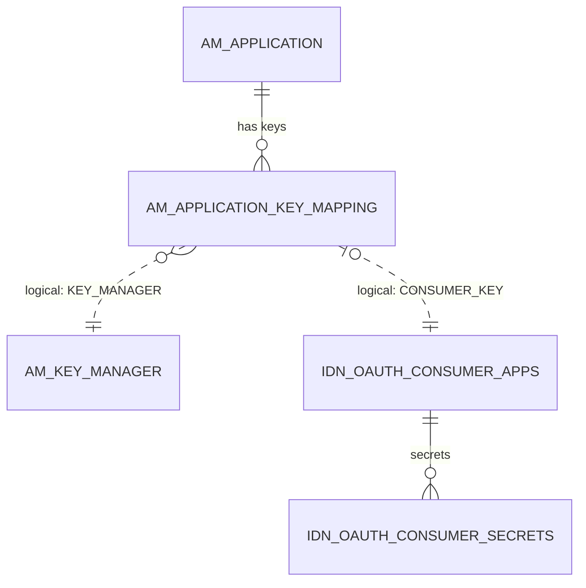
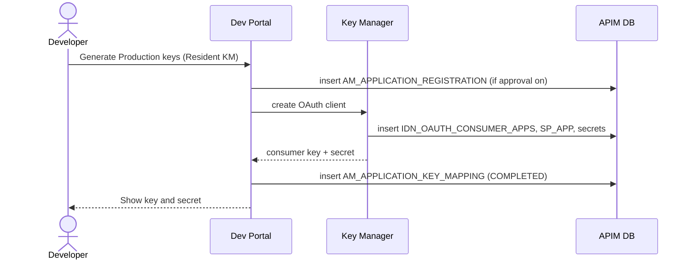

# Generate keys

!!! abstract "What happens"
    The developer clicks **Generate Keys** for an application, choosing *Production* or *Sandbox* and a Key Manager. The Key Manager creates an OAuth client, which gives the application a **consumer key and secret**. APIM then records which OAuth client belongs to which application in `AM_APPLICATION_KEY_MAPPING`.

**Who:** Developer (Dev Portal), Key Manager · **Tables written:** [`AM_APPLICATION_REGISTRATION`](../reference/am.md#am_application_registration) (if a workflow is on), [`AM_APPLICATION_KEY_MAPPING`](../reference/am.md#am_application_key_mapping), and with the Resident Key Manager also [`IDN_OAUTH_CONSUMER_APPS`](../reference/idn.md#idn_oauth_consumer_apps), [`IDN_OAUTH_CONSUMER_SECRETS`](../reference/idn.md#idn_oauth_consumer_secrets), [`SP_APP`](../reference/sp.md#sp_app), [`SP_INBOUND_AUTH`](../reference/sp.md#sp_inbound_auth) · **Tables read:** [`AM_KEY_MANAGER`](../reference/am.md#am_key_manager)

## How the tables connect

This diagram shows the bridge from an APIM application to an OAuth client in the Key Manager.



- An application can have up to one key set per **key type × Key Manager**, e.g. Production on the Resident KM plus Production on Keycloak.
- Both links out of the key mapping are dashed. The database enforces neither of them.

## The flow at a glance



- With a **third-party Key Manager** such as Keycloak or Okta, the OAuth client lives in *that* system. APIM then only stores the `AM_APPLICATION_KEY_MAPPING` row.

## Step by step

1. **Pick the Key Manager.** The enabled Key Managers come from [`AM_KEY_MANAGER`](../reference/am.md#am_key_manager) (`UUID`, `NAME`, `TYPE`, `ENABLED`, `ORGANIZATION`). Access can be restricted by role ([`AM_KEY_MANAGER_PERMISSIONS`](../reference/am.md#am_key_manager_permissions)) or by organization ([`AM_KEY_MANAGER_ALLOWED_ORGS`](../reference/am.md#am_key_manager_allowed_orgs)).

2. **(Optional) approval.** If the *application registration* workflow is on:
    - APIM stores the request in [`AM_APPLICATION_REGISTRATION`](../reference/am.md#am_application_registration). The row holds `SUBSCRIBER_ID`, `APP_ID`, `TOKEN_TYPE` (really the key type, `PRODUCTION`/`SANDBOX`), `KEY_MANAGER`, `WF_REF`, and the requested grant types and callback in `INPUTS`.
    - It also adds an [`AM_WORKFLOWS`](../reference/am.md#am_workflows) row of type `AM_APPLICATION_REGISTRATION_PRODUCTION` or `…_SANDBOX`.
    - The key mapping is created with `STATE = 'CREATED'`. The OAuth client is only made once the request is approved.

3. **OAuth client is created (Resident KM).** The built-in Key Manager (WSO2 Identity Server components):
    - inserts the client into [`IDN_OAUTH_CONSUMER_APPS`](../reference/idn.md#idn_oauth_consumer_apps): `CONSUMER_KEY`, `APP_NAME` (typically `<owner>_<appname>_<keytype>`), `GRANT_TYPES`, `CALLBACK_URL` and token lifetimes,
    - stores the secret in [`IDN_OAUTH_CONSUMER_SECRETS`](../reference/idn.md#idn_oauth_consumer_secrets) when multiple secrets are enabled (this is a real FK on `CONSUMER_KEY`),
    - registers a matching *service provider* in [`SP_APP`](../reference/sp.md#sp_app) and [`SP_INBOUND_AUTH`](../reference/sp.md#sp_inbound_auth) (`INBOUND_AUTH_KEY` = the consumer key, `INBOUND_AUTH_TYPE = 'oauth2'`).

    | IDN_OAUTH_CONSUMER_APPS.ID | CONSUMER_KEY | APP_NAME | GRANT_TYPES | TENANT_ID |
    |---|---|---|---|---|
    | 12 | `Xk9f…` | admin_PizzaMobile_PRODUCTION | client_credentials password refresh_token | -1234 |

4. **Key mapping.** APIM writes [`AM_APPLICATION_KEY_MAPPING`](../reference/am.md#am_application_key_mapping), with primary key `(APPLICATION_ID, KEY_TYPE, KEY_MANAGER)`:
    - `CONSUMER_KEY` → the OAuth client id.
    - `KEY_MANAGER` → the Key Manager's **UUID** in 4.x.
    - `STATE` → `COMPLETED` once the keys exist.
    - `CREATE_MODE` → `CREATED` if APIM generated the keys, or `MAPPED` if the developer brought an existing OAuth client ("Provide existing keys").
    - `APP_INFO` → a blob with the OAuth app details.
    - `UUID` → the id used by the REST API.

    | APPLICATION_ID | KEY_TYPE | KEY_MANAGER | CONSUMER_KEY | STATE | CREATE_MODE |
    |---|---|---|---|---|---|
    | 2 | PRODUCTION | `3e1a…` *(Resident KM)* | `Xk9f…` | COMPLETED | CREATED |
    | 2 | SANDBOX | `3e1a…` | `Pq7r…` | COMPLETED | CREATED |

    !!! warning "Logical links (no foreign key)"
        - `AM_APPLICATION_KEY_MAPPING.CONSUMER_KEY` ↔ `IDN_OAUTH_CONSUMER_APPS.CONSUMER_KEY` is **the** bridge between APIM and OAuth, and it's a plain value match.
        - `KEY_MANAGER` ↔ `AM_KEY_MANAGER.UUID` is also unenforced. Data migrated from older versions may hold the Key Manager's **name** instead.

5. **Allowed domains (optional).** For JavaScript clients, allowed browser domains go into [`AM_APP_KEY_DOMAIN_MAPPING`](../reference/am.md#am_app_key_domain_mapping) (`CONSUMER_KEY`, `AUTHZ_DOMAIN`).

!!! info "API keys: a lighter alternative"
    Instead of OAuth, a developer can generate an **API key**.
    - It's stored hashed in [`AM_API_KEY`](../reference/am.md#am_api_key) (`API_KEY_UUID`, `API_KEY_HASH`, `KEY_TYPE`, `STATUS`, `VALIDITY_PERIOD`, `LAST_USED`).
    - It's linked to the application through [`AM_API_KEY_APPLICATION_MAPPING`](../reference/am.md#am_api_key_application_mapping) (`APPLICATION_UUID` → `AM_APPLICATION.UUID`), or to an API through [`AM_API_KEY_API_MAPPING`](../reference/am.md#am_api_key_api_mapping).
    - These are real FKs with no ON DELETE rule, so the mappings must be removed before the key, app or API can be deleted.

## What gets cleaned up

- Deleting the application cascades to `AM_APPLICATION_KEY_MAPPING` and `AM_APPLICATION_REGISTRATION`.
- APIM's code then asks the Key Manager to delete the OAuth client. For the Resident KM, deleting from `IDN_OAUTH_CONSUMER_APPS` cascades to its tokens and secrets.
- Regenerating the secret updates the Key Manager side only. The mapping row is unchanged.

## Try it

This query lists each application's OAuth clients and the Key Manager that issued them.

```sql
SELECT ap.NAME AS APPLICATION, km.KEY_TYPE, k.NAME AS KEY_MANAGER,
       km.CONSUMER_KEY, km.STATE, km.CREATE_MODE, oc.GRANT_TYPES
FROM AM_APPLICATION_KEY_MAPPING km
JOIN AM_APPLICATION ap ON ap.APPLICATION_ID = km.APPLICATION_ID
LEFT JOIN AM_KEY_MANAGER k ON k.UUID = km.KEY_MANAGER
LEFT JOIN IDN_OAUTH_CONSUMER_APPS oc ON oc.CONSUMER_KEY = km.CONSUMER_KEY;
```

!!! note "Different in 3.x"
    In 3.x:
    - `AM_KEY_MANAGER` is scoped by `TENANT_DOMAIN` rather than `ORGANIZATION`.
    - The key-mapping FK to `AM_APPLICATION` is `RESTRICT`.
    - There are no `AM_API_KEY*` tables. API keys are self-contained JWTs.
    - 3.x also has `AM_SUBSCRIPTION_KEY_MAPPING`.

    See [3.x: Generate keys](../../apim-3/flows/09-generate-keys.md).

**Related domains:** [Keys & tokens](../domains/keys-tokens.md) · [Applications & subscriptions](../domains/applications-subscriptions.md)
