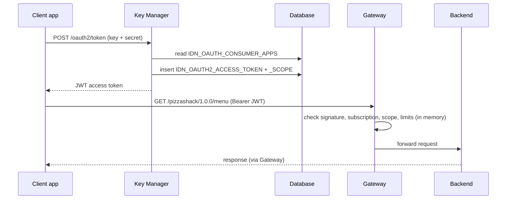

# Get a token & call the API

!!! abstract "What happens"
    The client app swaps its consumer key and secret for an **access token** from the Key Manager, then calls the API through the **Gateway**. The Gateway checks four things: that the token is valid, that the application is subscribed, that the token has the scopes the resource needs, and that the rate limits aren't exceeded. Then it forwards the request to the backend.

**Who:** Client app, Key Manager, Gateway · **Tables written:** [`IDN_OAUTH2_ACCESS_TOKEN`](../reference/idn.md#idn_oauth2_access_token), [`IDN_OAUTH2_ACCESS_TOKEN_SCOPE`](../reference/idn.md#idn_oauth2_access_token_scope) (Resident KM, when tokens are persisted) · **Tables read (via the control plane):** [`AM_APPLICATION_KEY_MAPPING`](../reference/am.md#am_application_key_mapping), [`AM_SUBSCRIPTION`](../reference/am.md#am_subscription), [`AM_API_URL_MAPPING`](../reference/am.md#am_api_url_mapping), [`AM_API_RESOURCE_SCOPE_MAPPING`](../reference/am.md#am_api_resource_scope_mapping), `AM_POLICY_*`

## The flow at a glance

This diagram shows one token request followed by one API call.



- The Gateway **doesn't query the database per request**. At startup it loads subscriptions, applications, key mappings, API resources and policies from the control plane's internal APIs, which read the tables listed above. After that, events keep its in-memory copy up to date.
- Rate limits are counted by the **Traffic Manager** in memory, not in the database.

## Step by step

1. **Token request.** The Key Manager finds the client in [`IDN_OAUTH_CONSUMER_APPS`](../reference/idn.md#idn_oauth_consumer_apps) by `CONSUMER_KEY` and checks the secret and grant type.

2. **Token stored (Resident KM).** With the default settings, the token is recorded in [`IDN_OAUTH2_ACCESS_TOKEN`](../reference/idn.md#idn_oauth2_access_token), and its scopes in [`IDN_OAUTH2_ACCESS_TOKEN_SCOPE`](../reference/idn.md#idn_oauth2_access_token_scope) (`TOKEN_ID`, `TOKEN_SCOPE`, FK with cascade). The important token columns are:
    - `CONSUMER_KEY_ID` → `IDN_OAUTH_CONSUMER_APPS.ID` (a real FK, cascade)
    - `AUTHZ_USER`, `GRANT_TYPE`, `TOKEN_STATE` (`ACTIVE`, `REVOKED`, `EXPIRED` …)
    - `TIME_CREATED`, `VALIDITY_PERIOD`
    - `ACCESS_TOKEN` / `ACCESS_TOKEN_HASH`. For JWT tokens this holds the token's identifier (`jti`), not the whole JWT.

    | TOKEN_ID | CONSUMER_KEY_ID | AUTHZ_USER | GRANT_TYPE | TOKEN_STATE | VALIDITY_PERIOD |
    |---|---|---|---|---|---|
    | `t-001` | 12 *(PizzaMobile PRODUCTION)* | admin | client_credentials | ACTIVE | 3600000 |

    | TOKEN_ID | TOKEN_SCOPE |
    |---|---|
    | `t-001` | order:write |
    | `t-001` | default |

    !!! info "Persisted or not?"
        - Newer versions can be configured **not to store** JWT access tokens at all. In that case there are no rows here, and revocation is tracked through [`IDN_INVALID_TOKENS`](../reference/idn.md#idn_invalid_tokens) and the revoked-event tables instead (see [Revoke & delete](12-revocation-and-delete.md)).
        - Third-party Key Managers keep their tokens in their own systems.

3. **Gateway validates the JWT.** It checks the signature and expiry locally, using the Key Manager's certificate/JWKS. It also checks the token isn't in the revoked list, which is loaded from [`AM_REVOKED_JWT`](../reference/am.md#am_revoked_jwt).

4. **Subscription check.** The token's client id, `azp`/consumer key, leads to the application through [`AM_APPLICATION_KEY_MAPPING`](../reference/am.md#am_application_key_mapping) and on to an [`AM_SUBSCRIPTION`](../reference/am.md#am_subscription) for this API.
    - The subscription must exist with `SUB_STATUS = 'UNBLOCKED'`. `PROD_ONLY_BLOCKED` blocks production keys only.
    - An API with `AM_API.SUB_VALIDATION = 'DISABLED'` skips this check.

5. **Resource and scope check.** The request path and verb are matched against the deployed revision's [`AM_API_URL_MAPPING`](../reference/am.md#am_api_url_mapping) rows. The token must contain the scope in [`AM_API_RESOURCE_SCOPE_MAPPING`](../reference/am.md#am_api_resource_scope_mapping) for that resource.

6. **Rate limits.** The Gateway applies each level in turn:

    | Level | Limit comes from |
    |---|---|
    | Subscription | `AM_SUBSCRIPTION.TIER_ID` → [`AM_POLICY_SUBSCRIPTION`](../reference/am.md#am_policy_subscription) |
    | Application | `AM_APPLICATION.APPLICATION_TIER` → [`AM_POLICY_APPLICATION`](../reference/am.md#am_policy_application) |
    | Resource | `AM_API_URL_MAPPING.THROTTLING_TIER` → [`AM_API_THROTTLE_POLICY`](../reference/am.md#am_api_throttle_policy) |
    | Custom / blocking | [`AM_POLICY_GLOBAL`](../reference/am.md#am_policy_global), [`AM_BLOCK_CONDITIONS`](../reference/am.md#am_block_conditions) |

    If any limit is exceeded, the Gateway returns HTTP 429. See [Manage throttling policies](11-throttling-policies.md).

7. **Forward and record.** The request goes to the endpoint from the revision's [`AM_API_ENDPOINTS`](../reference/am.md#am_api_endpoints) / endpoint config. Analytics events go to the analytics system, **not** to these tables. [`AM_SUBSCRIPTION`](../reference/am.md#am_subscription)`.LAST_ACCESSED` exists but isn't updated per request.

## What gets cleaned up

- Expired and revoked token rows are removed by the Key Manager's token cleanup, which is configurable. The cleanup may copy them to [`IDN_OAUTH2_ACCESS_TOKEN_AUDIT`](../reference/idn.md#idn_oauth2_access_token_audit) first.
- Deleting the OAuth client cascades to its tokens and their scopes.

## Try it

This query lists the active tokens for an application's production keys.

```sql
SELECT ap.NAME AS APPLICATION, t.AUTHZ_USER, t.GRANT_TYPE, t.TOKEN_STATE,
       t.TIME_CREATED, t.VALIDITY_PERIOD / 1000 AS VALID_SECONDS
FROM AM_APPLICATION ap
JOIN AM_APPLICATION_KEY_MAPPING km ON km.APPLICATION_ID = ap.APPLICATION_ID
                                  AND km.KEY_TYPE = 'PRODUCTION'
JOIN IDN_OAUTH_CONSUMER_APPS oc ON oc.CONSUMER_KEY = km.CONSUMER_KEY
JOIN IDN_OAUTH2_ACCESS_TOKEN t ON t.CONSUMER_KEY_ID = oc.ID
WHERE ap.NAME = 'PizzaMobile' AND t.TOKEN_STATE = 'ACTIVE';
```

!!! note "Different in 3.x"
    3.x validates tokens the same way, and also supports opaque tokens (validated by calling the Key Manager) and self-contained JWT API keys. Its `AM_SUBSCRIPTION_KEY_MAPPING` table has no 4.x equivalent. See [3.x: Get a token & call the API](../../apim-3/flows/10-token-and-invoke.md).

**Related domains:** [Keys & tokens](../domains/keys-tokens.md) · [Scopes](../domains/scopes.md) · [Throttling policies](../domains/throttling.md) · [Revocation](../domains/revocation.md)
