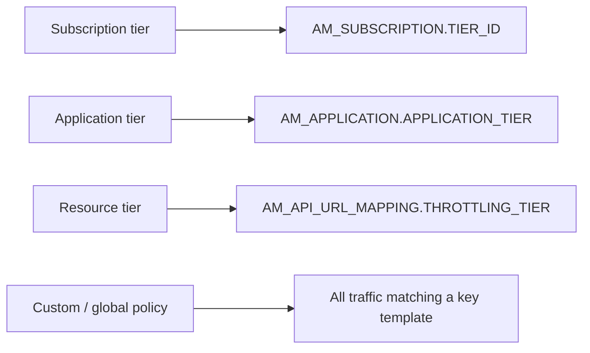
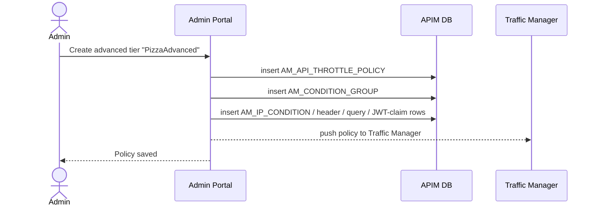

# Manage throttling policies

!!! abstract "What happens"
    An admin creates or edits **rate-limit policies** (also called tiers) in the Admin Portal. There are four families, one for each level at which a limit applies. Resource-level policies can also have *conditional groups*, e.g. "a higher limit for requests from this IP range".

!!! success "Verified on a running server"
    Confirmed on WSO2 APIM 4.7.0 (embedded H2, default config) through the Admin REST API. The calls created:
    - an advanced (resource) policy with one conditional group holding a header condition and an IP condition, which wrote [`AM_API_THROTTLE_POLICY`](../reference/am.md#am_api_throttle_policy), [`AM_CONDITION_GROUP`](../reference/am.md#am_condition_group), [`AM_HEADER_FIELD_CONDITION`](../reference/am.md#am_header_field_condition) and [`AM_IP_CONDITION`](../reference/am.md#am_ip_condition);
    - an application policy, which wrote [`AM_POLICY_APPLICATION`](../reference/am.md#am_policy_application);
    - a subscription policy with a role permission, which wrote [`AM_POLICY_SUBSCRIPTION`](../reference/am.md#am_policy_subscription) and [`AM_THROTTLE_TIER_PERMISSIONS`](../reference/am.md#am_throttle_tier_permissions);
    - a custom policy, which wrote [`AM_POLICY_GLOBAL`](../reference/am.md#am_policy_global);
    - a deny policy, which wrote [`AM_BLOCK_CONDITIONS`](../reference/am.md#am_block_conditions).

    Surprises:

    - **`IS_DEPLOYED` stayed `0`** on every new policy, even though they were in use.
    - **The subscription tier's role permission went to `AM_THROTTLE_TIER_PERMISSIONS`**, not `AM_TIER_PERMISSIONS`.
    - **The block condition's value is a JSON string**, e.g. `{"invert":false,"fixedIp":"10.9.9.9"}`, and `ENABLED` is stored as the text `'true'`.

**Who:** Admin (Admin Portal) · **Tables written:** [`AM_POLICY_SUBSCRIPTION`](../reference/am.md#am_policy_subscription), [`AM_POLICY_APPLICATION`](../reference/am.md#am_policy_application), [`AM_API_THROTTLE_POLICY`](../reference/am.md#am_api_throttle_policy) + [`AM_CONDITION_GROUP`](../reference/am.md#am_condition_group) + condition tables, [`AM_POLICY_GLOBAL`](../reference/am.md#am_policy_global), [`AM_BLOCK_CONDITIONS`](../reference/am.md#am_block_conditions), [`AM_THROTTLE_TIER_PERMISSIONS`](../reference/am.md#am_throttle_tier_permissions) · **Tables read:** none

## The four policy families

Each family limits traffic at a different level.



- The first three are attached **by name**. The custom policy applies globally through its `KEY_TEMPLATE`.
- **Blocking conditions** sit beside these and deny traffic outright, e.g. by IP, user, application or API context.

## The flow at a glance

This diagram shows an admin creating a resource tier with one conditional group.



## Step by step

1. **Subscription tier**, e.g. Gold. One row in [`AM_POLICY_SUBSCRIPTION`](../reference/am.md#am_policy_subscription), unique on `(NAME, TENANT_ID)`.
    - `QUOTA_TYPE` is the discriminator: `requestCount`, `bandwidthVolume`, `eventCount` or `aiApiQuota`. It decides which columns matter.
    - `QUOTA` + `UNIT_TIME` + `TIME_UNIT` give the limit, e.g. 5000 per 1 min.
    - `RATE_LIMIT_COUNT` / `RATE_LIMIT_TIME_UNIT` set a burst limit.
    - `STOP_ON_QUOTA_REACH` decides whether requests are refused or only flagged when the quota runs out.
    - `BILLING_PLAN` (`FREE`, `COMMERCIAL`) and the monetization columns cover paid plans.
    - `MAX_COMPLEXITY` / `MAX_DEPTH` apply to GraphQL, and `TOTAL_TOKEN_COUNT` / `PROMPT_TOKEN_COUNT` / `COMPLETION_TOKEN_COUNT` to AI APIs.

    | NAME | QUOTA_TYPE | QUOTA | UNIT_TIME | TIME_UNIT | STOP_ON_QUOTA_REACH | BILLING_PLAN | TENANT_ID |
    |---|---|---|---|---|---|---|---|
    | Gold | requestCount | 5000 | 1 | min | true | FREE | -1234 |
    | PizzaSubTier | requestCount | 1000 | 1 | min | true | FREE | -1234 |

2. **Application tier**, e.g. 10PerMin. One row in [`AM_POLICY_APPLICATION`](../reference/am.md#am_policy_application), with the same quota columns but none of the billing ones. It limits the total traffic of an application across all its subscriptions.

3. **Resource tier with conditions.** This one has a small tree:
    - [`AM_API_THROTTLE_POLICY`](../reference/am.md#am_api_throttle_policy) holds the default limit (`DEFAULT_QUOTA_TYPE`, `DEFAULT_QUOTA`, …) and `APPLICABLE_LEVEL` (`apiLevel` or `resourceLevel`).
    - Each [`AM_CONDITION_GROUP`](../reference/am.md#am_condition_group) row has `POLICY_ID` as an FK with cascade, plus its own quota that applies when *its* conditions match.
    - Each group has any number of conditions, all FKs with cascade: [`AM_IP_CONDITION`](../reference/am.md#am_ip_condition), [`AM_HEADER_FIELD_CONDITION`](../reference/am.md#am_header_field_condition), [`AM_QUERY_PARAMETER_CONDITION`](../reference/am.md#am_query_parameter_condition) and [`AM_JWT_CLAIM_CONDITION`](../reference/am.md#am_jwt_claim_condition). Their `IS_*_MAPPING` flags invert the match ("NOT equal").

    ```mermaid
    erDiagram
        AM_API_THROTTLE_POLICY ||--o{ AM_CONDITION_GROUP : "has"
        AM_CONDITION_GROUP ||--o{ AM_IP_CONDITION : "if IP"
        AM_CONDITION_GROUP ||--o{ AM_HEADER_FIELD_CONDITION : "if header"
        AM_CONDITION_GROUP ||--o{ AM_QUERY_PARAMETER_CONDITION : "if query param"
        AM_CONDITION_GROUP ||--o{ AM_JWT_CLAIM_CONDITION : "if JWT claim"
    ```

    | Table | Example row |
    |---|---|
    | AM_API_THROTTLE_POLICY | POLICY_ID 5, NAME `PizzaAdvanced`, DEFAULT_QUOTA 10 per 1 min, APPLICABLE_LEVEL `apiLevel` |
    | AM_CONDITION_GROUP | CONDITION_GROUP_ID 1, POLICY_ID 5, QUOTA 2 per 1 min, DESCRIPTION `mobile clients` |
    | AM_HEADER_FIELD_CONDITION | CONDITION_GROUP_ID 1, HEADER_FIELD_NAME `User-Agent`, HEADER_FIELD_VALUE `mobile` |
    | AM_IP_CONDITION | CONDITION_GROUP_ID 1, SPECIFIC_IP `10.0.0.1`, WITHIN_IP_RANGE false |

4. **Custom (global) policy.** One row in [`AM_POLICY_GLOBAL`](../reference/am.md#am_policy_global) with a `KEY_TEMPLATE`, e.g. `$userId`, and the policy logic as a Siddhi query in the `SIDDHI_QUERY` blob.

5. **Blocking condition.** One row in [`AM_BLOCK_CONDITIONS`](../reference/am.md#am_block_conditions), with `TYPE` set to `API`, `APPLICATION`, `USER`, `IP` or `IPRANGE`, plus `BLOCK_CONDITION` (the value), `ENABLED` and `DOMAIN` (the tenant).

    | CONDITION_ID | TYPE | BLOCK_CONDITION | ENABLED | DOMAIN |
    |---|---|---|---|---|
    | 1 | IP | `{"invert":false,"fixedIp":"10.9.9.9"}` | true | carbon.super |

6. **Who may use a tier (optional).** Creating a subscription tier with a role restriction wrote [`AM_THROTTLE_TIER_PERMISSIONS`](../reference/am.md#am_throttle_tier_permissions) (`TIER = 'PizzaSubTier'`, `PERMISSIONS_TYPE = 'allow'`, `ROLES = 'admin'`, `TENANT_ID`). The older [`AM_TIER_PERMISSIONS`](../reference/am.md#am_tier_permissions) has the same shape but wasn't written.

7. **Deploy.** The policy is pushed to the Traffic Manager and gateways by event. The `IS_DEPLOYED` column exists, but it stayed `0` on every policy created in the test, so don't use it to tell whether a policy is live. [`AM_POLICY_HARD_THROTTLING`](../reference/am.md#am_policy_hard_throttling) is a legacy table for backend hard limits.

!!! warning "Logical links (no foreign key)"
    Policies are referenced **by name** from `AM_SUBSCRIPTION.TIER_ID`, `AM_APPLICATION.APPLICATION_TIER`, `AM_API_URL_MAPPING.THROTTLING_TIER` and `AM_API.API_TIER`. There are no FKs, so renaming a policy isn't possible, and deleting one that's in use is blocked in code.

## What gets cleaned up

- Deleting a resource tier cascades to its condition groups and all their conditions.
- The other policy tables have no children in the database.

## Try it

This query shows each resource tier with its conditional groups and IP conditions.

```sql
SELECT p.NAME, p.DEFAULT_QUOTA, p.DEFAULT_TIME_UNIT,
       g.CONDITION_GROUP_ID, g.QUOTA AS GROUP_QUOTA,
       ip.SPECIFIC_IP, ip.STARTING_IP, ip.ENDING_IP
FROM AM_API_THROTTLE_POLICY p
LEFT JOIN AM_CONDITION_GROUP g ON g.POLICY_ID = p.POLICY_ID
LEFT JOIN AM_IP_CONDITION ip ON ip.CONDITION_GROUP_ID = g.CONDITION_GROUP_ID
ORDER BY p.NAME;
```

!!! note "Different in 3.x"
    3.x has the same policy tables. Its `AM_POLICY_SUBSCRIPTION` lacks `CONNECTIONS_COUNT` and the AI token-count columns (`TOTAL_TOKEN_COUNT`, `PROMPT_TOKEN_COUNT`, `COMPLETION_TOKEN_COUNT`). See [3.x: Manage throttling policies](../../apim-3/flows/11-throttling-policies.md).

**Related domains:** [Throttling policies](../domains/throttling.md) · [Applications & subscriptions](../domains/applications-subscriptions.md)
