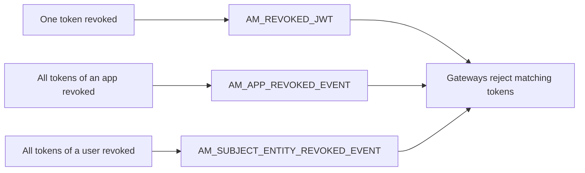
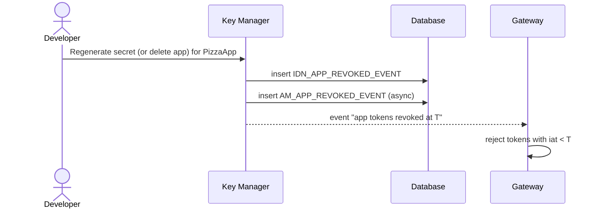

# Revoke & delete

!!! abstract "What happens"
    Tokens can be revoked one at a time, for everything an application issued, or for everything a user holds. Because most 4.x tokens are self-contained JWTs, the Gateway can't simply "look them up". Instead APIM records **what was revoked, and from when**, and pushes that to every gateway. This page also explains what the database removes automatically when you delete an API, an application or a subscription.

**Who:** Developer, admin or the Key Manager · **Tables written:** [`AM_REVOKED_JWT`](../reference/am.md#am_revoked_jwt), [`IDN_INVALID_TOKENS`](../reference/idn.md#idn_invalid_tokens), [`AM_APP_REVOKED_EVENT`](../reference/am.md#am_app_revoked_event), [`AM_SUBJECT_ENTITY_REVOKED_EVENT`](../reference/am.md#am_subject_entity_revoked_event), [`IDN_OAUTH2_ACCESS_TOKEN`](../reference/idn.md#idn_oauth2_access_token) (opaque tokens only), [`IDN_APP_REVOKED_EVENT`](../reference/idn.md#idn_app_revoked_event), [`IDN_SUBJECT_ENTITY_REVOKED_EVENT`](../reference/idn.md#idn_subject_entity_revoked_event)

## The three kinds of revocation

Each kind is stored in a different table.



- A single revocation is matched on the token's identity.
- An app or user revocation stores a **time**. Any token issued *before* that time is rejected.

## The flow at a glance

This diagram shows a developer regenerating an application's consumer secret, which revokes every token the application has issued.



## Step by step

1. **One token** (via `/oauth2/revoke`, or a user logging out):
    - For a **JWT** (the 4.7.0 default, not stored), the Key Manager inserts the token's identifier into [`IDN_INVALID_TOKENS`](../reference/idn.md#idn_invalid_tokens) (`TOKEN_IDENTIFIER` = the JWT's `jti`, `CONSUMER_KEY`, `EXPIRY_TIMESTAMP`). For a stored **opaque** token, it changes the [`IDN_OAUTH2_ACCESS_TOKEN`](../reference/idn.md#idn_oauth2_access_token) row instead.
    - APIM adds the JWT to [`AM_REVOKED_JWT`](../reference/am.md#am_revoked_jwt) (`UUID`, `SIGNATURE`, `EXPIRY_TIMESTAMP`, `TENANT_ID`, `TOKEN_TYPE`, `TIME_CREATED`). Despite its name, `SIGNATURE` held the token's `jti`, the same value as `IDN_INVALID_TOKENS.TOKEN_IDENTIFIER`. Gateways load this list at startup and receive new entries as events.

    | AM_REVOKED_JWT.UUID | SIGNATURE | EXPIRY_TIMESTAMP | TENANT_ID | TOKEN_TYPE |
    |---|---|---|---|---|
    | `c26f…` | `2d4d…` *(jti)* | 1790403509794 | -1234 | JWT |

    | IDN_INVALID_TOKENS.UUID | TOKEN_IDENTIFIER | CONSUMER_KEY |
    |---|---|---|
    | `2bc4…` | `2d4d…` *(jti)* | `rfjt…` |

2. **All tokens of an application** (the secret is regenerated, or the app is revoked or deleted):
    - Key Manager side: [`IDN_APP_REVOKED_EVENT`](../reference/idn.md#idn_app_revoked_event).
    - APIM side: [`AM_APP_REVOKED_EVENT`](../reference/am.md#am_app_revoked_event), with `CONSUMER_KEY`, `TIME_REVOKED` and `ORGANIZATION`. There's one row per consumer key, which is updated each time.
    - Deleting an application such as `PizzaApp` produces both rows for its consumer key. The APIM-side row is written a few seconds after the Key Manager-side row.

3. **All tokens of a user** (the user is deleted or locked, their password changes, or a role changes):
    - Key Manager side: [`IDN_SUBJECT_ENTITY_REVOKED_EVENT`](../reference/idn.md#idn_subject_entity_revoked_event).
    - APIM side: [`AM_SUBJECT_ENTITY_REVOKED_EVENT`](../reference/am.md#am_subject_entity_revoked_event), with `ENTITY_ID`, `ENTITY_TYPE` (e.g. a user id or client id) and `TIME_REVOKED`.

    !!! warning "Logical link (no foreign key)"
        The revoked-event tables link to applications and users only by value: a consumer key or a user id. Nothing is enforced, and the rows are kept even after the application is deleted.

4. **Cleanup.** Once a revoked JWT's `EXPIRY_TIMESTAMP` has passed, APIM deletes its row. The token would be rejected as expired anyway.

## What gets cleaned up when you delete things

This table shows what the **database** does by itself (the `ON DELETE` rules). Anything marked "code" is handled by APIM's Java code.

!!! warning "APIM's code adds its own guard rails"
    Even where an FK would cascade, APIM **refuses to delete an API that still has subscriptions** (HTTP 409). Remove the subscriptions first, then delete the API.

| You delete… | Removed automatically (CASCADE) | Blocks the delete (RESTRICT / no rule) | Removed by code |
|---|---|---|---|
| **API** (`AM_API`) | [`AM_SUBSCRIPTION`](../reference/am.md#am_subscription), [`AM_REVISION`](../reference/am.md#am_revision) → deployments, [`AM_API_ENDPOINTS`](../reference/am.md#am_api_endpoints), [`AM_API_LC_EVENT`](../reference/am.md#am_api_lc_event), comments, ratings, labels, API policies, client certs, GraphQL complexity, [`AM_GW_REVISION_DEPLOYMENT`](../reference/am.md#am_gw_revision_deployment) | [`AM_EXTERNAL_STORES`](../reference/am.md#am_external_stores), [`AM_API_METADATA`](../reference/am.md#am_api_metadata), [`AM_API_AI_CONFIGURATION`](../reference/am.md#am_api_ai_configuration), [`AM_API_KEY_API_MAPPING`](../reference/am.md#am_api_key_api_mapping), [`AM_BACKEND`](../reference/am.md#am_backend) | [`AM_API_URL_MAPPING`](../reference/am.md#am_api_url_mapping) (no FK), and then its scope and policy mappings by cascade. Also the registry artifact, `UM_PERMISSION` rows, gateway artifacts, `AM_API_DEFAULT_VERSION`, and the API's `GOV_ARTIFACT` and governance results. A scope still used by another version stays |
| **Application** (`AM_APPLICATION`) | [`AM_SUBSCRIPTION`](../reference/am.md#am_subscription), [`AM_APPLICATION_KEY_MAPPING`](../reference/am.md#am_application_key_mapping), [`AM_APPLICATION_REGISTRATION`](../reference/am.md#am_application_registration), attributes, group mappings | [`AM_API_KEY_APPLICATION_MAPPING`](../reference/am.md#am_api_key_application_mapping) (APIM's code removed it first) | The OAuth clients in the Key Manager (`IDN_OAUTH_CONSUMER_APPS`, `IDN_OAUTH_CONSUMER_SECRETS`, `IDN_OIDC_PROPERTY`, `SP_APP`, `SP_INBOUND_AUTH`, `SP_METADATA`), plus an app-revoked event. Also the pending [`AM_WORKFLOWS`](../reference/am.md#am_workflows) rows |
| **Subscription** (`AM_SUBSCRIPTION`) | — | — | Gateway event, pending workflows *(only the row itself is deleted)* |
| **Subscriber** (`AM_SUBSCRIBER`) | — | [`AM_APPLICATION`](../reference/am.md#am_application), [`AM_APPLICATION_REGISTRATION`](../reference/am.md#am_application_registration), [`AM_API_RATINGS`](../reference/am.md#am_api_ratings) | — |
| **OAuth client** (`IDN_OAUTH_CONSUMER_APPS`) | [`IDN_OAUTH2_ACCESS_TOKEN`](../reference/idn.md#idn_oauth2_access_token) → token scopes, [`IDN_OAUTH_CONSUMER_SECRETS`](../reference/idn.md#idn_oauth_consumer_secrets) | — | The `AM_APPLICATION_KEY_MAPPING` row, which is a logical link |

## Try it

This query shows revocations that are still in force.

```sql
SELECT 'app' AS KIND, CONSUMER_KEY AS WHO, TIME_REVOKED FROM AM_APP_REVOKED_EVENT
UNION ALL
SELECT ENTITY_TYPE, ENTITY_ID, TIME_REVOKED FROM AM_SUBJECT_ENTITY_REVOKED_EVENT
ORDER BY TIME_REVOKED DESC;

SELECT UUID, TOKEN_TYPE, EXPIRY_TIMESTAMP FROM AM_REVOKED_JWT;
```

!!! note "Different in 3.x"
    3.x only has `AM_REVOKED_JWT`. The app- and user-level revoked-event tables and `IDN_INVALID_TOKENS` don't exist. Its FKs on subscriptions and key mappings are **RESTRICT**, so APIM's code deletes the children before the parent. See [3.x: Revoke & delete](../../apim-3/flows/12-revocation-and-delete.md).

**Related domains:** [Revocation](../domains/revocation.md) · [Keys & tokens](../domains/keys-tokens.md)
