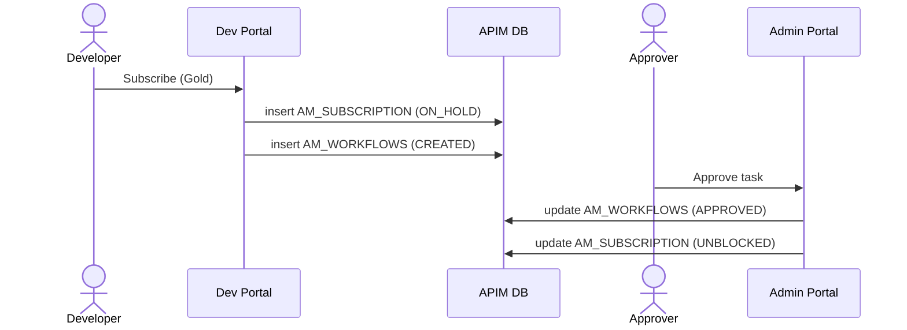

# Approval workflows

!!! abstract "What happens"
    An admin can put an approval step in front of certain actions, such as creating an application or subscribing to an API. When someone performs the action, APIM saves it in a "waiting" state and records a **workflow** row in `AM_WORKFLOWS`. When an approver approves or rejects it in the Admin Portal, APIM finishes (or cancels) the original action.

**Who:** The person doing the action, then an approver (Admin Portal) · **Tables written:** [`AM_WORKFLOWS`](../reference/am.md#am_workflows), plus the status column of the gated table · **Tables read:** the gated table

## The flow at a glance

This diagram uses subscription approval as the example. The other workflow types follow the same pattern.



- The gated row always exists *before* approval, so the workflow row can point at it.
- If there's no workflow configured, the "simple" executor approves instantly, and no `AM_WORKFLOWS` row is written.
- Which executor runs for each action is set in the registry resource `/_system/governance/apimgt/applicationdata/workflow-extensions.xml`, for example `ApplicationCreationSimpleWorkflowExecutor` → `ApplicationCreationApprovalWorkflowExecutor`.

## Step by step

1. **The action is saved "pending".** The gated table gets its row with a waiting status, e.g. `AM_SUBSCRIPTION.SUB_STATUS = 'ON_HOLD'` or `AM_APPLICATION.APPLICATION_STATUS = 'CREATED'`.

2. **Workflow row.** One row goes into [`AM_WORKFLOWS`](../reference/am.md#am_workflows):
    - `WF_TYPE` says *what* is waiting (see the table below).
    - `WF_REFERENCE` is the id of the waiting thing, stored as text (e.g. `'3'` for `APPLICATION_ID` 3).
    - `WF_STATUS` is `CREATED`, then `APPROVED` or `REJECTED`.
    - `WF_EXTERNAL_REFERENCE` is a unique UUID. The approval engine and the Admin REST API (`/workflows/update-workflow-status?workflowReferenceId=…`) use it.
    - `WF_METADATA` / `WF_PROPERTIES` hold details shown to the approver.
    - `WF_STATUS_DESC` starts as a description of the request ("Approve application PendingApp creation request from application creator - admin …"), and is replaced by the approver's comment.

    | WF_ID | WF_REFERENCE | WF_TYPE | WF_STATUS | WF_EXTERNAL_REFERENCE | TENANT_DOMAIN |
    |---|---|---|---|---|---|
    | 1 | 3 *(PendingApp)* | AM_APPLICATION_CREATION | CREATED → APPROVED | `f76f…` | carbon.super |
    | 2 | 2 *(subscription 2)* | AM_SUBSCRIPTION_CREATION | CREATED → APPROVED | `1ff1…` | carbon.super |

3. **Decision.** The approver acts in the Admin Portal (or an external BPMN engine calls back). `WF_STATUS` and `WF_STATUS_DESC` are updated, and APIM completes or cancels the original action. On approval, the application moves from `CREATED` to `APPROVED` and the subscription from `ON_HOLD` to `UNBLOCKED`.

## Workflow types and what they point at

`WF_TYPE` decides which table `WF_REFERENCE` refers to. This is a *polymorphic* reference: one column pointing at different tables depending on the type.

| WF_TYPE | Gates | WF_REFERENCE points to | Status column in the gated table |
|---|---|---|---|
| `AM_APPLICATION_CREATION` | Create an application | `AM_APPLICATION.APPLICATION_ID` | `APPLICATION_STATUS` |
| `AM_APPLICATION_UPDATE` | Update an application | `AM_APPLICATION.APPLICATION_ID` | `APPLICATION_STATUS` |
| `AM_APPLICATION_DELETION` | Delete an application | `AM_APPLICATION.APPLICATION_ID` | `APPLICATION_STATUS` |
| `AM_SUBSCRIPTION_CREATION` | Subscribe | `AM_SUBSCRIPTION.SUBSCRIPTION_ID` | `SUB_STATUS` |
| `AM_SUBSCRIPTION_UPDATE` | Change tier | `AM_SUBSCRIPTION.SUBSCRIPTION_ID` | `SUB_STATUS`, `TIER_ID_PENDING` |
| `AM_SUBSCRIPTION_DELETION` | Unsubscribe | `AM_SUBSCRIPTION.SUBSCRIPTION_ID` | `SUBS_CREATE_STATE` |
| `AM_APPLICATION_REGISTRATION_PRODUCTION` / `_SANDBOX` | Generate keys | `AM_APPLICATION_REGISTRATION.REG_ID` (via `WF_REF`) | `AM_APPLICATION_KEY_MAPPING.STATE` |
| `AM_API_STATE` / `AM_API_PRODUCT_STATE` | Lifecycle change | the API | registry lifecycle state |
| `AM_REVISION_DEPLOYMENT` | Deploy a revision | the revision | `AM_DEPLOYMENT_REVISION_MAPPING.REVISION_STATUS` |
| `AM_USER_SIGNUP` | Self sign-up | the username | user account state |

*These `WF_TYPE` values match the workflow constants in the 4.7.0 code (`WorkflowConstants`). The code also defines `AM_COMMENTS_ADD`, but no workflow executor ships for it, so it never appears in practice.*

!!! warning "Logical link (no foreign key)"
    `WF_REFERENCE` is a plain string that holds a number, a UUID or a username, depending on `WF_TYPE`. Deleting the gated row doesn't delete the workflow row. APIM's code cleans up pending ones.

!!! info "The `WF_*` tables"
    The `WF_*` tables (`WF_REQUEST`, `WF_WORKFLOW`, `WF_WORKFLOW_ASSOCIATION` and so on) belong to the embedded Identity Server's own workflow engine, which is used for user-management approvals. APIM's API-side approvals use only `AM_WORKFLOWS`. See [Workflows](../domains/workflows.md).

## Try it

This query lists pending approvals with the application or subscription each one refers to.

```sql
SELECT w.WF_ID, w.WF_TYPE, w.WF_STATUS, w.WF_CREATED_TIME,
       ap.NAME AS APPLICATION, sub.TIER_ID
FROM AM_WORKFLOWS w
LEFT JOIN AM_APPLICATION ap
       ON w.WF_TYPE LIKE 'AM_APPLICATION_%' AND w.WF_TYPE NOT LIKE 'AM_APPLICATION_REGISTRATION%'
      AND CAST(ap.APPLICATION_ID AS CHAR) = w.WF_REFERENCE
LEFT JOIN AM_SUBSCRIPTION sub
       ON w.WF_TYPE LIKE 'AM_SUBSCRIPTION_%'
      AND CAST(sub.SUBSCRIPTION_ID AS CHAR) = w.WF_REFERENCE
WHERE w.WF_STATUS = 'CREATED';
```

!!! note "Different in 3.x"
    3.x uses the same `AM_WORKFLOWS` table. It doesn't have the revision-deployment workflow type, because it has no revisions. See [3.x: Approval workflows](../../apim-3/flows/13-approval-workflows.md).

**Related domains:** [Workflows](../domains/workflows.md) · [Applications & subscriptions](../domains/applications-subscriptions.md)
