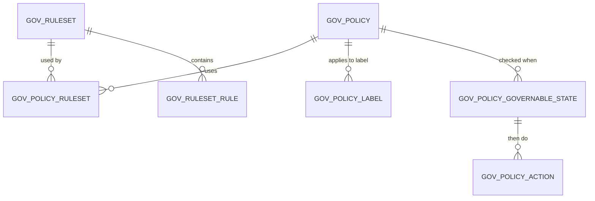
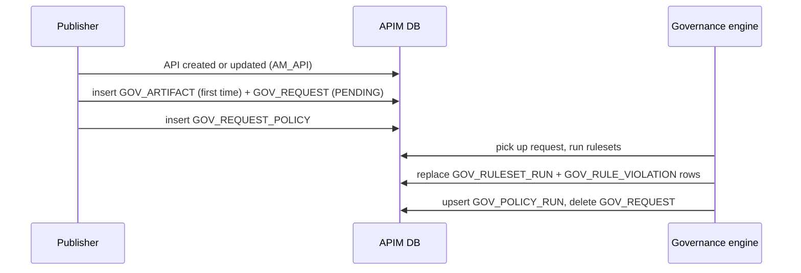

# Governance check

!!! abstract "What happens"
    Admins define **rulesets**, e.g. "OpenAPI best practices" or "OWASP security rules", and group them into **policies**. Each policy applies to APIs with certain labels, and is checked at certain moments such as "on create" or "on deploy". Whenever a matching API changes, APIM queues a governance request, runs the rulesets against the API and stores the result and any violations. Policies can also **block** an action when a serious rule fails.

!!! success "Verified on a running server"
    Confirmed on WSO2 APIM 4.7.0 (embedded H2, default config), using only the seeded default policy.
    - Creating an API, and creating a new version, each wrote [`GOV_ARTIFACT`](../reference/gov.md#gov_artifact), a `PENDING` [`GOV_REQUEST`](../reference/gov.md#gov_request) and a [`GOV_REQUEST_POLICY`](../reference/gov.md#gov_request_policy).
    - About ten seconds later the background engine had written [`GOV_POLICY_RUN`](../reference/gov.md#gov_policy_run), one [`GOV_RULESET_RUN`](../reference/gov.md#gov_ruleset_run) per ruleset (`RESULT = 0`, failed), and 16 [`GOV_RULE_VIOLATION`](../reference/gov.md#gov_rule_violation) rows per API, and had deleted the processed request.
    - Updating the API (creating a revision) queued a new request.

    Surprises:

    - **Results are replaced, not accumulated.** Each new run deletes the artifact's old `GOV_RULESET_RUN` and `GOV_RULE_VIOLATION` rows and inserts fresh ones. `GOV_POLICY_RUN` is updated in place. There's no history.
    - **The default policy is global and never blocks.** *WSO2 API Management Best Practices* has `IS_GLOBAL = 1`, checks on `API_CREATE` and `API_UPDATE` only, and uses `NOTIFY` for every severity. It links 3 of the 4 seeded rulesets. The OWASP Top 10 ruleset isn't linked.
    - **Deleting an API** removed its `GOV_ARTIFACT` and all its run and violation rows.

**Who:** Admin (sets up the rules), then APIM's governance engine (runs the checks automatically) · **Tables written:** `GOV_RULESET*`, `GOV_POLICY*`, [`GOV_ARTIFACT`](../reference/gov.md#gov_artifact), [`GOV_REQUEST`](../reference/gov.md#gov_request), [`GOV_REQUEST_POLICY`](../reference/gov.md#gov_request_policy), [`GOV_POLICY_RUN`](../reference/gov.md#gov_policy_run), [`GOV_RULESET_RUN`](../reference/gov.md#gov_ruleset_run), [`GOV_RULE_VIOLATION`](../reference/gov.md#gov_rule_violation) · **Tables read:** [`AM_API`](../reference/am.md#am_api), [`AM_API_LABEL_MAPPING`](../reference/am.md#am_api_label_mapping)

## How the rules are organised

A policy bundles rulesets and says when to check them and what to do about failures.



- **Ruleset** = the rules themselves, stored as a Spectral-style YAML file.
- **Policy** = which rulesets, for which APIs (by label or `IS_GLOBAL`), at which moments (states), and with which action per severity.

## The flow at a glance

This diagram shows a check triggered by an API being updated.



- Checks run **asynchronously** in the background. A *blocking* action (e.g. "block deploy when an ERROR-level rule fails") is instead evaluated synchronously at that moment.
- The rows above were all observed. Their exact order *within* one background run is inferred.

## Step by step

1. **Define rulesets** (admin).
    - [`GOV_RULESET`](../reference/gov.md#gov_ruleset) holds `RULESET_ID`, `NAME`, `ARTIFACT_TYPE` (e.g. REST API), `RULE_CATEGORY`, `RULE_TYPE` (e.g. API definition, documentation) and `ORGANIZATION`.
    - The uploaded YAML is stored in [`GOV_RULESET_CONTENT`](../reference/gov.md#gov_ruleset_content), and each rule parsed from it is stored in [`GOV_RULESET_RULE`](../reference/gov.md#gov_ruleset_rule) (`RULE_NAME`, `SEVERITY`, `RULE_CONTENT`).

2. **Define policies** (admin).
    - [`GOV_POLICY`](../reference/gov.md#gov_policy) holds `POLICY_ID`, `NAME` and `IS_GLOBAL`.
    - The policy is linked to rulesets through [`GOV_POLICY_RULESET`](../reference/gov.md#gov_policy_ruleset), and to API labels through [`GOV_POLICY_LABEL`](../reference/gov.md#gov_policy_label).
    - The moments to check (`STATE`, e.g. `API_CREATE`, `API_UPDATE`, `API_DEPLOY`, `API_PUBLISH`) go into [`GOV_POLICY_GOVERNABLE_STATE`](../reference/gov.md#gov_policy_governable_state). For each state + severity, the action (`TYPE` = `BLOCK` or `NOTIFY`) goes into [`GOV_POLICY_ACTION`](../reference/gov.md#gov_policy_action).

    What's seeded out of the box:

    | GOV_POLICY_ACTION.STATE | SEVERITY | TYPE |
    |---|---|---|
    | API_CREATE | ERROR / WARN / INFO | NOTIFY |
    | API_UPDATE | ERROR / WARN / INFO | NOTIFY |

    Changing a row to `TYPE = 'BLOCK'` (e.g. for `API_DEPLOY` + `ERROR`) makes the policy stop the action. That wasn't tested.

3. **Register the API as a governed artifact.** [`GOV_ARTIFACT`](../reference/gov.md#gov_artifact) gets one row per API. Its `ARTIFACT_KEY` is the governance id, and `ARTIFACT_REF_ID` is the **API UUID**. `(ARTIFACT_REF_ID, ARTIFACT_TYPE, ORGANIZATION)` is unique.

    !!! warning "Logical link (no foreign key)"
        `GOV_ARTIFACT.ARTIFACT_REF_ID` → `AM_API.API_UUID` is a value match only. Policy labels match API labels ([`AM_LABEL`](../reference/am.md#am_label)`.NAME`) by name, too.

4. **Queue a request.** [`GOV_REQUEST`](../reference/gov.md#gov_request) gets a row with `ARTIFACT_KEY`, `STATUS = 'PENDING'` and `REQ_TIMESTAMP`. It's deleted once processed. The unique key `(STATUS, ARTIFACT_KEY)` stops duplicate pending requests for the same API. The policies to evaluate are listed in [`GOV_REQUEST_POLICY`](../reference/gov.md#gov_request_policy).

5. **Store the results.**
    - [`GOV_RULESET_RUN`](../reference/gov.md#gov_ruleset_run) keeps one row per (artifact, ruleset). It holds the latest `RESULT` (1 pass, 0 fail) and `RUN_TIMESTAMP`. Each new run replaces the row with a new `RULESET_RUN_ID`.
    - [`GOV_RULE_VIOLATION`](../reference/gov.md#gov_rule_violation) gets one row for each failed rule, with `RULE_NAME`, `MESSAGE` and `VIOLATED_PATH` (where in the API definition the problem is). It links back to the run and to the rule.
    - [`GOV_POLICY_RUN`](../reference/gov.md#gov_policy_run) records when each policy last ran for the artifact.

    Real violations recorded for `PizzaShackAPI`:

    | RULE_NAME | MESSAGE | VIOLATED_PATH |
    |---|---|---|
    | api-technical-owner-email | Technical owner email is missing or empty. | `[data][businessInformation][technicalOwnerEmail]` |
    | api-business-owner-email | Business owner email is missing or empty. | `[data][businessInformation][businessOwnerEmail]` |
    | api-no-insecure-transports | API should not have insecure transports. | `[data][transport][0]` |

## What gets cleaned up

The `GOV_*` FKs have no ON DELETE rules, so the database blocks deleting a parent while child rows exist. APIM's code deletes in order: violations → runs → requests → artifact, and for rules: policy links → rules → ruleset. Deleting an API removed its governance data (verified: the `GOV_ARTIFACT`, `GOV_POLICY_RUN`, `GOV_RULESET_RUN` and `GOV_RULE_VIOLATION` rows all went).

## Try it

This query shows the current compliance problems for each API.

```sql
SELECT a.API_NAME, a.API_VERSION, rs.NAME AS RULESET,
       v.RULE_NAME, v.MESSAGE, v.VIOLATED_PATH
FROM GOV_RULE_VIOLATION v
JOIN GOV_RULESET_RUN r ON r.RULESET_RUN_ID = v.RULESET_RUN_ID
JOIN GOV_RULESET rs ON rs.RULESET_ID = r.RULESET_ID
JOIN GOV_ARTIFACT ga ON ga.ARTIFACT_KEY = r.ARTIFACT_KEY
LEFT JOIN AM_API a ON a.API_UUID = ga.ARTIFACT_REF_ID;
```

!!! note "Different in 3.x"
    API governance **doesn't exist in 3.x**. There are no `GOV_*` tables. The [3.x flows](../../apim-3/flows/index.md) have no equivalent page.

**Related domains:** [Governance](../domains/governance.md) · [Lifecycle & labels](../domains/lifecycle-labels.md)
