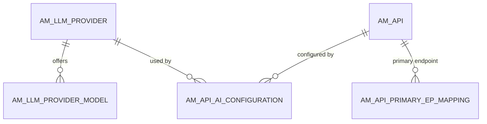
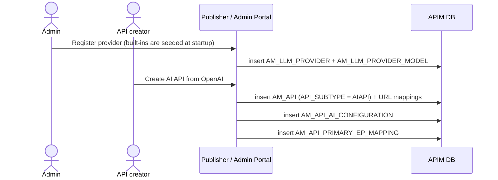

# Create an AI API

!!! abstract "What happens"
    An API creator exposes an AI service, such as OpenAI, Azure OpenAI or Mistral, through APIM. They pick an **LLM provider**, which an admin has registered with its API definition and models. APIM creates a normal API (`AM_API` plus resources) and links it to the provider through `AM_API_AI_CONFIGURATION`. Subscription tiers can then limit **tokens**, not just requests.

!!! success "Verified on a running server"
    Confirmed on WSO2 APIM 4.7.0 (embedded H2, default config) by creating `ChatAPI 1.0.0` on the built-in **OpenAI 2.0.0** provider (`subtypeConfiguration.subtype = 'AIAPI'`).
    - The call wrote [`AM_API`](../reference/am.md#am_api) with `API_SUBTYPE = 'AIAPI'`, one [`AM_API_AI_CONFIGURATION`](../reference/am.md#am_api_ai_configuration) row, one [`AM_API_PRIMARY_EP_MAPPING`](../reference/am.md#am_api_primary_ep_mapping) row, an [`AM_API_URL_MAPPING`](../reference/am.md#am_api_url_mapping) row, a lifecycle event, the registry artifact, and a governance request.
    - The 9 built-in providers and their 26 models were already there from startup.

    Surprises:

    - **No [`AM_API_ENDPOINTS`](../reference/am.md#am_api_endpoints) row was written.** The primary-endpoint mapping points at the name `default_production_endpoint`, and the endpoint itself stayed in the registry artifact.
    - **The working copy's `API_REVISION_UUID` is `NULL`** in `AM_API_AI_CONFIGURATION`, whereas `AM_API_PRIMARY_EP_MAPPING` uses `'Current API'` for the same idea.

**Who:** Admin (registers providers), API creator (Publisher) · **Tables written:** [`AM_LLM_PROVIDER`](../reference/am.md#am_llm_provider) + [`AM_LLM_PROVIDER_MODEL`](../reference/am.md#am_llm_provider_model) (at startup or by an admin), [`AM_API`](../reference/am.md#am_api), [`AM_API_LC_EVENT`](../reference/am.md#am_api_lc_event), [`AM_API_URL_MAPPING`](../reference/am.md#am_api_url_mapping), [`AM_API_AI_CONFIGURATION`](../reference/am.md#am_api_ai_configuration), [`AM_API_PRIMARY_EP_MAPPING`](../reference/am.md#am_api_primary_ep_mapping), `GOV_*`, `REG_*` · **Tables read:** [`AM_POLICY_SUBSCRIPTION`](../reference/am.md#am_policy_subscription)

## How the tables connect

An AI API is a normal API with one extra link to the provider it fronts.



- There's one AI configuration row per API **per revision**, so revisions snapshot the provider choice too.

## The flow at a glance



- After this, the API is revisioned, deployed, published and subscribed to exactly like any other API ([flows 4–10](index.md)).

## Step by step

1. **Provider registration** (admin, or built in).
    - [`AM_LLM_PROVIDER`](../reference/am.md#am_llm_provider) holds `UUID`, `NAME`, `API_VERSION` and `ORGANIZATION`.
    - `BUILT_IN_SUPPORT` is true for providers that ship with APIM.
    - `CONFIGURATIONS` holds how to read token counts, the model name and so on from responses. `API_DEFINITION` holds the provider's OpenAPI.
    - `(NAME, API_VERSION, ORGANIZATION)` is unique.

    | UUID | NAME | API_VERSION | BUILT_IN_SUPPORT | ORGANIZATION |
    |---|---|---|---|---|
    | `4d78…` | OpenAI | 2.0.0 | true | carbon.super |

2. **Models.** [`AM_LLM_PROVIDER_MODEL`](../reference/am.md#am_llm_provider_model) lists the models the provider offers, with `MODEL_NAME`, `MODEL_FAMILY_NAME` and `LLM_PROVIDER_UUID` (a real FK).

    | MODEL_ID | MODEL_NAME | MODEL_FAMILY_NAME | LLM_PROVIDER_UUID |
    |---|---|---|---|
    | 18 | gpt-4o | OpenAI | `4d78…` |
    | 19 | gpt-4o-mini | OpenAI | `4d78…` |
    | 20 | o3-mini | OpenAI | `4d78…` |

3. **The API itself.** An [`AM_API`](../reference/am.md#am_api) row is created with `API_TYPE = 'HTTP'` and **`API_SUBTYPE = 'AIAPI'`** (verified), which is what marks it as an AI API. Its resources, e.g. `POST /chat/completions`, are stored in [`AM_API_URL_MAPPING`](../reference/am.md#am_api_url_mapping) like any other API's.

    | API_ID | API_UUID | API_NAME | CONTEXT | API_TYPE | API_SUBTYPE | STATUS |
    |---|---|---|---|---|---|---|
    | 4 | `e6c6…` | ChatAPI | /chat/1.0.0 | HTTP | AIAPI | CREATED |

4. **The link.** [`AM_API_AI_CONFIGURATION`](../reference/am.md#am_api_ai_configuration) holds `AI_CONFIGURATION_UUID`, `API_UUID` (FK), `API_REVISION_UUID` and `LLM_PROVIDER_UUID` (FK). For the working copy `API_REVISION_UUID` is `NULL`. When a revision is created, a copy with the revision's UUID is expected, though revisions of the AI API weren't tested.

    | AI_CONFIGURATION_UUID | API_UUID | API_REVISION_UUID | LLM_PROVIDER_UUID |
    |---|---|---|---|
    | `796b…` | `e6c6…` | *(null)* | `4d78…` *(OpenAI 2.0.0)* |

5. **Endpoints and secrets.** [`AM_API_PRIMARY_EP_MAPPING`](../reference/am.md#am_api_primary_ep_mapping) records which endpoint is primary: `(API_UUID, ENDPOINT_UUID = 'default_production_endpoint', REVISION_UUID = 'Current API')`. The default endpoint defined at creation time stayed in the registry artifact; no [`AM_API_ENDPOINTS`](../reference/am.md#am_api_endpoints) row was written. Extra *named* endpoints, used for model routing and failover, go into `AM_API_ENDPOINTS` with their URL and API key in the `ENDPOINT_CONFIG` blob. Per-environment keys can go into [`AM_API_ENVIRONMENT_KEYS`](../reference/am.md#am_api_environment_keys).

6. **Token-based limits.** A subscription tier can cap AI usage through the [`AM_POLICY_SUBSCRIPTION`](../reference/am.md#am_policy_subscription) columns `TOTAL_TOKEN_COUNT`, `PROMPT_TOKEN_COUNT` and `COMPLETION_TOKEN_COUNT`, with `QUOTA_TYPE = 'aiApiQuota'`. The seeded tiers `AIGold`, `AISilver` and `AIBronze` are of this type (e.g. AIGold: 500 requests and 50000 total tokens per minute).

## What gets cleaned up

- The FKs from `AM_API_AI_CONFIGURATION` and `AM_LLM_PROVIDER_MODEL` have **no ON DELETE rule**. You can't delete a provider while APIs use it, or while it still has model rows.
- APIM's code removes the AI configuration when the API is deleted.

## Try it

This query lists the AI APIs, the provider behind each one, and the provider's models.

```sql
SELECT a.API_NAME, a.API_VERSION, p.NAME AS PROVIDER, p.API_VERSION AS PROVIDER_VERSION,
       m.MODEL_NAME
FROM AM_API_AI_CONFIGURATION c
JOIN AM_API a ON a.API_UUID = c.API_UUID
JOIN AM_LLM_PROVIDER p ON p.UUID = c.LLM_PROVIDER_UUID
LEFT JOIN AM_LLM_PROVIDER_MODEL m ON m.LLM_PROVIDER_UUID = p.UUID
WHERE c.API_REVISION_UUID IS NULL OR c.API_REVISION_UUID = 'Current API';
```

!!! note "Different in 3.x"
    AI APIs **don't exist in 3.x**. There are no LLM provider or AI configuration tables. The [3.x flows](../../apim-3/flows/index.md) have no equivalent page.

**Related domains:** [AI APIs](../domains/ai-apis.md) · [API definition](../domains/api-definition.md) · [Throttling policies](../domains/throttling.md)
