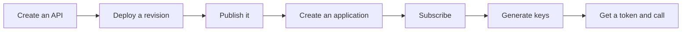

# Core flows

!!! abstract "What this section is"
    Each page here follows one thing a person (or APIM itself) does, and shows **which tables get written or read, in what order, and which columns link one step to the next**.

!!! success "Verified on a running server"
    Every flow page was checked against a real WSO2 APIM 4.7.0 server (embedded H2, default config). The test drove each flow through the REST APIs and compared full database snapshots before and after each step. Each page has a green box listing what was confirmed and what was surprising.

The pages are ordered roughly the way an API goes through its life. First an API creator designs and ships an API. Then a developer finds it and uses it. Finally admins keep everything under control.

## The end-to-end journey

This diagram shows the "happy path" from an idea to a working API call. Each box is a flow page.

- The first three boxes happen in the **Publisher**, and the last four in the **Developer Portal**.
- The final box is where the **Gateway** and **Key Manager** take over.

## All flows

| # | Flow | Who does it | Main tables |
|---|---|---|---|
| 1 | [Setup & first user](01-bootstrap.md) | APIM at startup, a user logging in | `UM_USER`, `AM_KEY_MANAGER`, `AM_POLICY_*`, `AM_SUBSCRIBER` + DefaultApplication |
| 2 | [Create an API](02-create-api.md) | API creator (Publisher) | `AM_API`, `AM_API_URL_MAPPING`, `AM_SCOPE`, `IDN_OAUTH2_SCOPE`, `GOV_REQUEST` |
| 3 | [Create a new version](03-new-version.md) | API creator (Publisher) | `AM_API`, `AM_API_DEFAULT_VERSION` |
| 4 | [Deploy a revision](04-deploy-revision.md) | API creator (Publisher), Gateway | `AM_REVISION`, `AM_GW_API_ARTIFACTS`, `AM_DEPLOYMENT_REVISION_MAPPING`, `AM_GW_REVISION_DEPLOYMENT` |
| 5 | [Change lifecycle state](05-lifecycle.md) | API publisher | `AM_API.STATUS`, `AM_API_LC_EVENT` |
| 6 | [Create an API product](06-api-product.md) | API creator (Publisher) | `AM_API` (type `APIProduct`), copied `AM_API_URL_MAPPING` rows, `AM_API_PRODUCT_MAPPING` |
| 7 | [Create an application](07-create-application.md) | Developer (Dev Portal) | `AM_SUBSCRIBER`, `AM_APPLICATION` |
| 8 | [Subscribe to an API](08-subscribe.md) | Developer (Dev Portal) | `AM_SUBSCRIPTION` |
| 9 | [Generate keys](09-generate-keys.md) | Developer (Dev Portal), Key Manager | `AM_APPLICATION_REGISTRATION`, `AM_APPLICATION_KEY_MAPPING`, `IDN_OAUTH_CONSUMER_APPS` |
| 10 | [Get a token & call the API](10-token-and-invoke.md) | Client app, Key Manager, Gateway | Nothing written for JWTs or calls. `AM_API_KEY` for API keys |
| 11 | [Manage throttling policies](11-throttling-policies.md) | Admin (Admin Portal) | `AM_POLICY_*`, `AM_API_THROTTLE_POLICY`, `AM_CONDITION_GROUP` |
| 12 | [Revoke & delete](12-revocation-and-delete.md) | Developer, admin, Key Manager | `AM_REVOKED_JWT`, `IDN_INVALID_TOKENS`, `AM_APP_REVOKED_EVENT`, cascading deletes |
| 13 | [Approval workflows](13-approval-workflows.md) | Any of the above, plus an approver | `AM_WORKFLOWS` |
| 14 | [Governance check](14-governance.md) | APIM governance engine | `GOV_*` |
| 15 | [Create an AI API](15-ai-api.md) | API creator (Publisher) | `AM_LLM_PROVIDER`, `AM_API_AI_CONFIGURATION` |

!!! tip "Reading the flow pages"
    Each page starts with a small sequence diagram, then walks through the steps with example rows. It finishes with a read-only SQL query you can run to see the result in your own database. See [How to read this site](../../how-to-read.md) for the diagram notation.

!!! note "Different in 3.x"
    3.x has most of the same flows. The big difference is step 4: instead of *revisions*, 3.x publishes APIs straight to *gateway labels*. See the [3.x flows](../../apim-3/flows/index.md).
