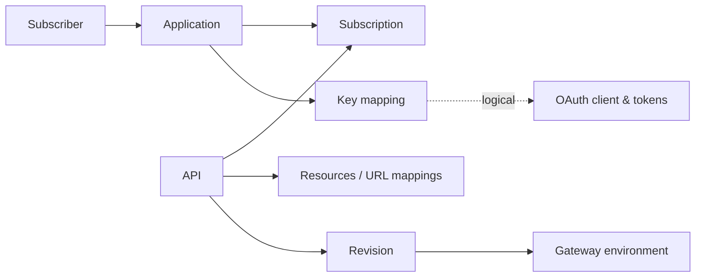

# APIM 4.x: the big picture

!!! info "Which version is this?"
    This section documents the database of **WSO2 API Manager 4.7.0**. It's generated from the scripts in `wso2am-4.7.0/dbscripts/`. Other 4.x releases share the same core design, but newer releases add tables.

## APIM in one paragraph

API Manager lets **API creators** design APIs in the *Publisher* and deploy them to *gateways*. **API consumers** find those APIs in the *Developer Portal*, create an *application*, *subscribe* it to APIs and generate OAuth *keys*. Their software then gets an *access token* and calls the API through the gateway, which checks the token, the subscription and the rate limits. Almost every one of those steps leaves rows in the database. This site explains those rows.

## The numbers

| What | Count |
|---|---|
| Tables in the APIM database (`WSO2AM_DB`) | 247 |
| Tables in the shared database (`WSO2SHARED_DB`) | 51 |
| **Total tables** | **298** |
| `AM_*` tables (API Manager's own) | 112 |
| `GOV_*` tables (API governance) | 14 |
| Tables inherited from WSO2 Identity Server (`IDN_*`, `SP_*`, `IDP_*`, `CM_*`, `FIDO*`) | 114 |
| `WF_*` workflow engine tables | 7 |
| Registry (`REG_*`) and user store (`UM_*`) tables | 17 + 34 |

About **210 relationships are real foreign keys** (168 in the APIM DB, 43 in the shared DB). Roughly another 60 are *logical links* that only the code enforces: the columns match, but the database doesn't check them. The domain pages call out every one of them.

## The hub: the tables everything else hangs off

This diagram shows only the most important tables and how they connect. Everything else in the database hangs off one of these.

- **Left side (consumers).** A subscriber owns applications, and an application subscribes to APIs.
- **Right side (creators).** An API has resources and gets snapshotted into revisions, which are deployed to gateway environments.
- **Bottom (security).** Each application has key mappings that point to an OAuth client in the key manager. The dashed line means the database doesn't enforce that link.

| Box | Main table |
|---|---|
| Subscriber | [`AM_SUBSCRIBER`](reference/am.md#am_subscriber) |
| Application | [`AM_APPLICATION`](reference/am.md#am_application) |
| Subscription | [`AM_SUBSCRIPTION`](reference/am.md#am_subscription) |
| API | [`AM_API`](reference/am.md#am_api) |
| Resources | [`AM_API_URL_MAPPING`](reference/am.md#am_api_url_mapping) |
| Revision | [`AM_REVISION`](reference/am.md#am_revision) |
| Gateway environment | [`AM_GATEWAY_ENVIRONMENT`](reference/am.md#am_gateway_environment) |
| Key mapping | [`AM_APPLICATION_KEY_MAPPING`](reference/am.md#am_application_key_mapping) |
| OAuth client & tokens | [`IDN_OAUTH_CONSUMER_APPS`](reference/idn.md#idn_oauth_consumer_apps), [`IDN_OAUTH2_ACCESS_TOKEN`](reference/idn.md#idn_oauth2_access_token) |

Rate limits (*throttling policies*) attach to three of these boxes: to the subscription (subscription tier), to the application (application tier) and to each resource (resource tier). See [Throttling policies](domains/throttling.md).

## Where to go next

**Domains** (groups of related tables):

| Domain | What it covers |
|---|---|
| [Tenants & users](domains/tenancy-users.md) | Tenants, organizations, users and roles, plus per-organization settings |
| [Registry](domains/registry.md) | The generic store that keeps each API's full metadata and documents |
| [API definition](domains/api-definition.md) | The API itself: resources, endpoints, certificates, categories, service catalog |
| [Scopes](domains/scopes.md) | Permission names attached to API resources |
| [Operation policies](domains/operation-policies.md) | Reusable mediation attached to APIs, resources and gateways |
| [API products](domains/api-products.md) | Bundles of resources from several APIs |
| [Revisions & deployment](domains/revisions-deployment.md) | Snapshots of APIs and getting them onto gateways |
| [Lifecycle & labels](domains/lifecycle-labels.md) | Created → Published → Retired history, and API labels |
| [Applications & subscriptions](domains/applications-subscriptions.md) | Consumers, their apps and what they subscribe to |
| [Keys & tokens](domains/keys-tokens.md) | Key managers, OAuth clients, access tokens, API keys |
| [Revocation](domains/revocation.md) | How revoked tokens and apps are remembered |
| [Throttling policies](domains/throttling.md) | Rate limits at every level |
| [Workflows](domains/workflows.md) | Approval steps |
| [Governance](domains/governance.md) | Rulesets, policies and compliance results |
| [AI APIs](domains/ai-apis.md) | LLM providers, AI API configuration and MCP servers |
| [Developer Portal extras](domains/devportal-extras.md) | Comments, ratings, portal content, webhooks |
| [Everything else](domains/other.md) | Monetization, alerts, analytics uploads, housekeeping |

**Core flows** (step-by-step stories): start at [All flows](flows/index.md), or jump to [Create an API](flows/02-create-api.md), [Deploy a revision](flows/04-deploy-revision.md), [Subscribe](flows/08-subscribe.md) or [Generate keys](flows/09-generate-keys.md).

**Before you query anything**, read the [Gotchas](gotchas.md). They'll save you from the most common wrong joins.

!!! note "Different in 3.x"
    3.x has no revisions, gateway environments in the database, organizations, operation policies, governance or AI tables, and its `AM_API` table has no UUID column. See the [3.x overview](../apim-3/index.md) and the [3.x vs 4.x comparison](../comparison.md).
