# 3.x vs 4.x: what changed

This page compares the **APIM 3.2.0** database (the [3.x series](apim-3/index.md)) with the **APIM 4.7.0** database (the [4.x series](apim-4/index.md)). It's based on a diff of the two products' `dbscripts/apimgt/mysql.sql` and `dbscripts/mysql.sql` files.

!!! abstract "The short version"
    The core of the model survives unchanged: **subscriber → application → subscription ← API**, plus keys and throttling policies. 4.x builds a lot around that core:

    - **Revisions.** You deploy a frozen snapshot of an API, not the live API.
    - **Gateway environments and VHosts in the database.** In 3.x these were names in a config file.
    - **The API's UUID moves into `AM_API`.** In 3.x it only lived in the registry.
    - **`ORGANIZATION` columns** start to replace tenant IDs on the main tables.
    - **Many new feature areas:** operation policies, persisted API keys, the service catalog, multiple endpoints, governance and AI/LLM APIs.
    - **Deletes cascade more.** Several links that used to block deletes now cascade.

## Headline numbers

| | 3.2.0 | 4.7.0 | Change |
|---|---:|---:|---:|
| **Tables, total** | 200 | 298 | **+98** (101 added, 3 removed) |
| `AM_*` (API Manager core) | 57 | 112 | +55 |
| `GOV_*` (governance) | — | 14 | +14 |
| `IDN_*` (identity & OAuth) | 59 | 77 | +18 |
| `UM_*` (users, roles, tenants) | 24 | 34 | +10 |
| `SP_*` (service providers) | 12 | 13 | +1 |
| `REG_*`, `IDP_*`, `CM_*`, `WF_*`, `FIDO*` | 17, 12, 10, 7, 2 | same | 0 |
| **Declared foreign keys, total** | 126 | 211 | +85 |
| Declared FKs on `AM_*` tables | 28 | 74 | +46 |
| Tables with a `REVISION_UUID`-style column | 0 | 20 | +20 |
| `AM_*` tables with an `ORGANIZATION` column | 0 | 20 | +20 |

Only **3 tables were removed**: `AM_LABELS`, `AM_LABEL_URLS` and `AM_SUBSCRIPTION_KEY_MAPPING`. Everything that existed in 3.2.0 is still there in 4.7.0, although some tables gained columns.

## The big changes

### 1. Gateway labels → revisions, environments and VHosts

In **3.x**, gateways were configured in `deployment.toml` and never appeared in the database. By default, publishing pushed the API straight to those gateways. Only when the optional database artifact sync was turned on did publishing write the artifact into `AM_GW_API_ARTIFACTS`, keyed by a **gateway label**, with a `GATEWAY_INSTRUCTION` column (publish or remove) telling each gateway what to do. On a default 3.2.0 install that table stays empty.

In **4.x**, you first create a **revision**, which is a frozen copy of the API. Then you deploy that revision to a **gateway environment** and a **VHost**. The environments are now database rows.

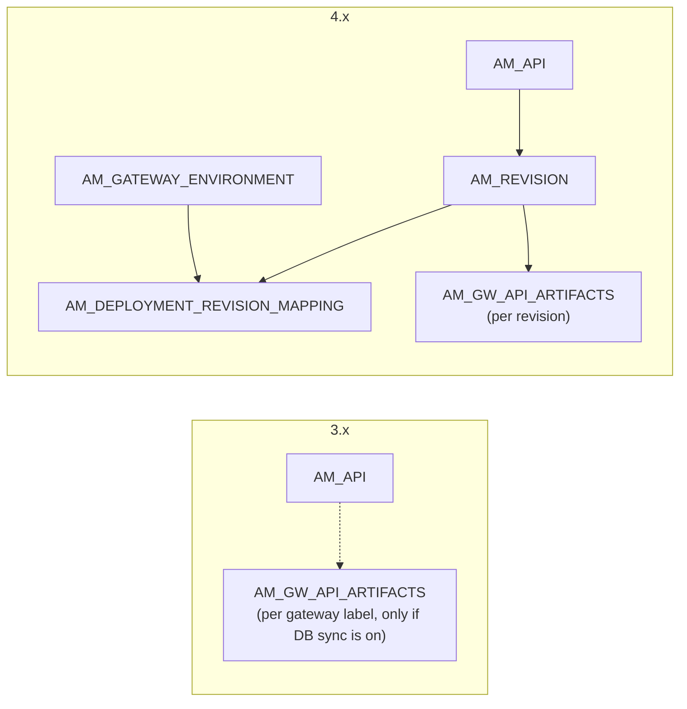

- `AM_GW_API_ARTIFACTS` changed its key from `(GATEWAY_LABEL, API_ID)` to `(REVISION_ID, API_ID)`. It also lost `GATEWAY_INSTRUCTION`, because deploy and undeploy state now lives in the deployment tables.
- Creating a revision writes its artifact to `AM_GW_API_ARTIFACTS` straight away. Deploying the revision then writes `AM_DEPLOYMENT_REVISION_MAPPING` (the request), `AM_GW_API_DEPLOYMENTS`, and `AM_GW_REVISION_DEPLOYMENT`, which records the gateway's `SUCCESS` acknowledgement. On a default 4.7.0 run, `AM_DEPLOYED_REVISION` was never written. Environments and VHosts created in the Admin Portal are stored in `AM_GATEWAY_ENVIRONMENT` and `AM_GW_VHOST`, but the Default environment from `deployment.toml` isn't.
- 20 tables now carry a revision column. The working copy of an API has the sentinel value `'Current API'` or `NULL` there. Revision rows copy the URL mappings, endpoints, policies and so on, each tagged with the revision's UUID.

See [Revisions & deployment (4.x)](apim-4/domains/revisions-deployment.md) and [Gateway publishing (3.x)](apim-3/domains/gateway-publishing.md).

### 2. The API's UUID moves into `AM_API`

In **3.x**, `AM_API` identifies an API by an integer `API_ID` plus the unique set *(provider, name, version)*. The API's **UUID**, which the REST APIs use, is the registry artifact ID `REG_RESOURCE.REG_UUID`. It isn't in `AM_API` at all.

In **4.x**, `AM_API.API_UUID` holds the UUID, and almost every new table joins on it rather than on the integer ID.

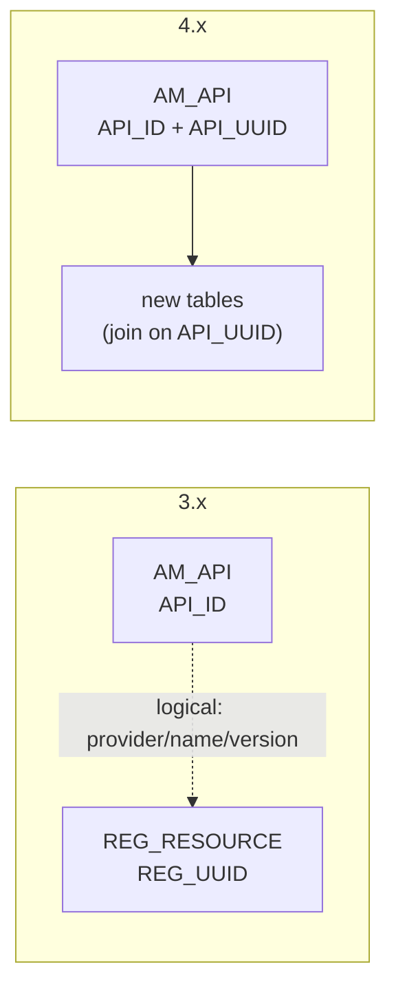

!!! warning "Two kinds of API ID"
    Even in 4.x, older tables such as `AM_SUBSCRIPTION`, `AM_API_URL_MAPPING` and `AM_API_LC_EVENT` still join on the integer `API_ID`. The gateway tables (`AM_GW_PUBLISHED_API_DETAILS.API_ID`) hold the UUID **string** in both series.

### 3. Tenant IDs → `ORGANIZATION` scoping

**3.x** scopes data with `TENANT_ID` (an integer, e.g. `-1234`) or `TENANT_DOMAIN` (e.g. `carbon.super`). **4.x** adds an `ORGANIZATION` column to 20 `AM_*` tables, including `AM_API`, `AM_APPLICATION`, `AM_KEY_MANAGER`, `AM_API_CATEGORIES` and `AM_API_DEFAULT_VERSION`. For a plain tenant, its value is the tenant domain.

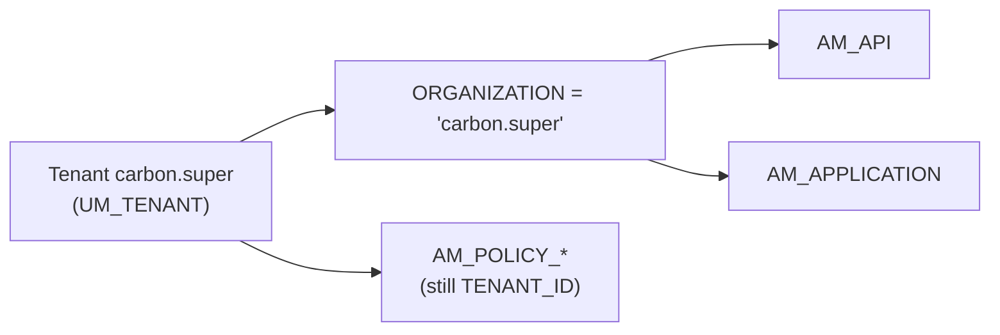

- Uniqueness rules now include the organization. For example, `AM_API` is unique on *(provider, name, version, organization)*, and `AM_KEY_MANAGER` on *(name, organization)* instead of *(name, tenant domain)*.
- The switch isn't complete. **Throttling policies** (`AM_POLICY_SUBSCRIPTION`, `AM_POLICY_APPLICATION`, `AM_API_THROTTLE_POLICY`, `AM_POLICY_GLOBAL`, `AM_POLICY_HARD_THROTTLING`) and 15 other `AM_*` tables still use `TENANT_ID`.
- `UM_TENANT` gains `UM_TENANT_UUID` and `UM_ORG_UUID`. The new `UM_ORG*` tables and `AM_ORGANIZATION_MAPPING` model sub-organizations.

### 4. Operation policies

**3.x** only had per-API mediation sequences, which lived in the registry. **4.x** adds reusable **operation policies**: a policy is defined once, then attached to an API resource, to a whole API, or to a gateway globally.

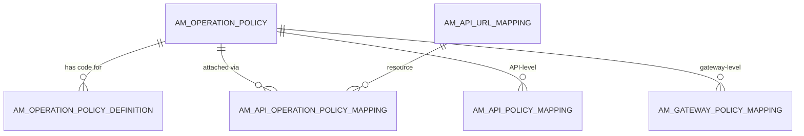

`AM_COMMON_OPERATION_POLICY` marks the shared, organization-wide policies. `AM_API_OPERATION_POLICY` holds API-specific copies (`CLONED_POLICY_UUID`). Gateway-wide (global) policies use `AM_GATEWAY_POLICY_METADATA` → `AM_GATEWAY_POLICY_MAPPING` → `AM_GATEWAY_POLICY_DEPLOYMENT`. See [Operation policies](apim-4/domains/operation-policies.md).

### 5. API keys: `AM_SUBSCRIPTION_KEY_MAPPING` removed, `AM_API_KEY*` added

**3.x** had `AM_SUBSCRIPTION_KEY_MAPPING` (`SUBSCRIPTION_ID`, `ACCESS_TOKEN`, `KEY_TYPE`), a legacy link between access tokens and subscriptions. 3.x API keys are self-contained signed JWTs and aren't stored in the database. Revoking one adds a row to `AM_REVOKED_JWT`.

**4.x** removes that table and adds **persisted API keys**. Only a hash of each key is stored, and a key can be tied to APIs and/or applications.

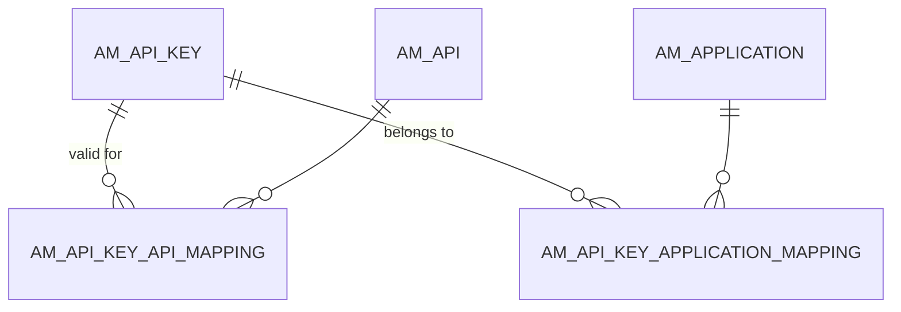

`AM_API_KEY` stores `API_KEY_HASH` (unique), `KEY_TYPE`, `STATUS`, `VALIDITY_PERIOD` and `LAST_USED`. Both mapping tables join on UUIDs (`API_UUID` and `APPLICATION_UUID`), not integer IDs.

### 6. Service catalog

**4.x** adds a **service catalog**, a registry of backend services with their definitions. An API can be created from a service, and the link is recorded.

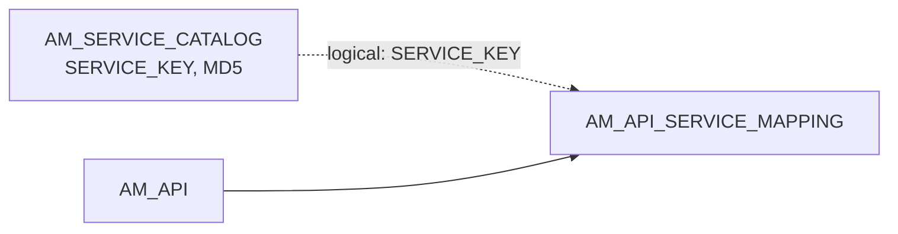

`AM_API_SERVICE_MAPPING` keeps the service's `MD5` from when the API was created. Comparing it with the catalog's current `MD5` tells APIM that the service has changed since. Both tables are scoped by `TENANT_ID`.

### 7. Endpoints and backends

In **3.x**, an API's endpoint configuration lived only in the registry artifact. **4.x** can store **several named endpoints per API** (for example, per key type) and choose a primary one. It also adds backend definitions for newer API types.

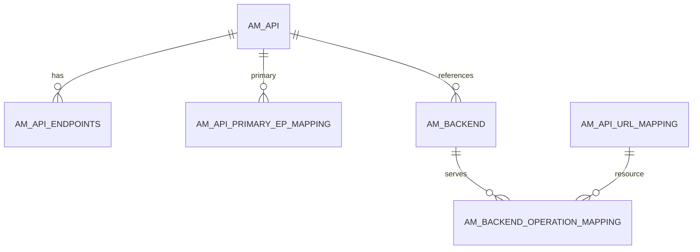

All of these are revision-aware. `AM_API_SEQUENCE_BACKEND` (custom sequence backends) and `AM_API_METADATA` (key/value metadata) are revision-aware too.

### 8. Governance

This area is entirely new in **4.x**. You define **rulesets** (for example, linting rules), group them into **policies**, and APIM checks each API (an *artifact*) against them. Every check leaves results and violations behind.

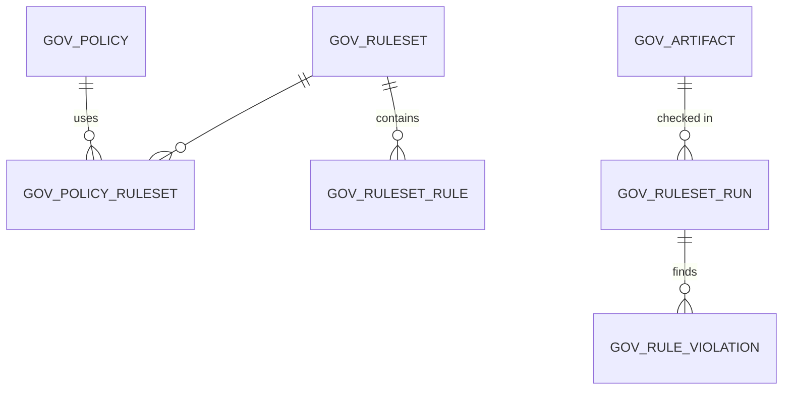

`GOV_ARTIFACT.ARTIFACT_REF_ID` points to the API's UUID (a logical link, no FK). See [Governance](apim-4/domains/governance.md).

### 9. AI / LLM APIs

**4.x** can front LLM providers. A provider and its models are stored once, and an AI API links to a provider (per revision). Subscription tiers can also cap token usage.

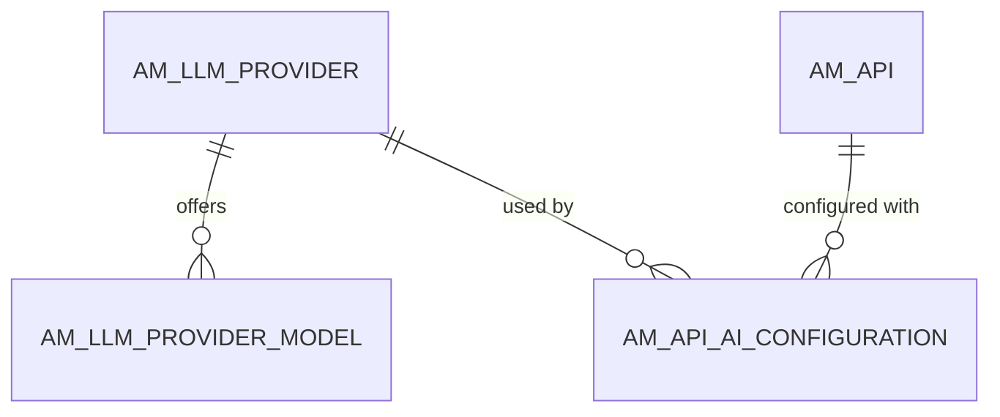

`AM_POLICY_SUBSCRIPTION` gains `TOTAL_TOKEN_COUNT`, `PROMPT_TOKEN_COUNT` and `COMPLETION_TOKEN_COUNT` for AI token quotas. See [AI APIs](apim-4/domains/ai-apis.md).

### 10. New identity tables

The embedded Identity Server grew by 18 `IDN_*` tables. The ones that matter to APIM flows are:

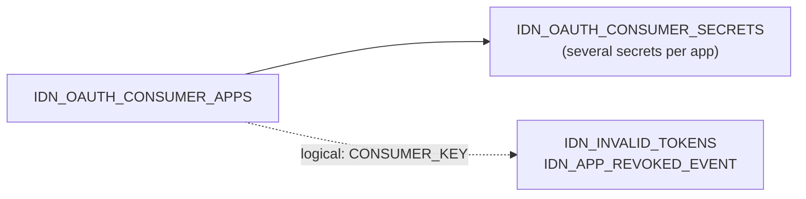

- **`IDN_OAUTH_CONSUMER_SECRETS`**: an OAuth app can now have several secrets, each with its own expiry. The FK is on `CONSUMER_KEY`.
- **Revocation event tables** (`IDN_APP_REVOKED_EVENT`, `IDN_SUBJECT_ENTITY_REVOKED_EVENT`, and on the APIM side `AM_APP_REVOKED_EVENT`, `AM_SUBJECT_ENTITY_REVOKED_EVENT`): 4.x revokes whole groups of JWTs ("everything for this app" or "everything for this user") by recording an event, instead of listing each token.
- **`IDN_INVALID_TOKENS`**: records revoked non-persisted tokens.
- The rest are general Identity Server features (config store, CORS, remote config fetch, secrets, user functionality locks, OAuth user consent) and `SP_SHARED_APP` for organization-shared service providers. See the [Identity Server tables](apim-4/identity-tables.md).

## Tables added and removed

### Removed in 4.x (3)

| Table (3.2.0) | What it was | What replaces it in 4.x |
|---|---|---|
| [`AM_LABELS`](apim-3/reference/am.md#am_labels) | Gateway / microgateway labels (`LABEL_ID`, `NAME`, `TENANT_DOMAIN`) | Gateway environments ([`AM_GATEWAY_ENVIRONMENT`](apim-4/reference/am.md#am_gateway_environment)). The name lives on in [`AM_LABEL`](apim-4/reference/am.md#am_label), which is a *different* concept: a tag on an API. |
| [`AM_LABEL_URLS`](apim-3/reference/am.md#am_label_urls) | Access URLs per label | VHosts ([`AM_GW_VHOST`](apim-4/reference/am.md#am_gw_vhost)) |
| [`AM_SUBSCRIPTION_KEY_MAPPING`](apim-3/reference/am.md#am_subscription_key_mapping) | Access token ↔ subscription link | Nothing directly. Persisted API keys use [`AM_API_KEY`](apim-4/reference/am.md#am_api_key). |

### Added in 4.x (101)

**Revisions, environments & deployment** (17)

[`AM_REVISION`](apim-4/reference/am.md#am_revision), [`AM_API_REVISION_METADATA`](apim-4/reference/am.md#am_api_revision_metadata), [`AM_DEPLOYMENT_REVISION_MAPPING`](apim-4/reference/am.md#am_deployment_revision_mapping), [`AM_DEPLOYED_REVISION`](apim-4/reference/am.md#am_deployed_revision), [`AM_GATEWAY_ENVIRONMENT`](apim-4/reference/am.md#am_gateway_environment), [`AM_GW_VHOST`](apim-4/reference/am.md#am_gw_vhost), [`AM_GATEWAY_PERMISSIONS`](apim-4/reference/am.md#am_gateway_permissions), [`AM_GW_INSTANCES`](apim-4/reference/am.md#am_gw_instances), [`AM_GW_INSTANCE_ENV_MAPPING`](apim-4/reference/am.md#am_gw_instance_env_mapping), [`AM_GW_REVISION_DEPLOYMENT`](apim-4/reference/am.md#am_gw_revision_deployment), [`AM_GW_API_DEPLOYMENTS`](apim-4/reference/am.md#am_gw_api_deployments), [`AM_GATEWAY_TOKEN`](apim-4/reference/am.md#am_gateway_token), [`AM_GW_PLATFORM_API_ARTIFACTS`](apim-4/reference/am.md#am_gw_platform_api_artifacts), [`AM_GW_PLATFORM_EVENT`](apim-4/reference/am.md#am_gw_platform_event), [`AM_API_EXTERNAL_API_MAPPING`](apim-4/reference/am.md#am_api_external_api_mapping), [`AM_API_ENVIRONMENT_KEYS`](apim-4/reference/am.md#am_api_environment_keys), [`AM_ARTIFACT`](apim-4/reference/am.md#am_artifact)

**API definition: endpoints, backends, service catalog** (9)

[`AM_API_ENDPOINTS`](apim-4/reference/am.md#am_api_endpoints), [`AM_API_PRIMARY_EP_MAPPING`](apim-4/reference/am.md#am_api_primary_ep_mapping), [`AM_BACKEND`](apim-4/reference/am.md#am_backend), [`AM_BACKEND_OPERATION_MAPPING`](apim-4/reference/am.md#am_backend_operation_mapping), [`AM_API_SEQUENCE_BACKEND`](apim-4/reference/am.md#am_api_sequence_backend), [`AM_API_METADATA`](apim-4/reference/am.md#am_api_metadata), [`AM_API_OPERATION_MAPPING`](apim-4/reference/am.md#am_api_operation_mapping), [`AM_SERVICE_CATALOG`](apim-4/reference/am.md#am_service_catalog), [`AM_API_SERVICE_MAPPING`](apim-4/reference/am.md#am_api_service_mapping)

**Operation & gateway policies** (9)

[`AM_OPERATION_POLICY`](apim-4/reference/am.md#am_operation_policy), [`AM_OPERATION_POLICY_DEFINITION`](apim-4/reference/am.md#am_operation_policy_definition), [`AM_COMMON_OPERATION_POLICY`](apim-4/reference/am.md#am_common_operation_policy), [`AM_API_OPERATION_POLICY`](apim-4/reference/am.md#am_api_operation_policy), [`AM_API_OPERATION_POLICY_MAPPING`](apim-4/reference/am.md#am_api_operation_policy_mapping), [`AM_API_POLICY_MAPPING`](apim-4/reference/am.md#am_api_policy_mapping), [`AM_GATEWAY_POLICY_METADATA`](apim-4/reference/am.md#am_gateway_policy_metadata), [`AM_GATEWAY_POLICY_MAPPING`](apim-4/reference/am.md#am_gateway_policy_mapping), [`AM_GATEWAY_POLICY_DEPLOYMENT`](apim-4/reference/am.md#am_gateway_policy_deployment)

**Labels** (2)

[`AM_LABEL`](apim-4/reference/am.md#am_label), [`AM_API_LABEL_MAPPING`](apim-4/reference/am.md#am_api_label_mapping)

**Keys & key managers** (5)

[`AM_API_KEY`](apim-4/reference/am.md#am_api_key), [`AM_API_KEY_API_MAPPING`](apim-4/reference/am.md#am_api_key_api_mapping), [`AM_API_KEY_APPLICATION_MAPPING`](apim-4/reference/am.md#am_api_key_application_mapping), [`AM_KEY_MANAGER_PERMISSIONS`](apim-4/reference/am.md#am_key_manager_permissions), [`AM_KEY_MANAGER_ALLOWED_ORGS`](apim-4/reference/am.md#am_key_manager_allowed_orgs)

**Revocation** (2)

[`AM_APP_REVOKED_EVENT`](apim-4/reference/am.md#am_app_revoked_event), [`AM_SUBJECT_ENTITY_REVOKED_EVENT`](apim-4/reference/am.md#am_subject_entity_revoked_event)

**Tenants, organizations & users** (12)

[`AM_ORGANIZATION_MAPPING`](apim-4/reference/am.md#am_organization_mapping), [`AM_SYSTEM_CONFIGS`](apim-4/reference/am.md#am_system_configs), [`UM_ORG`](apim-4/reference/um.md#um_org), [`UM_ORG_ATTRIBUTE`](apim-4/reference/um.md#um_org_attribute), [`UM_ORG_HIERARCHY`](apim-4/reference/um.md#um_org_hierarchy), [`UM_ORG_PERMISSION`](apim-4/reference/um.md#um_org_permission), [`UM_ORG_ROLE`](apim-4/reference/um.md#um_org_role), [`UM_ORG_ROLE_GROUP`](apim-4/reference/um.md#um_org_role_group), [`UM_ORG_ROLE_PERMISSION`](apim-4/reference/um.md#um_org_role_permission), [`UM_ORG_ROLE_USER`](apim-4/reference/um.md#um_org_role_user), [`UM_GROUP_UUID_DOMAIN_MAPPER`](apim-4/reference/um.md#um_group_uuid_domain_mapper), [`UM_HYBRID_GROUP_ROLE`](apim-4/reference/um.md#um_hybrid_group_role)

**AI / LLM APIs** (3)

[`AM_LLM_PROVIDER`](apim-4/reference/am.md#am_llm_provider), [`AM_LLM_PROVIDER_MODEL`](apim-4/reference/am.md#am_llm_provider_model), [`AM_API_AI_CONFIGURATION`](apim-4/reference/am.md#am_api_ai_configuration)

**Governance** (14)

[`GOV_RULESET`](apim-4/reference/gov.md#gov_ruleset), [`GOV_RULESET_CONTENT`](apim-4/reference/gov.md#gov_ruleset_content), [`GOV_RULESET_RULE`](apim-4/reference/gov.md#gov_ruleset_rule), [`GOV_POLICY`](apim-4/reference/gov.md#gov_policy), [`GOV_POLICY_RULESET`](apim-4/reference/gov.md#gov_policy_ruleset), [`GOV_POLICY_LABEL`](apim-4/reference/gov.md#gov_policy_label), [`GOV_POLICY_GOVERNABLE_STATE`](apim-4/reference/gov.md#gov_policy_governable_state), [`GOV_POLICY_ACTION`](apim-4/reference/gov.md#gov_policy_action), [`GOV_ARTIFACT`](apim-4/reference/gov.md#gov_artifact), [`GOV_REQUEST`](apim-4/reference/gov.md#gov_request), [`GOV_REQUEST_POLICY`](apim-4/reference/gov.md#gov_request_policy), [`GOV_POLICY_RUN`](apim-4/reference/gov.md#gov_policy_run), [`GOV_RULESET_RUN`](apim-4/reference/gov.md#gov_ruleset_run), [`GOV_RULE_VIOLATION`](apim-4/reference/gov.md#gov_rule_violation)

**Developer Portal content & webhooks** (5)

[`AM_DEVPORTAL_API_CONTENT`](apim-4/reference/am.md#am_devportal_api_content), [`AM_DEVPORTAL_API_REFERENCE`](apim-4/reference/am.md#am_devportal_api_reference), [`AM_DEVPORTAL_ORG_CONTENT`](apim-4/reference/am.md#am_devportal_org_content), [`AM_WEBHOOKS_SUBSCRIPTION`](apim-4/reference/am.md#am_webhooks_subscription), [`AM_WEBHOOKS_UNSUBSCRIPTION`](apim-4/reference/am.md#am_webhooks_unsubscription)

**Operations & housekeeping** (4)

[`AM_CORRELATION_CONFIGS`](apim-4/reference/am.md#am_correlation_configs), [`AM_CORRELATION_PROPERTIES`](apim-4/reference/am.md#am_correlation_properties), [`AM_TASK_LOCK`](apim-4/reference/am.md#am_task_lock), [`AM_TRANSACTION_RECORDS`](apim-4/reference/am.md#am_transaction_records)

**Identity Server (IDN_*, SP_*)** (19)

[`IDN_OAUTH_CONSUMER_SECRETS`](apim-4/reference/idn.md#idn_oauth_consumer_secrets), [`IDN_INVALID_TOKENS`](apim-4/reference/idn.md#idn_invalid_tokens), [`IDN_APP_REVOKED_EVENT`](apim-4/reference/idn.md#idn_app_revoked_event), [`IDN_SUBJECT_ENTITY_REVOKED_EVENT`](apim-4/reference/idn.md#idn_subject_entity_revoked_event), [`IDN_OAUTH2_USER_CONSENT`](apim-4/reference/idn.md#idn_oauth2_user_consent), [`IDN_OAUTH2_USER_CONSENTED_SCOPES`](apim-4/reference/idn.md#idn_oauth2_user_consented_scopes), [`IDN_CONFIG_TYPE`](apim-4/reference/idn.md#idn_config_type), [`IDN_CONFIG_RESOURCE`](apim-4/reference/idn.md#idn_config_resource), [`IDN_CONFIG_ATTRIBUTE`](apim-4/reference/idn.md#idn_config_attribute), [`IDN_CONFIG_FILE`](apim-4/reference/idn.md#idn_config_file), [`IDN_CORS_ORIGIN`](apim-4/reference/idn.md#idn_cors_origin), [`IDN_CORS_ASSOCIATION`](apim-4/reference/idn.md#idn_cors_association), [`IDN_REMOTE_FETCH_CONFIG`](apim-4/reference/idn.md#idn_remote_fetch_config), [`IDN_REMOTE_FETCH_REVISIONS`](apim-4/reference/idn.md#idn_remote_fetch_revisions), [`IDN_SECRET`](apim-4/reference/idn.md#idn_secret), [`IDN_SECRET_TYPE`](apim-4/reference/idn.md#idn_secret_type), [`IDN_USER_FUNCTIONALITY_MAPPING`](apim-4/reference/idn.md#idn_user_functionality_mapping), [`IDN_USER_FUNCTIONALITY_PROPERTY`](apim-4/reference/idn.md#idn_user_functionality_property), [`SP_SHARED_APP`](apim-4/reference/sp.md#sp_shared_app)

## Column changes on the core tables

These tables exist in both versions but changed shape. Tables not listed here, such as `AM_SUBSCRIPTION`, `AM_SUBSCRIBER`, `AM_APPLICATION_KEY_MAPPING` and `AM_API_THROTTLE_POLICY`, have **identical columns** in both versions.

| Table | Added in 4.x | Removed | Keys & other changes |
|---|---|---|---|
| [`AM_API`](apim-4/reference/am.md#am_api) | `API_UUID`, `API_SUBTYPE`, `ORGANIZATION`, `GATEWAY_VENDOR`, `STATUS`, `LOG_LEVEL`, `IS_EGRESS`, `REVISIONS_CREATED`, `VERSION_COMPARABLE`, `SUB_VALIDATION`, `API_DISPLAY_NAME`, `INITIATED_FROM_GW` | — | Unique key gains `ORGANIZATION`. New unique `API_UUID`. The lifecycle `STATUS` is now copied into the table. |
| [`AM_APPLICATION`](apim-4/reference/am.md#am_application) | `ORGANIZATION`, `SHARED_ORGANIZATION` | — | Unique *(name, subscriber)* becomes *(name, subscriber, organization)* |
| [`AM_API_URL_MAPPING`](apim-4/reference/am.md#am_api_url_mapping) | `REVISION_UUID`, `LOG_LEVEL`, `DESCRIPTION`, `SCHEMA_DEFINITION` | — | One set of rows per revision. Still no FK to `AM_API` in either version. |
| [`AM_API_PRODUCT_MAPPING`](apim-4/reference/am.md#am_api_product_mapping) | `REVISION_UUID` | — | Products are revisioned too |
| [`AM_GRAPHQL_COMPLEXITY`](apim-4/reference/am.md#am_graphql_complexity) | `REVISION_UUID` | — | The unique *(API_ID, TYPE, FIELD)* was dropped because rows repeat per revision |
| [`AM_API_CLIENT_CERTIFICATE`](apim-4/reference/am.md#am_api_client_certificate) | `KEY_TYPE`, `REVISION_UUID` | — | PK widened to *(alias, tenant, key type, removed, revision)* |
| [`AM_GW_API_ARTIFACTS`](apim-4/reference/am.md#am_gw_api_artifacts) | `REVISION_ID` | `GATEWAY_LABEL`, `GATEWAY_INSTRUCTION` | PK *(GATEWAY_LABEL, API_ID)* becomes *(REVISION_ID, API_ID)*. `ARTIFACT` changes from LONGBLOB to MEDIUMBLOB. |
| [`AM_GW_PUBLISHED_API_DETAILS`](apim-4/reference/am.md#am_gw_published_api_details) | `API_TYPE` | — | — |
| [`AM_KEY_MANAGER`](apim-4/reference/am.md#am_key_manager) | `ORGANIZATION`, `TOKEN_TYPE`, `EXTERNAL_REFERENCE_ID` | `TENANT_DOMAIN` | Unique *(name, tenant domain)* becomes *(name, organization)* |
| [`AM_POLICY_SUBSCRIPTION`](apim-4/reference/am.md#am_policy_subscription) | `CONNECTIONS_COUNT`, `TOTAL_TOKEN_COUNT`, `PROMPT_TOKEN_COUNT`, `COMPLETION_TOKEN_COUNT` | — | Adds connection limits (for streaming APIs) and AI token quotas. Still scoped by `TENANT_ID`. |
| [`AM_POLICY_APPLICATION`](apim-4/reference/am.md#am_policy_application) | `RATE_LIMIT_COUNT`, `RATE_LIMIT_TIME_UNIT` | — | Adds a burst-control (rate limit) setting |
| [`AM_API_CATEGORIES`](apim-4/reference/am.md#am_api_categories) | `ORGANIZATION` | `TENANT_ID` | Unique becomes *(name, organization)* |
| [`AM_API_DEFAULT_VERSION`](apim-4/reference/am.md#am_api_default_version) | `ORGANIZATION` | — | — |
| [`AM_API_COMMENTS`](apim-4/reference/am.md#am_api_comments) | `CREATED_BY`, `CREATED_TIME`, `UPDATED_TIME`, `PARENT_COMMENT_ID`, `ENTRY_POINT`, `CATEGORY` | `COMMENTED_USER`, `DATE_COMMENTED` | Threaded replies via a new self-FK on `PARENT_COMMENT_ID`. `COMMENT_ID` shrinks to VARCHAR(64). |
| [`AM_APPLICATION_ATTRIBUTES`](apim-4/reference/am.md#am_application_attributes) | `APP_ATTRIBUTE` | `VALUE` | The value column was renamed (it's a BLOB in 4.x) |
| [`AM_BLOCK_CONDITIONS`](apim-4/reference/am.md#am_block_conditions) | `BLOCK_CONDITION` | `VALUE` | The value column was renamed |
| [`AM_APPLICATION_REGISTRATION`](apim-4/reference/am.md#am_application_registration) | — | — | `INPUTS` changes from VARCHAR(1000) to LONGBLOB |
| [`AM_CERTIFICATE_METADATA`](apim-4/reference/am.md#am_certificate_metadata) | `CERTIFICATE` | — | The certificate content is now stored in the table |
| [`UM_TENANT`](apim-4/reference/um.md#um_tenant) | `UM_TENANT_UUID`, `UM_ORG_UUID` | — | New unique `UM_TENANT_UUID` |
| [`IDN_OAUTH2_ACCESS_TOKEN`](apim-4/reference/idn.md#idn_oauth2_access_token) | `CONSENTED_TOKEN` | — | — |

Smaller changes (not core to APIM): several `IDN_*`, `CM_*`, `REG_RESOURCE_*` and `UM_SHARED_USER_ROLE` tables gained a surrogate `ID` primary key, and a number of `REG_*` user columns widened from VARCHAR(31) to VARCHAR(255).

### Deletes cascade more in 4.x

Nine foreign keys changed from **RESTRICT** (you can't delete the parent while children exist) to **CASCADE** (deleting the parent deletes the children):

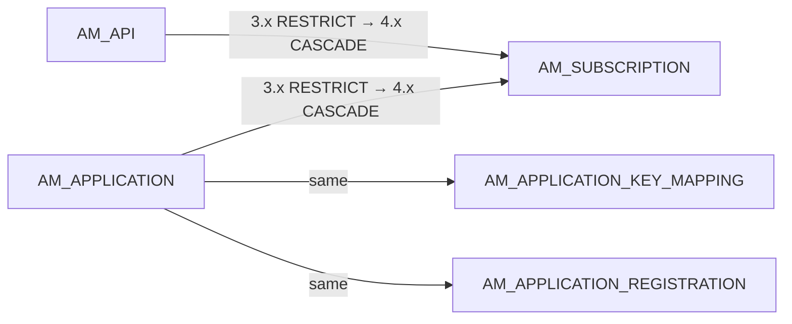

The full list is:

- `AM_SUBSCRIPTION` → `AM_API` and → `AM_APPLICATION`
- `AM_APPLICATION_KEY_MAPPING` → `AM_APPLICATION`
- `AM_APPLICATION_REGISTRATION` → `AM_APPLICATION`
- `AM_API_LC_EVENT`, `AM_API_COMMENTS`, `AM_API_RATINGS` and `AM_SECURITY_AUDIT_UUID_MAPPING` → `AM_API`
- `AM_GW_API_ARTIFACTS` → `AM_GW_PUBLISHED_API_DETAILS`, which went from explicit `NO ACTION` to the default

In 3.x, APIM's code had to delete the children first. In 4.x, the database does it for you.

## How each core flow changed

| Flow | 3.x | 4.x | What changed |
|---|---|---|---|
| Setup & first user | [3.x](apim-3/flows/01-bootstrap.md) | [4.x](apim-4/flows/01-bootstrap.md) | Adds organizations (`UM_ORG*`, `AM_ORGANIZATION_MAPPING`) and `AM_SYSTEM_CONFIGS`. Gateway environments can be seeded as rows. |
| Create an API | [3.x](apim-3/flows/02-create-api.md) | [4.x](apim-4/flows/02-create-api.md) | `AM_API` gets `API_UUID` and `ORGANIZATION`. Endpoints, operation policies, metadata, service links and AI config can be written to their own tables instead of only the registry. |
| Create a new version | [3.x](apim-3/flows/03-new-version.md) | [4.x](apim-4/flows/03-new-version.md) | Same idea: a new `AM_API` row. The new version's revision-aware rows start again at `'Current API'`. |
| Publish / deploy to the gateway | [3.x: publish](apim-3/flows/04-publish-to-gateway.md) | [4.x: deploy a revision](apim-4/flows/04-deploy-revision.md) | **The biggest change.** By default 3.x pushes straight to the gateways, so nothing goes to the database; artifacts per gateway label only appear when DB sync is on. 4.x creates `AM_REVISION` and stores its artifact, then deployment writes `AM_DEPLOYMENT_REVISION_MAPPING` and the gateway's acknowledgement in `AM_GW_REVISION_DEPLOYMENT`. |
| Change lifecycle state | [3.x](apim-3/flows/05-lifecycle.md) | [4.x](apim-4/flows/05-lifecycle.md) | The state is also copied to `AM_API.STATUS`. The FK from `AM_API_LC_EVENT` now cascades. |
| Create an API product | [3.x](apim-3/flows/06-api-product.md) | [4.x](apim-4/flows/06-api-product.md) | `AM_API_PRODUCT_MAPPING` is revision-aware, and products are deployed through revisions |
| Create an application | [3.x](apim-3/flows/07-create-application.md) | [4.x](apim-4/flows/07-create-application.md) | `ORGANIZATION` and `SHARED_ORGANIZATION` on `AM_APPLICATION` |
| Subscribe | [3.x](apim-3/flows/08-subscribe.md) | [4.x](apim-4/flows/08-subscribe.md) | `AM_SUBSCRIPTION` is unchanged, but deletes now cascade from both the API and the application |
| Generate keys | [3.x](apim-3/flows/09-generate-keys.md) | [4.x](apim-4/flows/09-generate-keys.md) | Key managers are per organization and have permissions and allowed-org lists. OAuth apps can have several secrets (`IDN_OAUTH_CONSUMER_SECRETS`). |
| Get a token & call the API | [3.x](apim-3/flows/10-token-and-invoke.md) | [4.x](apim-4/flows/10-token-and-invoke.md) | Persisted, hashed API keys (`AM_API_KEY*`) replace stateless-only API keys. `AM_SUBSCRIPTION_KEY_MAPPING` is gone. |
| Manage throttling policies | [3.x](apim-3/flows/11-throttling-policies.md) | [4.x](apim-4/flows/11-throttling-policies.md) | New limit types (connections, AI tokens, application burst). Still scoped by tenant. |
| Revoke & delete | [3.x](apim-3/flows/12-revocation-and-delete.md) | [4.x](apim-4/flows/12-revocation-and-delete.md) | Event-based bulk JWT revocation (`*_REVOKED_EVENT`) and more cascading deletes |
| Approval workflows | [3.x](apim-3/flows/13-approval-workflows.md) | [4.x](apim-4/flows/13-approval-workflows.md) | `AM_WORKFLOWS` is unchanged. Revision deployment can also be gated by a workflow. |
| Governance check | — | [4.x](apim-4/flows/14-governance.md) | New in 4.x |
| Create an AI API | — | [4.x](apim-4/flows/15-ai-api.md) | New in 4.x |

## Verified behaviour differences

These differences were observed by running the same flows on **3.2.0** and **4.7.0**, both using the default H2 setup, and diffing the databases after each step. The schema alone doesn't show them.

| Behaviour | 3.2.0 | 4.7.0 |
|---|---|---|
| Access tokens | Every token is **stored** in `IDN_OAUTH2_ACCESS_TOKEN`. Generating keys also issues and stores a first token. | Application JWTs are **not stored**. Only opaque tokens, such as the portals' own, get a row. |
| Revoking a token | The row moves from `IDN_OAUTH2_ACCESS_TOKEN` to `IDN_OAUTH2_ACCESS_TOKEN_AUDIT`, and an `AM_REVOKED_JWT` row is added. | Adds `AM_REVOKED_JWT` and `IDN_INVALID_TOKENS` rows. |
| API keys | Self-contained JWTs, so there's **nothing in the database**. | Stored as a SHA-256 hash in `AM_API_KEY`, linked to the application by UUID. |
| Resource scopes | Only in `IDN_OAUTH2_SCOPE`. `AM_SCOPE` stays empty. | In `AM_SCOPE` **and** `IDN_OAUTH2_SCOPE`. |
| API product resources | `AM_API_PRODUCT_MAPPING` points straight at the underlying API's existing URL mapping row. | The URL mapping row is **copied**, and the copy stores the product's `API_ID` in `REVISION_UUID`. |
| Gateway artifacts in the database | None by default. Database sync is opt-in. | Written to `AM_GW_API_ARTIFACTS` when a **revision is created**. The gateway's acknowledgement goes to `AM_GW_REVISION_DEPLOYMENT`. |
| Key manager reference | `KEY_MANAGER` holds the name (`Resident Key Manager`). | `KEY_MANAGER` holds the key manager's UUID. |
| Governance | Doesn't exist. | Every API create, update or revision queues a governance run (`GOV_REQUEST`). Each run's results replace the previous run's. |

Both versions agree on these:
- `AM_SUBSCRIBER` and a `DefaultApplication` are created on the first Developer Portal action.
- `AM_APPLICATION_REGISTRATION` is written even when no approval workflow is configured.
- Calling an API writes nothing to the database.
- APIM's code refuses (HTTP 409) to delete an API that has active subscriptions, whatever the foreign keys say.

## Migration tips

!!! tip "When moving from 3.x to 4.x"
    - **Use WSO2's migration client. Don't hand-write SQL.** It backfills `AM_API.API_UUID` from the registry, fills the `ORGANIZATION` columns from tenant domains, and creates an initial revision (and deployment) for every published API.
    - **Check your custom queries for integer vs UUID joins.** New 4.x tables join on `API_UUID` and `APPLICATION_UUID`. Old tables still use the integer `API_ID` and `APPLICATION_ID`.
    - **Filter revision-aware tables on the working copy.** A query on `AM_API_URL_MAPPING` that used to return one row per resource now returns one row per resource **per revision**. Add `REVISION_UUID IS NULL` (or `= 'Current API'`, depending on the table) to get just the working copy.
    - **Filter by organization.** Uniqueness on `AM_API`, `AM_APPLICATION` and `AM_KEY_MANAGER` now includes `ORGANIZATION`. Policy and scope tables still use `TENANT_ID`, so you'll often need to join via the tenant domain.
    - **Replace label-based gateway logic.** Anything that read `AM_LABELS`, or `GATEWAY_LABEL` on `AM_GW_API_ARTIFACTS`, should now use `AM_DEPLOYMENT_REVISION_MAPPING` and `AM_GW_REVISION_DEPLOYMENT` for deployment state, and `AM_GATEWAY_ENVIRONMENT` / `AM_GW_VHOST` for environments created in the Admin Portal. Environments defined in `deployment.toml` aren't in the database.
    - **Beware the new cascades.** Deleting an application or API in 4.x silently removes its subscriptions and key mappings. Back up before running clean-up scripts.
