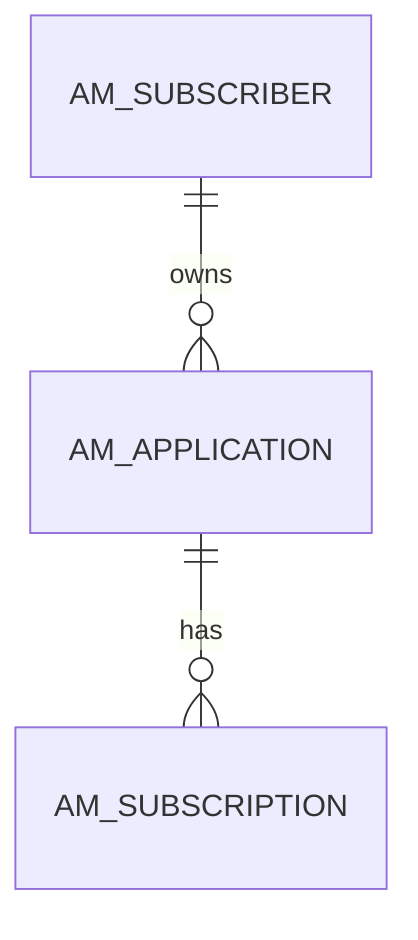
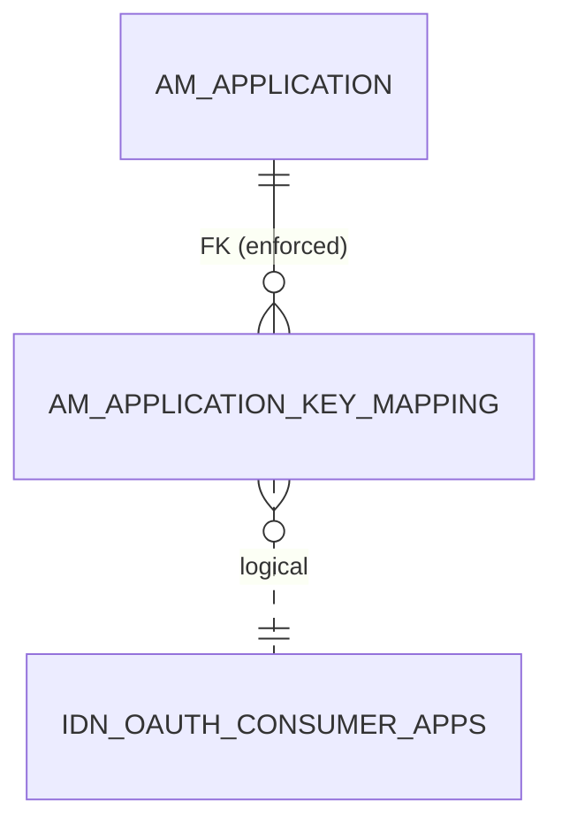
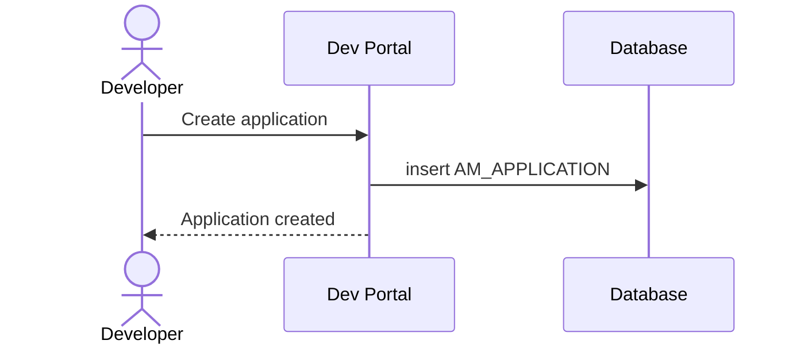

# How to read this guide

## How the guide is organized

Each series (4.x and 3.x) has the same parts:

| Part | What you'll find |
|---|---|
| **Overview** | The whole picture on one page, with a single "hub" diagram of the most important tables. |
| **The databases** | Which physical databases APIM uses and what lives in each. |
| **Domains** | Groups of related tables, each explained in plain words. Every important table is explained on exactly one domain page. |
| **Core flows** | Stories such as "create an API" or "subscribe", with the tables written at each step. |
| **Gotchas** | Things that often confuse people. |
| **Identity Server tables** | Tables APIM inherits from WSO2 Identity Server. They're listed for completeness. |
| **Table reference** | Every table and every column, with keys and relationships. |

## Reading the table diagrams

Table diagrams are *entity-relationship* diagrams. A box is a table, and a line is a relationship between two tables.

The symbols at the ends of a line tell you **how many** rows can be on each side:

| Symbol at the line end | Means |
|---|---|
| `||` (two bars) | exactly one |
| `o|` (circle + bar) | zero or one |
| `o{` (circle + crow's foot) | zero or many |
| `|{` (bar + crow's foot) | one or many |

So the diagram above reads: *one subscriber owns zero or many applications, and one application has zero or many subscriptions.*

### Solid vs dashed lines

- A **solid line** is a *foreign key*. The database enforces it, so a child row can't point at a parent that doesn't exist.
- A **dashed line** is a **logical link**. APIM's code joins these tables on matching values, but the database doesn't enforce the relationship. APIM uses a lot of these, so they're always called out.

## Reading the flow diagrams

Flow pages use *sequence diagrams*. Read them top to bottom: each arrow is one step, and the arrows into **Database** show which tables get written.

## Boxes on the pages

!!! note "Different in 3.x"
    Marks something that works differently in the other series. It always links to the matching page there.

!!! warning "Logical link (no foreign key)"
    Marks a relationship the database doesn't enforce.

!!! tip "Try it"
    A read-only SQL query you can run to see the relationship in your own database.
